---
author:
- Maksim Levental
bibliography: /Users/maksim/dev_projects/pytorch_abstraction_comparison/tex/main.bib
csl: springer-mathphys-brackets.csl
link-citations: true
reference-section-title: References
title: Comparing the costs of abstraction for DL frameworks
---

High level abstractions for implementing, training, and testing Deep
Learning (DL) models abound. Such frameworks function primarily by
abstracting away the implementation details of arbitrary neural
architectures, thereby enabling researchers and engineers to focus on
design. In principle, such frameworks could be “zero-cost
abstractions”; in practice, they incur translation and indirection
overheads. We study at which points exactly in the engineering
life-cycle of a DL model the highest costs are paid and whether they
can be mitigated. We train, test, and evaluate a representative DL
model using PyTorch, LibTorch, TorchScript, and cuDNN on
representative datasets, comparing accuracy, execution time and memory
efficiency.

# Introduction

Deep Learning (DL) frameworks represent neural network models as
dataflow and computation graphs (where nodes correspond to functional
units and edges correspond to composition). In recent years, there has
been a proliferation of DL
frameworks \[[1](#ref-paszke2019pytorch)–[4](#ref-cntk)\] implemented as
domain-specific languages (DSLs) embedded in “high-level” languages[^1]
such as Python, Java, and C#. These DSLs serve as *abstractions* that
aim to map the DL graphs to hardware pipelines. That is to say, they
hide (or *encapsulate*) details of DL models that are judged to be
either irrelevant or too onerous to consider
(see <a href="#subsec:abstraction" data-reference-type="ref" data-reference="subsec:abstraction">abstraction</a>
for a more comprehensive discussion on abstraction in computer science).
By virtue of these design decisions the frameworks trade-off ease-of-use
for execution performance; quoting the architects of PyTorch:

> \[\[[1](#ref-paszke2019pytorch)\]\] To be useful, PyTorch needs to
> deliver compelling performance, although not at the expense of
> simplicity and ease of use. Trading 10% of speed for a significantly
> simpler to use model is acceptable; 100% is not.

Trading off ergonomics for performance is manifestly reasonable[^2],
especially during the early phases of the DL engineering/research
process (i.e. during the hypothesis generation and experimentation
phases). Ultimately one needs to put the DL model into production. It is
at this phase of the DL engineering process that every percentage point
of execution performance becomes critical. Alternatively, there are many
areas of academic DL where the research community strives to
incrementally improve
performance \[[5](#ref-abdelhamed2020ntire)–[7](#ref-ILSVRC15)\]. For
example, in the area of super-resolution a high-priority goal is to be
able to “super-resolve” in real-time \[[8](#ref-7780576)\]. Similarly,
in natural language processing, where enormous language models are
becoming the norm \[[9](#ref-brown2020language)\], memory efficiency of
DL models is of the utmost concern. In such instances it is natural to
wonder whether ease-of-use trade-offs that sacrifice execution
performance, or memory efficiency, are worthwhile and whether their
costs can be mitigated.

Thus, our intent here is to investigate the costs of some of the
abstractions employed by framework developers. In particular we focus on
the PyTorch ecosystem (chosen for its popularity amongst academic
researchers) deployed to Graphics Processing Units (GPUs). To that end,
we implement a popular and fairly representative[^3] DL model at four
levels of abstraction: conventional PyTorch, LibTorch, cuDNN, and
TorchScript. We argue, in the forthcoming, that these four
implementations span considerable breadth in the abstraction spectrum.
Furthermore we train, test, and evaluate each of the implementations on
four object detection datasets and tabulate performance and accuracy
metrics.

The rest of this article is organized as follows:
 <a href="#sec:background" data-reference-type="ref" data-reference="sec:background">background</a>
discusses abstraction and quickly reviews the germaine background
material on GPUs and DL frameworks,
 <a href="#sec:methodology" data-reference-type="ref" data-reference="sec:methodology">methodology</a>
describes the implementations and our profiling
methodology, <a href="#sec:results" data-reference-type="ref" data-reference="sec:results">results</a>
presents our results and a comparative discussion thereof,
 <a href="#sec:discussion" data-reference-type="ref" data-reference="sec:discussion">discussion</a>
discusses broad lessons learned,
 <a href="#sec:futurework" data-reference-type="ref" data-reference="sec:futurework">futurework</a>
concludes and proposes future work, and
 <a href="#sec:speculation" data-reference-type="ref" data-reference="sec:speculation">speculation</a>
speculates wildly about the future of DL systems more generally.

# Background

## Abstraction

What is abstraction? In fact, there are several closely related notions
of abstraction. First there is the philosophical notion of abstraction;
Locke defines abstraction as follows (bolding ours):

> \[\[[10](#ref-Locke1689-LOCAEC-4)\]\] The acts of the mind, wherein it
> exerts its power over simple ideas, are chiefly these three: The third
> is **separating them from all other ideas that accompany them in their
> real existence**: this is called abstraction

Then there is mathematical abstraction; Russell defines abstraction as
follows:

> \[\[[11](#ref-Russell1937-RUSPOM-7)\]\] This principle \[of
> abstraction\] asserts that, whenever a relation, of which there are
> instances, has the two properties of being symmetrical and transitive,
> then the relation in question is not primitive, but is analyzable into
> sameness of relation to some other term; and that this common relation
> is such that there is only one term at most to which a given term can
> be so related, though many terms may be so related to a given term.

Intriguing as these notions of abstraction may be, they are distinctly
different from the notion of abstraction in computer science; in
particular with respect to mathematical abstraction (bolding ours):

> \[\[[12](#ref-abstraction)\]\] the primary product of mathematics is
> *inference structures*, while the primary product of computer science
> is *interaction patterns*. This is a crucial difference, and it shapes
> their use of formalism and the kind of abstraction used in the two
> disciplines.
>
> computer science is distinguished from mathematics in the use of a
> kind of abstraction that computer scientists call *information
> hiding*. The complexity of behaviour of modern computing devices makes
> the task of programming them impossible without abstraction tools that
> hide, but do not neglect, **details that are essential in a
> lower-level processing context but inessential in a \[particular\]
> software design and programming context**.

This understanding of abstraction is widely agreed upon; notably
Abelson, Sussman, and Sussman in their much revered *Structure and
Interpretation of Programs*:

> \[\[[13](#ref-abelson1996structure)\]\] We are not at that moment
> concerned with how the procedure computes its result, only with the
> fact that it computes the square. The details of how the square is
> computed can be suppressed, to be considered at a later time. Indeed,
> as far as the `good-enough?` procedure is concerned, `square` is not
> quite a procedure but rather an abstraction of a procedure, a
> so-called *procedural abstraction*. At this level of abstraction, any
> procedure that computes the square is equally good.

Thus, abstraction is the modulation of concern for details in accordance
with the needs of the user and *levels of abstractions* are graded by
the degree of the elision (bolding ours):

> \[\[[12](#ref-abstraction)\]\] To specify nontrivial computational
> processes in machine language is a practical impossibility for humans,
> and so programming languages with higher levels of abstraction are
> necessary.
>
> At a higher level of \[abstraction\], a *subroutine*, *function*, or
> *procedure* is an abstraction of a segment of memory that hides the
> details of how the segment represents a piece of a program that is
> passed certain parameter values and returns a value as a result.
>
> A *garbage collector* is an abstraction of a special process that
> collects garbage and makes it once again available to the original
> program, hiding from that program the details of how this is done.
>
> **This use of code libraries is an example of *procedural
> abstraction***, or the ability to execute code through the calling of
> named procedures that accept explicitly described parameters and
> return certain guaranteed results. It is an example of abstraction
> because the details of how the procedure performs its computation are
> hidden from the procedure’s caller; since the caller only makes use of
> the procedure for its results, there is no need for it to know the
> internals.

Taking *information and concern encapsulation* as our operational
definition of abstraction, in what sense shall we measure the costs of
the abstractions employed by DL frameworks? An immediate candidate
measure of cost is the asymptotic time (or space) complexity of various
operations and data structures that comprise the abstraction. We claim
that, with rare exception[^4], asymptotic complexity is a poorly suited
measure of the complexity or cost of abstractions in the sense that we
here deal with. If the abstraction is truly abstract then it bears no
resemblance to the realization (recall Locke’s definition of
abstraction) and if the abstraction is reified then the analysis becomes
completely impractical (owing to the numerous components and
operations). Even if such analysis were practicable the result would
most likely be uninteresting and inconsequential for actual DL
frameworks and their users. It is well known that the constant factors
in the complexity and particularities of hardware systems themselves
more closely govern performance than the order terms. For example,
Quicksort, an O$\left(n^2\right)$ sorting routine, outperforms even many
$\Theta(n\log n)$ sorting routines because it is more cache
efficient \[[15](#ref-10.5555/1410219)\].

Another way to reason about the cost of abstractions is according to the
“zero-overhead” principle as articulated by Bjarne Stroustrup:

> \[\[[16](#ref-10.1007/978-3-642-28869-2_1)\]\] In general, C++
> implementations obey the zero-overhead principle: What you don’t use,
> you don’t pay for. And further: What you do use, you couldn’t hand
> code any better.

Therefore we make the expedient and practical assumption that what is
more interesting and valuable to the DL community than asymptotics is,
in fact, an empirical study of the resource efficiency of the
abstractions; namely execution time, memory usage, and GPU utilization.

## GPUs

We briefly review NVIDIA GPUs[^5] in order that the performance criteria
we measure
in <a href="#sec:methodology" data-reference-type="ref" data-reference="sec:methodology">methodology</a>
are legible.

A GPU consists of many simple processors, called streaming
multiprocessors (SMs), which are comprised by many compute *cores* that
run at relatively low clock speeds[^6]. Each compute core in an SM can
execute one floating-point or integer operation per clock cycle. See
 <a href="#fig:1" data-reference-type="ref" data-reference="fig:fermi_arch">1</a>
for a diagram of NVIDIA’s Fermi architecture, where each SM consists of
32 cores, 16 load/store (LD/ST) units, four special-function units
(SFUs) which compute transcendental functions (such as $\sin$, $\cos$,
$\exp$), a relatively large register file[^7], and thread control logic
(to be discussed in the proceeding). Each SM has access to local memory,
several cache levels, and global memory. In the Fermi architecture (and
subsequent architectures) local memory is configurable in software; a
fraction of it can be apportioned as either local memory or L1 cache
(for workloads that query global memory in excess of local memory). One
final feature worth mentioning, though irrelevant for us here, is the L2
cache’s atomic `read-modify-write` facilities; this enables sharing data
across groups of threads more efficiently than possible in conventional
CPUs[^8].

Such an architecture, particularly suited to maximizing throughput,
necessitates a programming model distinct from that of a conventional,
general purpose processor architecture. A unit of computation deployed
to a GPU is called a *kernel*; kernels can be defined using NVIDIA’s
Compute Unified Device Architecture (CUDA) extensions to C, C++, and
FORTRAN[^9]. Compiled kernels are executed by many *threads* in
parallel, with each thread starting at the same instruction; NVIDIA
describes this addition to Flynn’s taxonomy \[[18](#ref-5009071)\] as
Single Instruction Multiple Thread (SIMT)[^10]. The large register file
enables very fast thread context switching ($\sim$<!-- -->25
microseconds on the Fermi
architecture \[[20](#ref-Glaskowsky2009NVIDIAS)\]), performed by a
centralized hardware thread scheduler. Multiple threads are grouped into
blocks (SMs are single tenant with respect to blocks) and blocks are
grouped into *grids* (grids execute a single kernel). All threads in a
block, by virtue of running on the same SM, coordinate (execute in
arbitrary order, concurrently, or sequentially) and share memory. Thread
blocks are partitioned into *warps* of 32 threads; it is these warps
that are dispatched by the warp scheduler
(see <a href="#fig:1" data-reference-type="ref" data-reference="fig:cuda_cores">1</a>)
and starting with the Fermi architecture two warps can be executed
concurrently on the same SM in order to increase utilization[^11].

  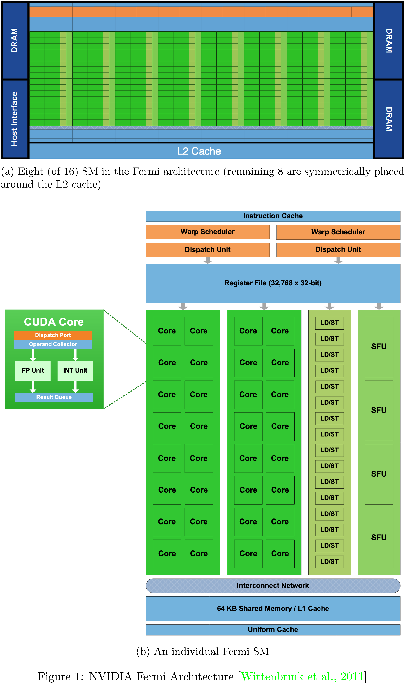

We present an example CUDA program
in <a href="#fig:2" data-reference-type="ref" data-reference="fig:cuda_hello_world">2</a>
to illustrate some of the artifacts of the CUDA threading model. The
premise of the program is performing an element-wise sum of two
$32 \times 48$ entry matrices. Note that all of the data weighs in at
$3 \times 32 \times 48 \times 4 = 18$ kilobytes (well within the bounds
of shared memory on any one SM). The actual work of summing is
partitioned across a grid of six thread blocks, each containing
$16 \times 16$ threads. Such a partitioning means each thread can be
logically responsible for exactly one sum and therefore the kernel is
quite simple
(see <a href="#lst:2" data-reference-type="ref" data-reference="lst:cuda_hello_world">2</a>).
Within the context of a kernel, each thread is uniquely identified by
its multi-index in the thread hierarchy (`threadIdx` and `blockIdx`).
Hence, to carry out the sum, the kernel maps this multi-index to the
physical address of the data[^12]. This (grid, block, thread)-to-data
mapping is, in effect, the mechanism that implements the SIMT
architecture. Note that, since each block is allocated to exactly one
SM, this sum will take $\left( 16 \times 16 \right) \div 16 = 16$ clock
cycles on the Fermi architecture; better throughput could be achieved by
increasing the number of blocks (and therefore the number of SMs
assigned work).

  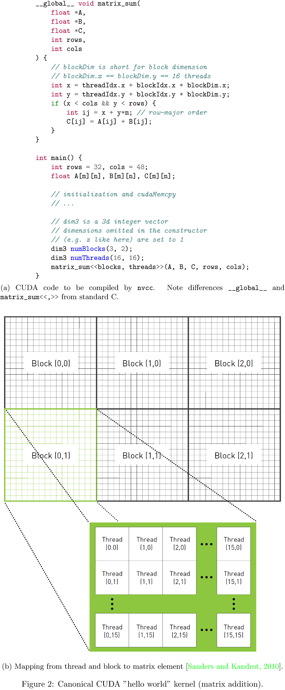

## Graph compilers and Tensors

DL frameworks primarily function as graph compilers and tensor
abstractions[^13]. They typically also include some “quality of life”
utilities useful for the training of DL models (e.g. optimizers and data
loaders). PyTorch’s `Tensor` abstraction is responsible for a great deal
of the complexity and implementation overhead of the framework. Due to
the framework’s broad support for hardware and data types, dynamic
dispatch[^14] is employed to resolve methods on `Tensor`s
(see <a href="#fig:3" data-reference-type="ref" data-reference="fig:dispatch">3</a>).
This dynamic dispatch produces deep call stacks for every single
operation on a `Tensor`
(see <a href="#fig:4" data-reference-type="ref" data-reference="fig:stacks">4</a>);
it remains to be seen whether the context switching[^15] between
function contexts incurs any appreciable execution time penalty.

  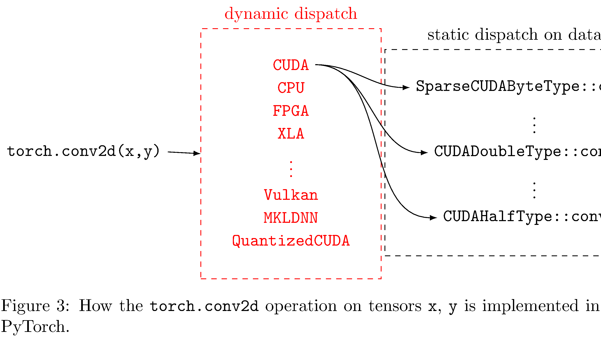

  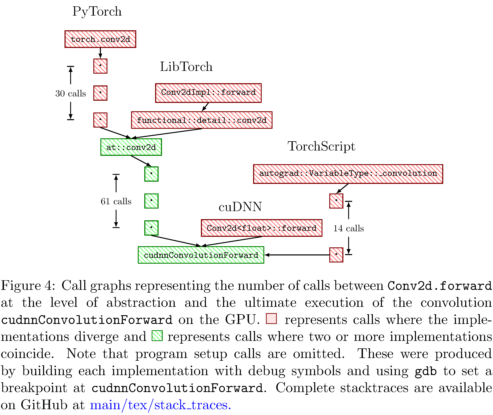

DL graph compilers are distinct from other dataflow compilers (such as
VHDL and Verilog[^16]); in addition to keeping account of how the data
streams through the compute graph, they also keep account of how the
gradients of the data stream through the graph (i.e. the
*gradient-flow*). This is called *automatic differentiation* (often
shortened to *autodiff*). In principle autodiff is implemented by using
the rules of Newton’s calculus to calculate the derivatives of primitive
functions and the chain rule to calculate derivatives of compositions of
primitive functions. There are two types of autodiff: *forward mode* (or
*forward accumulation*) and *reverse mode* (or *reverse
accumulation*)[^17]. Reverse mode autodiff enables the framework to
effectively calculate the gradients of parameters of a neural network
with respect to some relevant loss or objective function. Note that such
gradients can be *back-propagated* through the neural network in order
to adjust the parameters of the neural network such that it minimizes
the loss[^18] or maximizes the objective.

Dataflow graphs (and their corresponding gradient-flow graphs) can be
specified either statically, with fan-in and fan-out for all functions
predetermined, or dynamically, where compositions of functions are
determined “on-the-run.” There are advantages and disadvantages to both
specification strategies. Static specifications tightly constrain[^19]
the intricacy of the dataflow graph but, obversely, can be leveraged to
improve performance and scalability \[[22](#ref-le2019tflms),
[23](#ref-Pradelle2017PolyhedralOO)\]. TensorFlow (prior to v2.0) is an
example of a DL framework that compiles statically specified graphs.
Conversely, dynamic specifications can be very expressive and user
friendly, including such conveniences as runtime debugging, but are much
more difficult to optimize. PyTorch is an example of a DL framework that
supports dynamic specification. Both PyTorch and TensorFlow also support
just-in-time (JIT) compilation strategies (TorchScript and XLA
respectively); such JIT compilers strike a balance between fluency and
scalability. In this work we investigate TorchScript
(see <a href="#sec:methodology" data-reference-type="ref" data-reference="sec:methodology">methodology</a>).

It warrants mention that, in addition to vertically integrated DL
frameworks (i.e. specification language and hardware compiler), recently
there has been work on intermediate bytecode representations for
dataflow graphs that arbitrary compiler “frontends” can target. The
Multi-Level Intermediate Representation
(MLIR) \[[24](#ref-lattner2020mlir)\] project has goals that include
supporting dataflow graphs, optimization passes on those graphs and
hardware specific optimizations[^20].
Stripe \[[25](#ref-zerrell2019stripe)\] is a polyhedral compiler[^21]
that aims to support general machine learning kernels, which are
distinguished by their high parallelism with limited mutual dependence
between iterations. Tensor
Comprehensions \[[27](#ref-vasilache2018tensor)\] is an intermediate
specification language (rather than intermediate bytecode
representation) and corresponding polyhedral compiler; the syntax bears
close resemblance to Einstein summation notation and the compiler
supports operator fusion and specialization for particular data shapes.
Finally, Tensor Virtual Machine
(TVM) \[[28](#ref-10.5555/3291168.3291211)\] is an optimizing graph
compiler that automates optimization using a learning-based cost
modeling method that enables it to efficiently explore the space of
low-level code optimizations.

# Methods

As discussed in the preceding, the translation from high-level neural
network specification to native hardware involves a diverse set of
choices at design time and translation time. Any such choice made
implicitly by the DL framework abstracts away intermediary details at
the level of abstraction at which the choice is made. For example, in
PyTorch, by default, convolutions include not only learnable filters but
also a learnable bias. Naturally this increases the number of parameters
for which gradients need to be kept account of and updated for. At the
next level of abstraction (translation from Python specification to C++
objects) another implicit choice is made in choosing tensor dimension
ordering[^22]. Finally, at the level of abstraction just prior to
compilation into CUDA kernels a convolution strategy is chosen[^23]
according to heuristics. Each of these choices potentially incurs a
runtime execution and memory cost, depending on whether the heuristics
according to which the choice was made apply to the user’s DL model.

With this as subtext, we describe the intent and design of our
experiments. We implement the popular object detection deep neural
network ResNet-50 \[[29](#ref-he2015deep)\] at four levels of
abstraction (PyTorch, TorchScript[^24], LibTorch, and cuDNN) in order to
investigate the differences amongst them. We measure accuracy, execution
time, GPU utilization, and memory efficiency of each implementation on
four image datasets (MNIST, CIFAR10, STL10, PASCAL). The source for the
implementations is available on GitHub[^25]. The datasets were chosen
because they span the spectrum of image complexity (from small
single-channel images to large multi-channel images). The reasons for
choosing ResNet-50
(see <a href="#fig:5" data-reference-type="ref" data-reference="fig:resnet">5</a>)
are two fold. Firstly, it serves as a benchmark architecture in the
research community. Secondly, it includes functional units included in
many other network architectures (residual units, convolutions of
various sizes, batch normalizations, ReLU activations, and pooling
layers) and is therefore representative of typical neural network
compute workloads. The reason for staying within the same ecosystem is
that, in theory, we fix as many of the dimensions of functionality
orthogonal to our concerns as possible.

  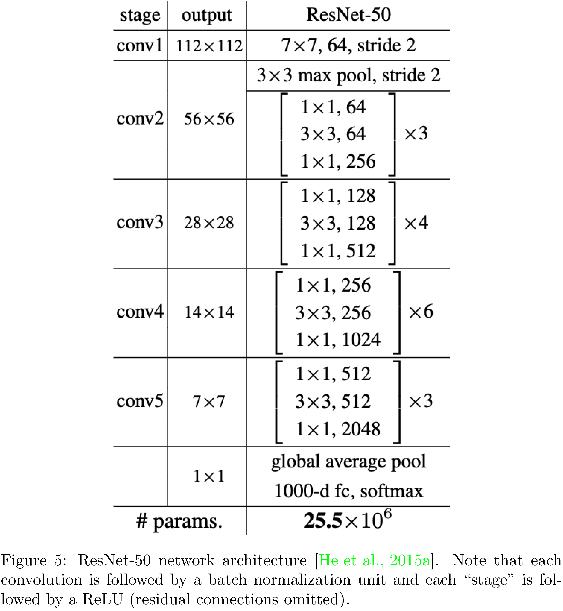

We employ two test platforms
(see <a href="#tab:platforms" data-reference-type="ref" data-reference="tab:platforms">2</a>);
training is performed for 100 epochs with batch size 128 (except for on
PASCAL where we use batch size 16) on the “Training platform.” Distinct
models were trained in parallel in order to expedite the overall
training process but neither data parallelism nor intra-model
parallelism were employed. In addition we perform scaling experiments
(in resolution and batch size) on the PASCAL dataset; for
$\texttt{batch\_size}, \texttt{resolution} = 8, 16, \dots, 1024$. For
this purpose we employ the “Resolutions platform,” which has GPU RAM
enough to accommodate large batch sizes and large image resolutions. For
both sets of experiments, each run is repeated 10 times and results are
averaged to reduce variance in the measurements. Precise execution time
measurements are collected using the CUDA `cudaEventCreate`,
`cudaEventRecord`, `cudaEventElapsedTime` APIs. Precise memory and GPU
utilization measurements are collected using the NVIDIA Management
Library C API. Both sets of APIs were appropriately wrapped for use in
Python.

  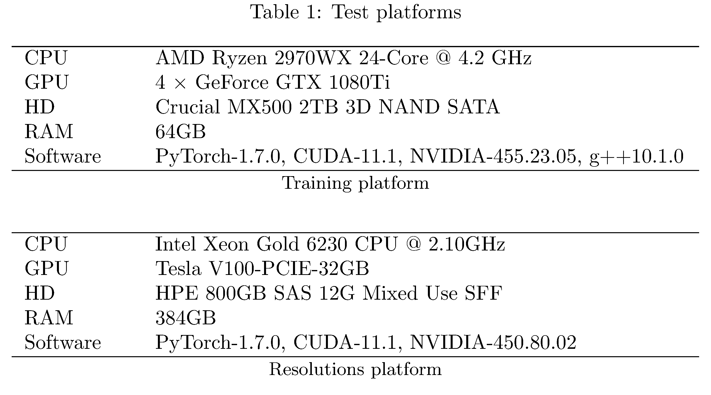

  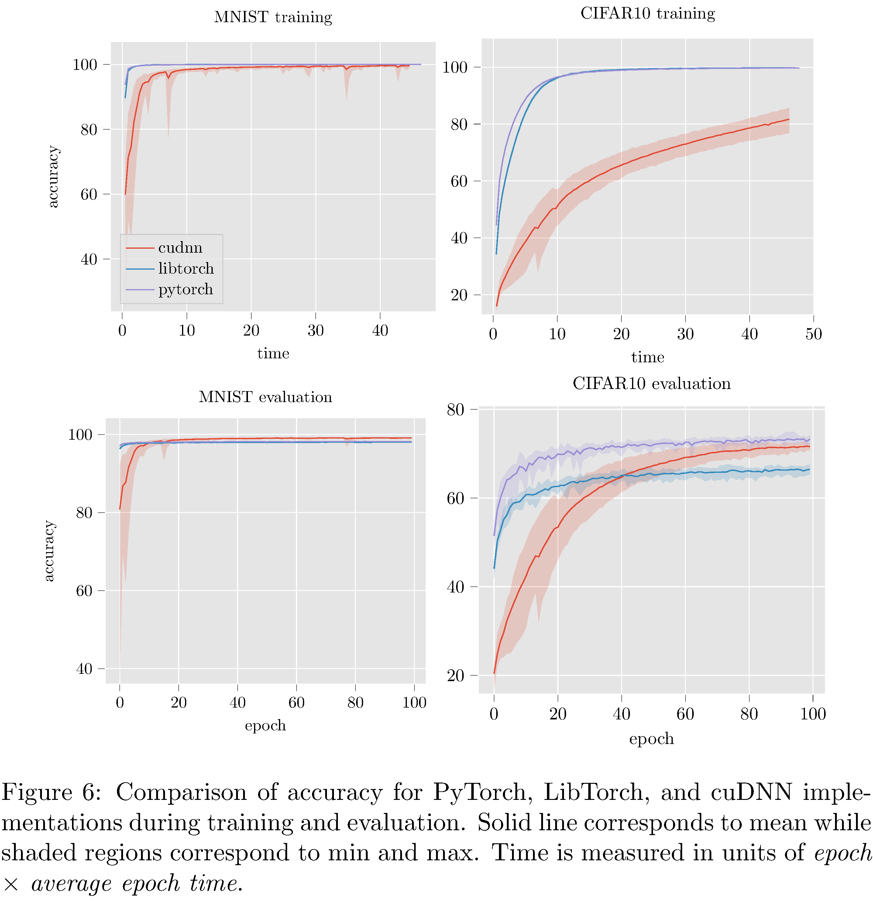

# Results

  

The PyTorch implementation compares favorably with both LibTorch and the
cuDNN implementations
(see <a href="#fig:7" data-reference-type="ref" data-reference="fig:accuracy_results">7</a>)
in terms of accuracy. On MNIST and CIFAR10 all three implementations
perform reasonably well; LibTorch and PyTorch attain maximum accuracy at
around the same time while cuDNN lags behind. On the more complex STL10
and PASCAL datasets
(see <a href="#fig:15" data-reference-type="ref" data-reference="fig:other_accuracy_results">15</a>
in the appendix) the cuDNN implementation dramatically underperformed
PyTorch and LibTorch. The cause of the difference between the cuDNN
implementation and the others is unclear.

In attempting to resolve the poor performance of the cuDNN
implementation it was discovered that PyTorch (and LibTorch as well)
initializes weights in convolutional, linear, and batch normalization
layers. This is not documented and not configurable. For convolutional
and linear layers Kaiming uniform
initialization \[[30](#ref-he2015delving)\] is used and for batch
normalization layers $(\gamma=1,\beta=0)$ initialization is used. This
presents a serious problem for us because it is known that **ResNets
with Kaiming initializations lead to exploding
gradients** \[[31](#ref-zhang2019fixup)\]. Nonetheless, we implemented
Kaiming initialization for the cuDNN implementation but it did not
resolve the under-performance issues. Indeed, the network vacillated
between vanishing gradients and exploding gradients depending on various
settings of the hyper-parameters in the Kaiming initialization. Note
that TorchScript training and evaluation accuracy is not
measured/reported because TorchScript implementations cannot (as of yet)
be trained, only evaluated.

The undocumented initialization leads us to believe that most likely
there are several other heuristic optimizations implemented by Pytorch
(and LibTorch). While such optimizations generally do improve
performance (to wit: here on STL10 and PASCAL) this prompts the question
of whether or not this is a “moral” cost of abstraction (since the
optimizations might hurt performance for other
models \[[31](#ref-zhang2019fixup)\]).

  

In terms of execution time and memory usage PyTorch compares unfavorably
with each of the other implementations. We measure execution time,
memory usage, and GPU utilization during evaluation on PASCAL for
various batch sizes and resolution. For example, for fixed batch size
and various resolutions and for fixed resolution and various batch sizes
(see <a href="#fig:8" data-reference-type="ref" data-reference="fig:timing_results">8</a>),
we see that PyTorch is almost an order of magnitude slower than all
other implementations. This execution time difference persists across
resolutions and batch sizes but narrows as either increases
(see <a href="#fig:10" data-reference-type="ref" data-reference="#fig:10">10</a>,<a href="#fig:11" data-reference-type="ref" data-reference="#fig:11">11</a>,<a href="#fig:9" data-reference-type="ref" data-reference="#fig:9">9</a>,<a href="#fig:13" data-reference-type="ref" data-reference="#fig:13">13</a>,<a href="#fig:14" data-reference-type="ref" data-reference="#fig:14">14</a>,<a href="#fig:12" data-reference-type="ref" data-reference="#fig:12">12</a>
in the appendix). With respect to memory usage PyTorch and LibTorch are
approximately the same across resolutions and batch sizes, while cuDNN
and TorchScript are more memory efficient, especially below resolution
$2^6$ and batch size $2^7$.

We use NVIDIA’s Visual profiler[^26] to investigate fixed
`batch_size = 32` further. One critical way in which the PyTorch
implementation differs from the others is in host-to-device per batch
copy size: PyTorch copies 25.166MB while the other implementations copy
12.583MB. Consequently PyTorch requires $\sim$<!-- -->15.17ms to copy
the batch while all other implementations require
$\sim$<!-- -->7.55ms[^27]. Another significant discrepancy is the choice
in block size and grid size (regarding threaded distribution across GPU
SMs). For the ReLU kernel, which is the second most often executed
kernel ($\sim$<!-- -->12% of total execution time), the PyTorch
implementation allocates a grid of size $\left( 1024,2,1 \right)$ while
the LibTorch and cuDNN implementations allocate grids of size
$\left( 512,2,1 \right)$. Consequently, on average, each PyTorch ReLU
invocation consumes $\sim$<!-- -->690.6 microseconds while each
invocation consumes $\sim$<!-- -->372.6 microseconds. it is unclear
exactly why the larger grid leads to a slowdown but one hypothesis is
that distributing work across more SMs leads to more stalls on cache
misses[^28].

# Discussion

Overall the central challenges for this work revolved around the cuDNN
implementation. Chief among them involved familiarizing ourselves with
the SIMT compute model and the CUDA/cuDNN APIs. It is important to
contextualize these challenges appropriately: how much of the challenge
is akin to the initial learning curve associated with any new software
toolset (e.g. PyTorch) and how much is enduring. Certainly memory leaks,
and debugging them, given that C++ is not a memory managed language,
will persist, but the difficulties associated with the idiosyncrasies of
the APIs most likely will not. Assuming that the majority of challenge
decreases with time, are these lower levels of abstraction worth the
investment of effort and time?

The lackluster accuracy results of cuDNN seemingly do not bode well for
the hypothesis that one can, in a straightforward way, trade performance
for implementation effort. The cuDNN performance indicates there are
serious bugs with the implementation. Alternatively the accuracy results
suggest that there are optimizations present in the PyTorch and LibTorch
implementations that are obscured from the user (such as the Kaiming
initialization mentioned
in <a href="#sec:results" data-reference-type="ref" data-reference="sec:results">results</a>).
The former case, when juxtaposed with the execution time and memory
usage results, suggests that the cuDNN implementation could be as
accurate the PyTorch and LibTorch implementations, with much lower
execution time and memory usage (assuming the bugs can be rectified  a
reasonable assumption). In the latter case, we face a sort of
existential crisis: how many results in DL research, attributed to
architectural innovations, in fact, hinge on the implementation details
of the frameworks those architectures are themselves implemented
against?

It bears repetition: even broadly useful heuristics are a cost of
abstraction if they cannot be adjusted. Case in point, **Kaiming
initialization is not always net positive with respect to performance**:

> \[\[[31](#ref-zhang2019fixup)\]\] Standard initialization methods
> (Glorot & Bengio, 2010; He et al., 2015; Xiao et al., 2018) attempt to
> set the initial parameters of the network such that the activations
> neither vanish nor explode. Unfortunately, it has been observed that
> without normalization techniques such as BatchNorm they do not account
> properly for the effect of residual connections and this causes
> exploding gradients.

In addition batch normalization layers being initialized to
$(\gamma=1,\beta=0)$ also does not uniformly improve performance:

> \[\[[32](#ref-goyal2018accurate)\]\] For BN layers, the learnable
> scaling coefficient $\gamma$ is initialized to be 1, *except for each
> residual block’s last BN where $\gamma$ is initialized to be 0*.
> Setting $\gamma = 0$ in the last BN of each residual block causes the
> forward/backward signal initially to propagate through the identity
> shortcut of ResNets, which we found to ease optimization at the start
> of training.

In theory, a sufficiently flexible DL compiler could rescue us from the
purgatory we find ourselves in; a sufficiently powerful compiler would
implement the necessary DL abstractions in a robust way but also have
enough flexibility to enable users to implement custom extensions of
those abstractions. One promising project that has as its goal such a
high-level compiler is the “Extensible
Programming” \[[33](#ref-Besard_2019)\] project. Besard et al. expose
interfaces to alter the compilation process for Julia-lang[^29]. The
project instruments the Julia compiler itself and enables users to build
high-level hardware abstractions in the source language itself[^30].
They’ve had initial success writing high-level GPU code that performs
comparably with CUDA C[^31].

# Conclusion and future work

In this work we have implemented ResNet-50 in PyTorch, LibTorch,
TorchScript, and cuDNN. We then trained[^32] and evaluated each
implementation on the MNIST, CIFAR10, STL10, and PASCAL VOC datasets.
Despite difficulties with the cuDNN implementation, we show that PyTorch
underperforms lower level abstractions along various batch sizes and
resolutions
(see <a href="#fig:10" data-reference-type="ref" data-reference="#fig:10">10</a>,<a href="#fig:11" data-reference-type="ref" data-reference="#fig:11">11</a>,<a href="#fig:9" data-reference-type="ref" data-reference="#fig:9">9</a>,<a href="#fig:13" data-reference-type="ref" data-reference="#fig:13">13</a>,<a href="#fig:14" data-reference-type="ref" data-reference="#fig:14">14</a>,<a href="#fig:12" data-reference-type="ref" data-reference="#fig:12">12</a>
in the appendix). The ultimate causes for these differences in
performance are hypothesized to be the larger buffers and larger grid
allocations used by PyTorch and consequently longer host-to-device copy
times.

Future work will focus on further narrowing down the causes of the
memory and sample time inefficiencies of PyTorch; in particular we hope
to more closely investigate the execution paths of the PyTorch and
LibTorch implementations in order to discover what additional heuristic
choices are made (relative to the cuDNN implementation). A long term
research goal is to design a DL framework that uses code generation to
statically generate C++ code corresponding to neural network graphs.
Such a framework would obviate the need for dynamic dispatch at the
object level.

# Speculation

We speculate about DL systems along three dimensions: hardware,
software, and use cases/techniques. Firstly, we project that with the
end of Dennard scaling \[[34](#ref-CARDOSO201717)\] general purpose
processors will give way to Application Specific Integrated Circuit
(ASIC). Architectures like Cerebras’ CS-1, SambdaNova’s Cardinal SN10,
Google’s TPU, and even Apple’s Neural Engine (packaged with their M1)
demonstrate that chip designers recognize the need for ML/DL purpose
built hardware. These purpose built chips are better suited for the
concurrency and memory access patterns unique to ML/DL workloads. With
the impending cambrian explosion of different architectures, there will
be a great need for compilers that act as intermediaries between
high-level neural network representations and their hardware
implementations. Compiler infrastructures such as MLIR, PlaidML, and
Intel’s oneAPI \[[35](#ref-oneapi)\] will become critical for software
developers. As ML/DL ASICs become more ubiquitous and more performant,
ML/DL powered software will become commensurately more ubiquitous;
already mobile phones employ ML/DL for text
autocorrection \[[36](#ref-DBLP:journals/corr/abs-1709-06429)\], image
compression/super-resolution \[[37](#ref-DBLP:journals/corr/RomanoIM16)\],
and facial fingerprinting \[[19](#ref-cuda_toolkit)\]. We project that
most user-interaction driven tasks (e.g. setting alarms, coordinating
appointments/meetings, planning daily routines) will have ML/DL
solutions in the coming years. Further, more platforms that have been up
until today analog or simple computers (e.g. kitchen appliances, light
power tools) will become “smart.” This distribution of lower power edge
devices will necessitate more effective (and private) federated learning
methods \[[38](#ref-48690)\].

# Acknowledgements

We would like to thank Rick Stevens and Ian Foster for their
constructive criticism and feedback on the project and paper itself.

# Extra plots

  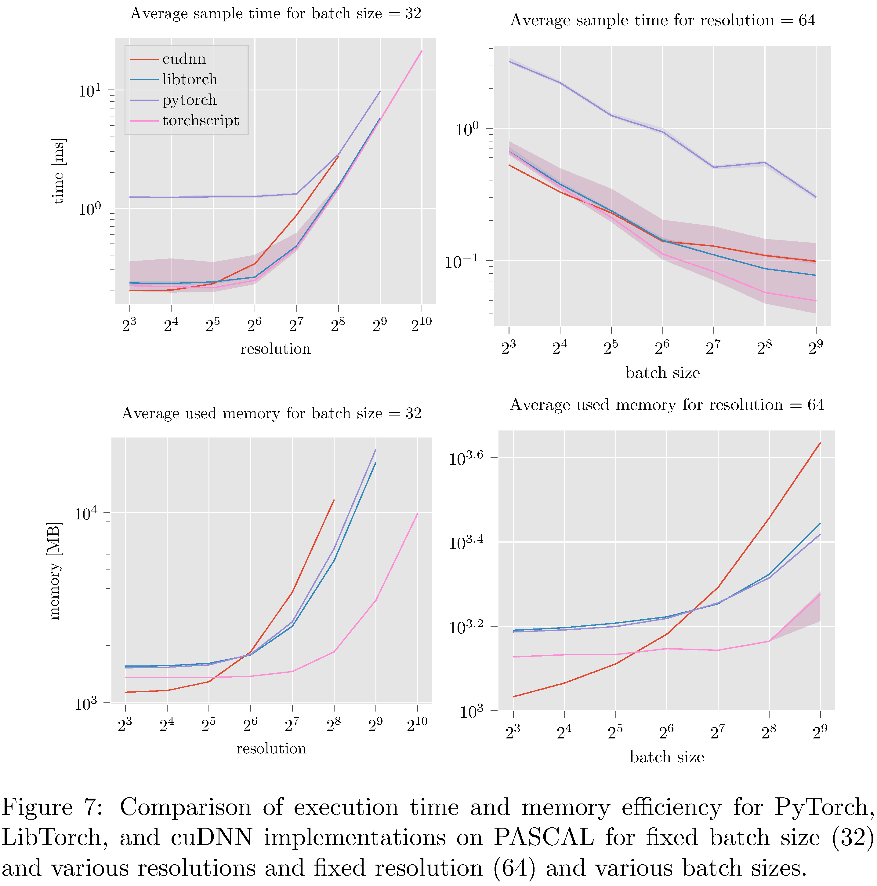

  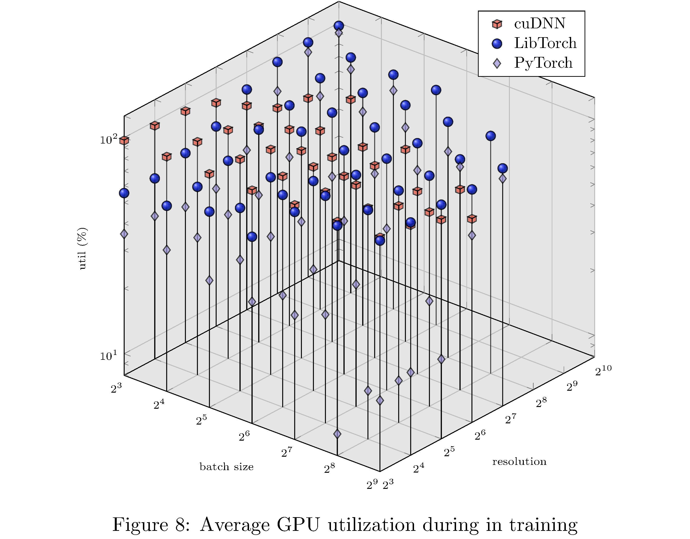

  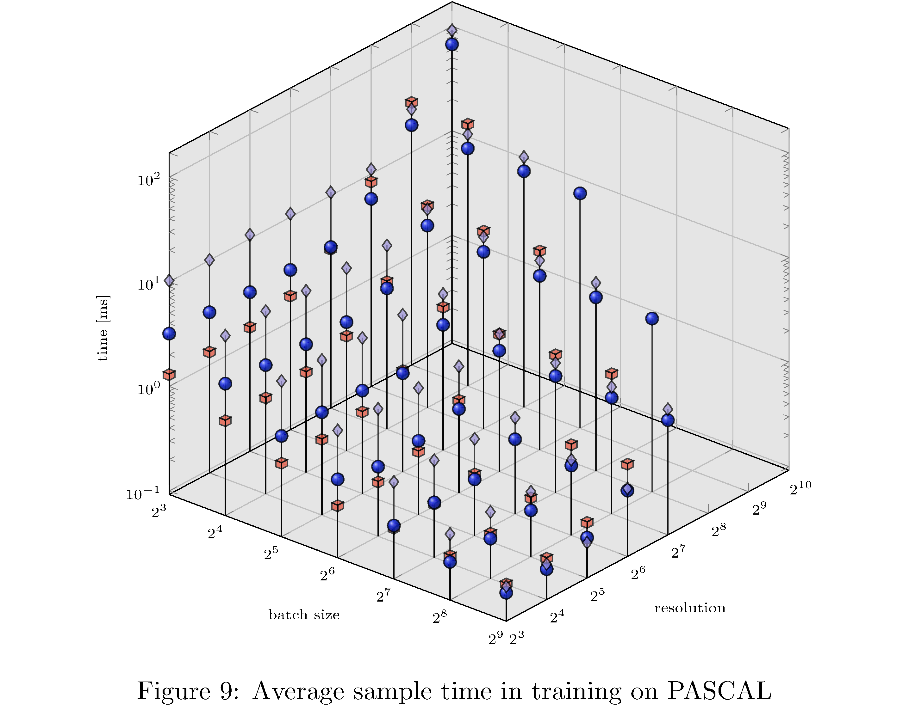

  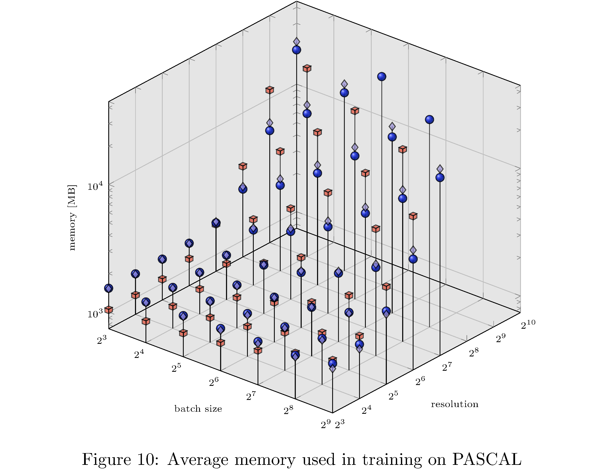

  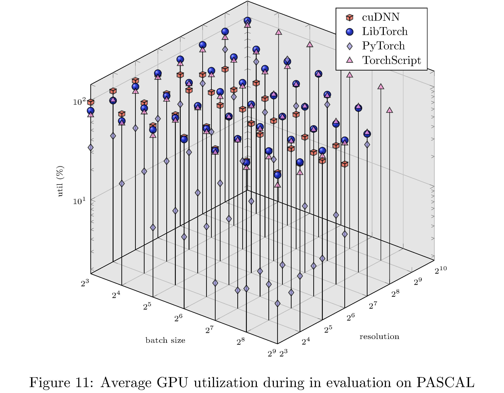

  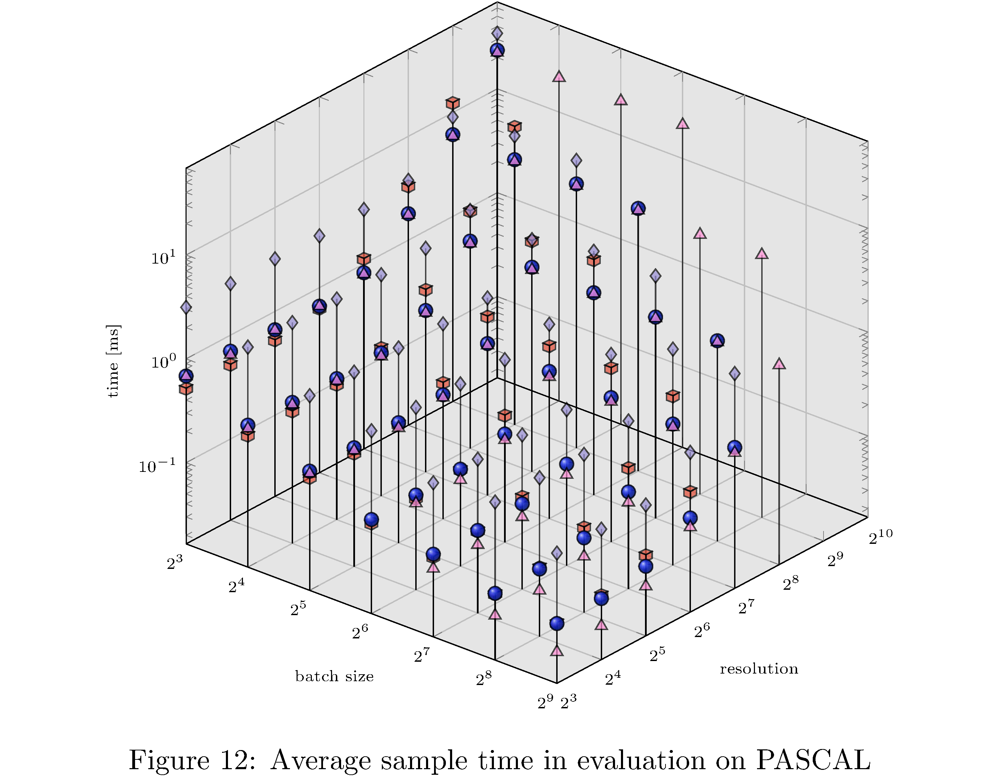

  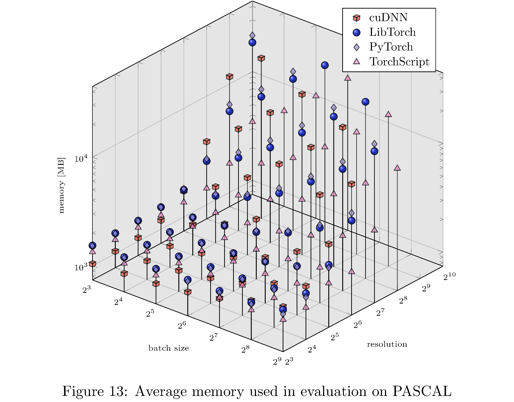

  

# References

1. Paszke, A., Gross, S., Massa, F., Lerer, A.,
Bradbury, J., Chanan, G., Killeen, T., Lin, Z., Gimelshein, N., Antiga,
L., Desmaison, A., Köpf, A., Yang, E., DeVito, Z., Raison, M., Tejani,
A., Chilamkurthy, S., Steiner, B., Fang, L., Bai, J., Chintala, S.:
PyTorch: An imperative style, high-performance deep learning library,
<https://arxiv.org/abs/1912.01703>, (2019)

2. Abadi, M., Agarwal, A., Barham, P., Brevdo, E.,
Chen, Z., Citro, C., Corrado, G.S., Davis, A., Dean, J., Devin, M.,
Ghemawat, S., Goodfellow, I., Harp, A., Irving, G., Isard, M., Jia, Y.,
Jozefowicz, R., Kaiser, L., Kudlur, M., Levenberg, J., Mane, D., Monga,
R., Moore, S., Murray, D., Olah, C., Schuster, M., Shlens, J., Steiner,
B., Sutskever, I., Talwar, K., Tucker, P., Vanhoucke, V., Vasudevan, V.,
Viegas, F., Vinyals, O., Warden, P., Wattenberg, M., Wicke, M., Yu, Y.,
Zheng, X.: TensorFlow: Large-scale machine learning on heterogeneous
distributed systems, <https://arxiv.org/abs/1603.04467>, (2016)

3. Chen, T., Li, M., Li, Y., Lin, M., Wang, N.,
Wang, M., Xiao, T., Xu, B., Zhang, C., Zhang, Z.: MXNet: A flexible and
efficient machine learning library for heterogeneous distributed
systems, <https://arxiv.org/abs/1512.01274>, (2015)

4. Seide, F., Agarwal, A.: CNTK: Microsoft’s
open-source deep-learning toolkit. In: Proceedings of the 22nd ACM
SIGKDD international conference on knowledge discovery and data mining.
p. 2135. Association for Computing Machinery, New York, NY, USA
(2016)

5. Abdelhamed, A., Afifi, M., Timofte, R., Brown,
M.S., Cao, Y., Zhang, Z., Zuo, W., Zhang, X., Liu, J., Chen, W., Wen,
C., Liu, M., Lv, S., Zhang, Y., Pan, Z., Li, B., Xi, T., Fan, Y., Yu,
X., Zhang, G., Liu, J., Han, J., Ding, E., Yu, S., Park, B., Jeong, J.,
Liu, S., Zong, Z., Nan, N., Li, C., Yang, Z., Bao, L., Wang, S., Bai,
D., Lee, J., Kim, Y., Rho, K., Shin, C., Kim, S., Tang, P., Zhao, Y.,
Zhou, Y., Fan, Y., Huang, T., Li, Z., Shah, N.A., Liu, W., Yan, Q.,
Zhao, Y., Możejko, M., Latkowski, T., Treszczotko, L., Szafraniuk, M.,
Trojanowski, K., Wu, Y., Michelini, P.N., Hu, F., Lu, Y., Kim, S., Kim,
W., Lee, J., Choi, J.-H., Zhussip, M., Khassenov, A., Kim, J.H., Cho,
H., Kansal, P., Nathan, S., Ye, Z., Lu, X., Wu, Y., Yang, J., Cao, Y.,
Tang, S., Cao, Y., Maggioni, M., Marras, I., Tanay, T., Slabaugh, G.,
Yan, Y., Kang, M., Choi, H.-S., Song, K., Xu, S., Lu, X., Wang, T., Lei,
C., Liu, B., Gupta, R., Kumar, V.: NTIRE 2020 challenge on real image
denoising: Dataset, methods and results,
<https://arxiv.org/abs/2005.04117>, (2020)

6. Hall, D., Dayoub, F., Skinner, J., Zhang, H.,
Miller, D., Corke, P., Carneiro, G., Angelova, A., Sünderhauf, N.:
Probabilistic object detection: Definition and evaluation. In: IEEE
winter conference on applications of computer vision (WACV)
(2020)

7. Russakovsky, O., Deng, J., Su, H., Krause, J.,
Satheesh, S., Ma, S., Huang, Z., Karpathy, A., Khosla, A., Bernstein,
M., Berg, A.C., Fei-Fei, L.: ImageNet Large Scale Visual Recognition
Challenge. International Journal of Computer Vision (IJCV). 115, 211–252
(2015). <https://doi.org/10.1007/s11263-015-0816-y>

8. Shi, W., Caballero, J., Huszár, F., Totz, J.,
Aitken, A.P., Bishop, R., Rueckert, D., Wang, Z.: Real-time single image
and video super-resolution using an efficient sub-pixel convolutional
neural network. In: 2016 IEEE conference on computer vision and pattern
recognition (CVPR). pp. 1874–1883 (2016)

9. Brown, T.B., Mann, B., Ryder, N., Subbiah, M.,
Kaplan, J., Dhariwal, P., Neelakantan, A., Shyam, P., Sastry, G.,
Askell, A., Agarwal, S., Herbert-Voss, A., Krueger, G., Henighan, T.,
Child, R., Ramesh, A., Ziegler, D.M., Wu, J., Winter, C., Hesse, C.,
Chen, M., Sigler, E., Litwin, M., Gray, S., Chess, B., Clark, J.,
Berner, C., McCandlish, S., Radford, A., Sutskever, I., Amodei, D.:
Language models are few-shot learners,
<https://arxiv.org/abs/2005.14165>, (2020)

10. Locke, J.: An essay concerning human
understanding. Oxford University Press (1689)

11. Russell, B.: Principles of mathematics.
Routledge (1937)

12. Colburn, T., Shute, G.: Abstraction in computer
science. Minds and Machines. 17, 169–184 (2007).
<https://doi.org/10.1007/s11023-007-9061-7>

13. Abelson, H., Sussman, G.J., Sussman, J.:
Structure and interpretation of computer programs. MIT Press
(1996)

14. Pippenger, N.: Pure versus impure lisp. ACM
Trans. Program. Lang. Syst. 19, 223–238 (1997).
<https://doi.org/10.1145/244795.244798>

15. Skiena, S.S.: The algorithm design manual.
Springer Publishing Company, Incorporated (2008)

16. Stroustrup, B.: Foundations of c++. In:
Proceedings of the 21st european conference on programming languages and
systems. pp. 1–25. Springer-Verlag, Berlin, Heidelberg (2012)

17. Sanders, J., Kandrot, E.: CUDA by example: An
introduction to general-purpose GPU programming. Addison-Wesley
Professional (2010)

18. Flynn, M.J.: Some computer organizations and
their effectiveness. IEEE Transactions on Computers. C-21, 948–960
(1972). <https://doi.org/10.1109/TC.1972.5009071>

19. NVIDIA: CUDA toolkit documentation,
(2020)

20. Glaskowsky, P.: NVIDIA’s fermi: The first
complete GPU computing architecture. Presented at the (2009)

21. Panchenko, M., Auler, R., Nell, B., Ottoni, G.:
BOLT: A practical binary optimizer for data centers and beyond. In:
Proceedings of the 2019 IEEE/ACM international symposium on code
generation and optimization. pp. 2–14. IEEE Press, Washington, DC, USA
(2019)

22. Le, T.D., Imai, H., Negishi, Y., Kawachiya, K.:
TFLMS: Large model support in TensorFlow by graph rewriting,
<https://arxiv.org/abs/1807.02037>, (2019)

23. Pradelle, B., Meister, B.î. t, Baskaran, M.,
Springer, J., Lethin, R.: Polyhedral optimization of TensorFlow
computation graphs. In: ESPT/VPA@SC (2017)

24. Lattner, C., Amini, M., Bondhugula, U., Cohen,
A., Davis, A., Pienaar, J., Riddle, R., Shpeisman, T., Vasilache, N.,
Zinenko, O.: MLIR: A compiler infrastructure for the end of moore’s law,
<https://arxiv.org/abs/2002.11054>, (2020)

25. Zerrell, T., Bruestle, J.: Stripe: Tensor
compilation via the nested polyhedral model,
<https://arxiv.org/abs/1903.06498>, (2019)

26. Griebl, M., Lengauer, C., Wetzel, S.: Code
generation in the polytope model. In: In IEEE PACT. pp. 106–111. IEEE
Computer Society Press (1998)

27. Vasilache, N., Zinenko, O., Theodoridis, T.,
Goyal, P., DeVito, Z., Moses, W.S., Verdoolaege, S., Adams, A., Cohen,
A.: Tensor comprehensions: Framework-agnostic high-performance machine
learning abstractions, <https://arxiv.org/abs/1802.04730>, (2018)

28. Chen, T., Moreau, T., Jiang, Z., Zheng, L.,
Yan, E., Cowan, M., Shen, H., Wang, L., Hu, Y., Ceze, L., Guestrin, C.,
Krishnamurthy, A.: TVM: An automated end-to-end optimizing compiler for
deep learning. In: Proceedings of the 13th USENIX conference on
operating systems design and implementation. pp. 579–594. USENIX
Association, USA (2018)

29. He, K., Zhang, X., Ren, S., Sun, J.: Deep
residual learning for image recognition,
<https://arxiv.org/abs/1512.03385>, (2015)

30. He, K., Zhang, X., Ren, S., Sun, J.: Delving
deep into rectifiers: Surpassing human-level performance on ImageNet
classification, <https://arxiv.org/abs/1502.01852>, (2015)

31. Zhang, H., Dauphin, Y.N., Ma, T.: Fixup
initialization: Residual learning without normalization,
<https://arxiv.org/abs/1901.09321>, (2019)

32. Goyal, P., Dollár, P., Girshick, R., Noordhuis,
P., Wesolowski, L., Kyrola, A., Tulloch, A., Jia, Y., He, K.: Accurate,
large minibatch SGD: Training ImageNet in 1 hour,
<https://arxiv.org/abs/1706.02677>, (2018)

33. Besard, T., Foket, C., De Sutter, B.: Effective
extensible programming: Unleashing julia on GPUs. IEEE Transactions on
Parallel and Distributed Systems. 30, 827–841 (2019).
<https://doi.org/10.1109/tpds.2018.2872064>

34. M. P. Cardoso, J.ã. o, Coutinho, J.é.G.F.,
Diniz, P.C.: Chapter 2 - high-performance embedded computing. In: M. P.
Cardoso, J.ã. o, Coutinho, J.é.G.F., and Diniz, P.C. (eds.) Embedded
computing for high performance. pp. 17–56. Morgan Kaufmann, Boston
(2017)

35. Intel: Driving a new era of accelerated
computing, (2020)

36. Ghosh, S., Kristensson, P.O.: Neural networks
for text correction and completion in keyboard decoding. CoRR.
abs/1709.06429, (2017)

37. Romano, Y., Isidoro, J., Milanfar, P.: RAISR:
Rapid and accurate image super resolution. CoRR. abs/1606.01299,
(2016)

38. Augenstein, S., McMahan, B., Ramage, D.,
Ramaswamy, S., Kairouz, P., Chen, M., Mathews, R., Aguera-Arcas, B.:
Generative models for effective ML on private, decentralized datasets.
Presented at the (2019)

# Footnotes

[^1]: For the purposes of this article, we take “high-level” to mean
    garbage collected and agnostic with respect to hardware *from the
    perspective of the user*.

[^2]: The real problem is that programmers have spent far too much time
    worrying about efficiency in the wrong places and at the wrong
    times; premature optimization is the root of all evil (or at least
    most of it) in programming.

[^3]: In the sense that the functional units constituting the model are
    widely used in various other models.

[^4]: One result does come to mind:
    Pippenger \[[14](#ref-10.1145/244795.244798)\] produces a program
    that runs in O$(n)$ on an impure implementation (i.e. with
    side-effects) LISP but which runs in $\Theta(n \log n)$ on a pure
    LISP.

[^5]: A more comprehensive introduction to GPUs themselves and CUDA
    programming is available in \[[17](#ref-10.5555/1891996)\].

[^6]: For example, individual NVIDIA GTX-1080 Ti cores run at
    $\sim$<!-- -->1500MHz.

[^7]: For example, Intel’s Haswell architecture supports 168 integer and
    168 floating-point registers.

[^8]: On a CPU, atomic `test-and-set` instructions manage a semaphore,
    which itself manages access to memory (therefore incurring a cost of
    at least two clock cycles).

[^9]: In fact, CUDA compiles down to a virtual machine assembly code (by
    way of `nvcc`) for a virtual machine called the Parallel Thread
    Execution (PTX) virtual machine. So, in effect, it is compilers all
    the way down.

[^10]: They key difference between SIMD and SIMT is that while in SIMD
    all vector elements in a vector instruction execute synchronously,
    threads in SIMT can diverge; branches are handled by predicated
    instructions \[[19](#ref-cuda_toolkit)\].

[^11]: That is, one warp can occupy the compute cores while the other
    occupies the SFUs or Load/Store units.

[^12]: In CUDA C/C++ data is laid out in row-major order but this is not
    fixed (in CUDA FORTRAN the data is laid out in column-major order).

[^13]: A tensor in this context is a data structure similar to a
    multidimensional array that supports some useful operations (e.g.
    slicing, flattening, index permutation). Most DL frameworks also
    abstract memory layout on hardware behind this abstraction.

[^14]: Kernels live in shared-object libraries (e.g. `libcaffe2.so`,
    `libcaffe2_gpu.so`) and therefore call sites of virtual functions
    (indirection) are resolved at runtime.

[^15]: Every function call corresponds to a stack frame allocation and
    register allocations. In addition indirection to far away call sites
    leads to poor instruction cache
    efficiency \[[21](#ref-10.5555/3314872.3314876)\]

[^16]: Verilog and Very High Speed Integrated Circuit Hardware
    Description Language (VHSIC-HDL or VHDL) are specification languages
    for specifying circuits on field programmable gate arrays.

[^17]: Briefly, for a composition of functions $y=f(g(h(x)))$, forward
    mode evaluates the derivative $y'(x)$, as given by the chain rule,
    inside-out while reverse mode evaluates the derivative outside-in.
    For those familiar with functional programming, these operations
    correspond to `foldl` and `foldr` on the sequence of functions with
    $\partial_x$ as the operator.

[^18]: In which case, it is, in fact, the negatives of the gradients
    that are back-propagated.

[^19]: For example, branches and loops are cumbersome to specify
    statically.

[^20]: Interestingly enough, the project is headed by Chris Lattner who,
    in developing LLVM, pioneered the same ideas in general purpose
    programming languages.

[^21]: A polyhedral compiler models complex programs (usually deeply
    nested loops) as polyhedra and then performs transformations on
    those polyhedra in order to produce equivalent but optimized
    programs \[[26](#ref-Griebl98codegeneration)\].

[^22]: PyTorch uses some heuristics to order tensor dimensions as either
    NCHW or NHWC.

[^23]: Winograd convolution, general matrix multiply (GEMM), or FFT
    convolution.

[^24]: TorchScript models are serializations of PyTorch models but can
    run in inference mode in C++, i.e. sans Python runtime.

[^25]: <https://github.com/makslevental/pytorch_abstraction_comparison>

[^26]: <https://developer.nvidia.com/nvidia-visual-profiler>

[^27]: In fact, pinning memory (copying from memory that is not paged)
    halves copy time again.

[^28]: SM level statistics are not presented in the NVIDIA profiler.

[^29]: <https://julialang.org/>

[^30]: This is possible because Julia is JITed using LLVM and is
    homo-iconic i.e. it supports a macro system that can manipulate the
    JITed LLVM bytecode.

[^31]: <https://github.com/JuliaGPU/CUDAnative.jl>

[^32]: With the exception of TorchScript since currently it cannot be
    trained.
