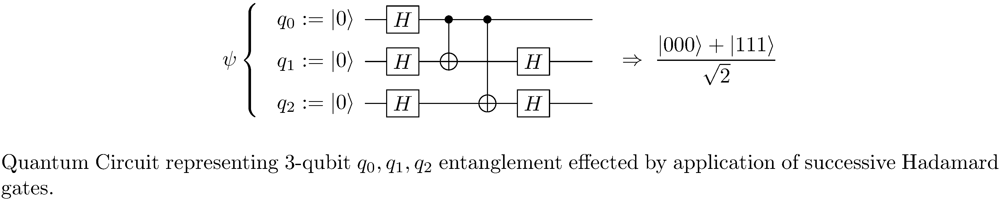
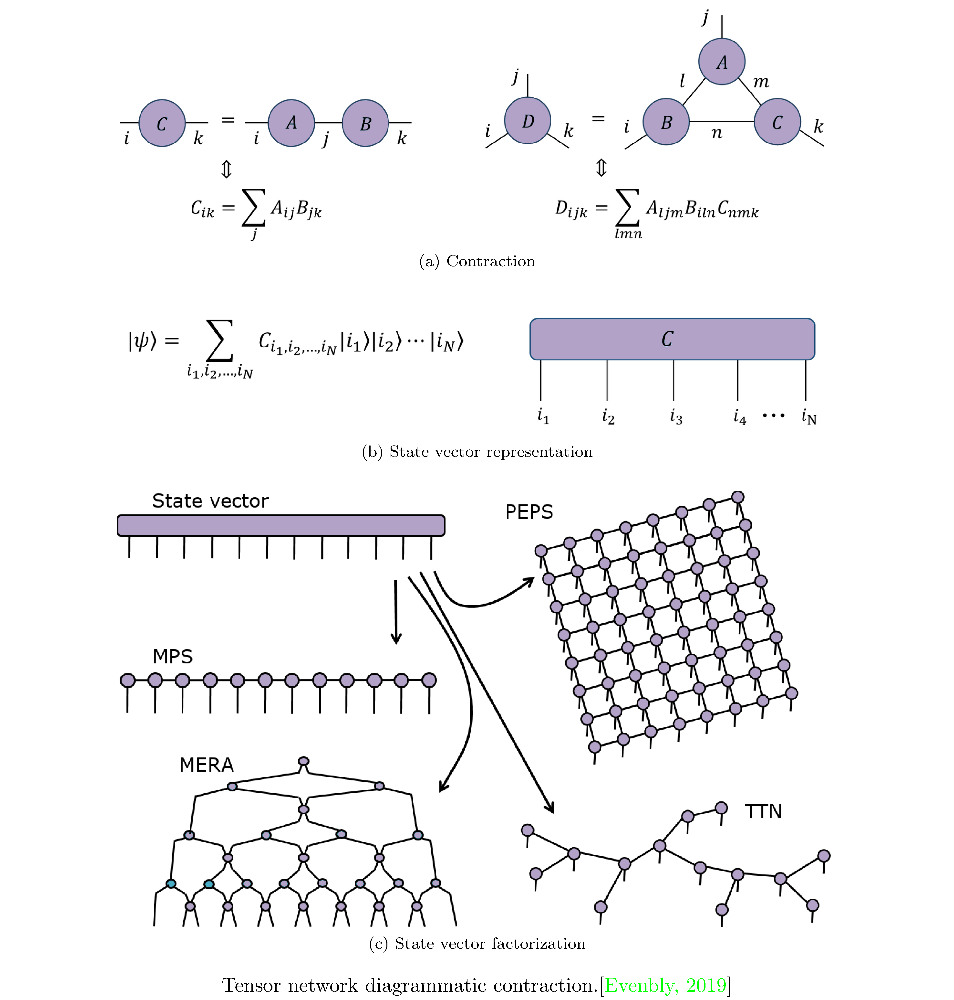
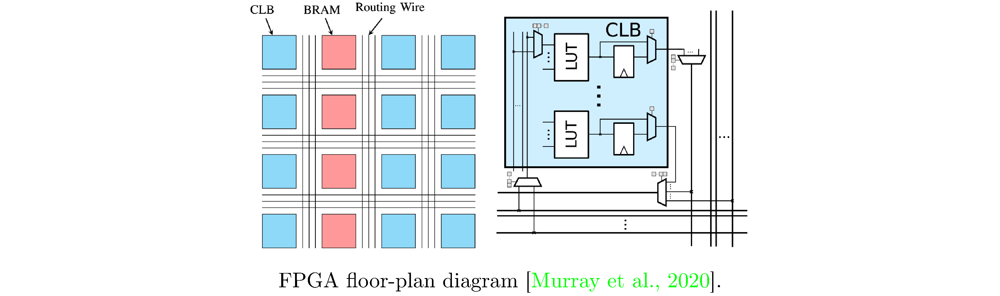
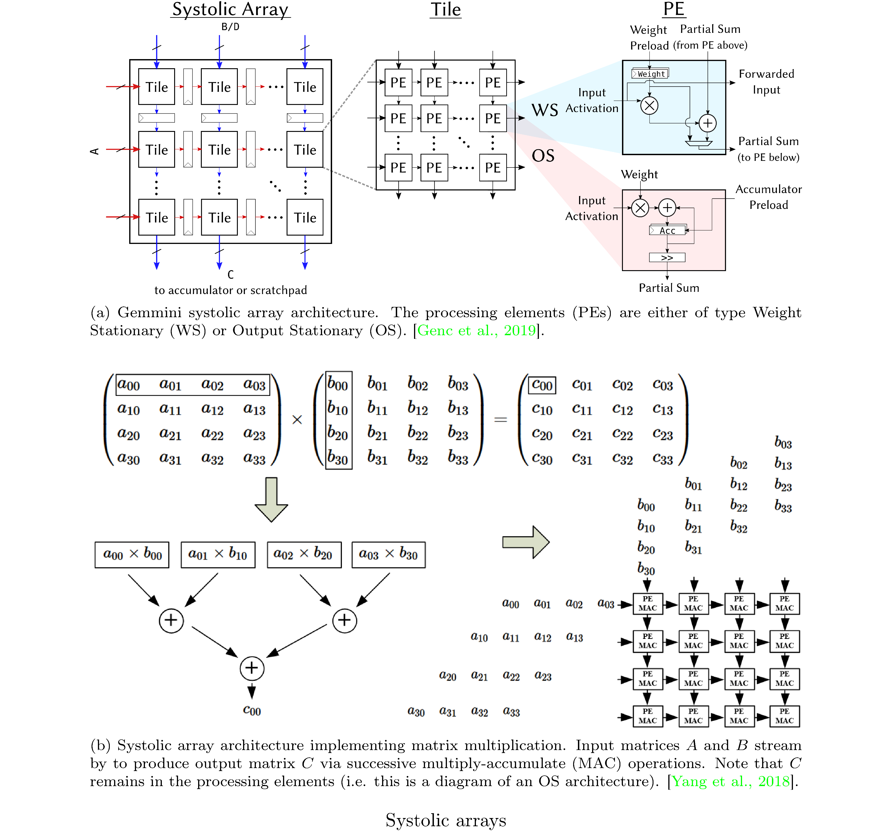
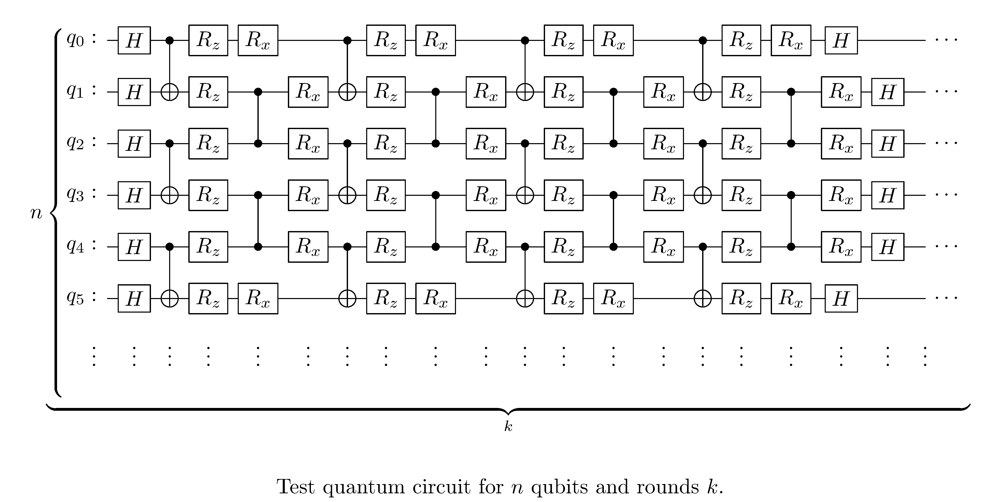
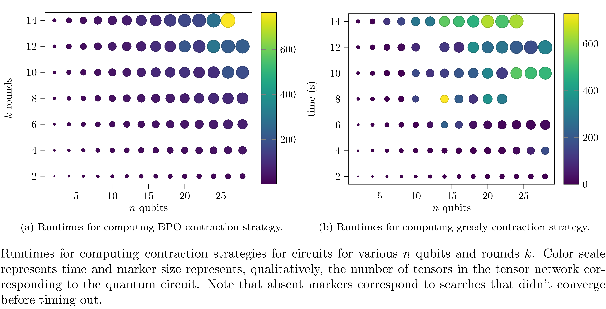
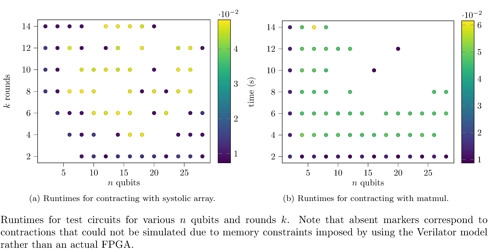
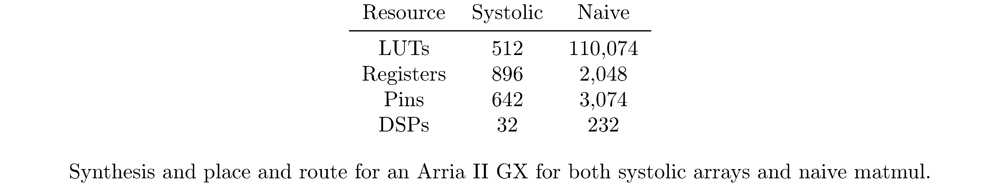

---
author:
- Maksim Levental
bibliography: /Users/maksim/dev_projects/school_work/spring2021/CMSC32900/biblio.bib
csl: springer-mathphys-brackets.csl
excerpt_separator: \<!--more-->
link-citations: true
reference-section-title: References
title: Tensor Networks for Simulating Quantum Circuits on FPGAs
---

# Abstract

Most research in quantum computing today is performed against
simulations of quantum computers rather than true quantum computers.
Simulating a quantum computer entails implementing all of the unitary
operators corresponding to the quantum gates as tensors. For high
numbers of qubits, performing tensor multiplications for these
simulations becomes quite expensive, since $N$-qubit gates correspond
to $2^{N}$-dimensional tensors. \<!--more--> One way to accelerate such a
simulation is to use field programmable gate array (FPGA) hardware to
efficiently compute the matrix multiplications. Though FPGAs can
efficiently perform tensor multiplications, they are memory bound,
having relatively small static random access memory. One way to
potentially reduce the memory footprint of a quantum computing system
is to represent it as a tensor network; tensor networks are a
formalism for representing compositions of tensors wherein economical
tensor contractions are readily identified. Thus we explore tensor
networks as a means to reducing the memory footprint of quantum
computing systems and broadly accelerating simulations of such
systems.

# Introduction

Quantum computing (QC) refers to the manipulation and exploitation of
properties of quantum mechanical (QM) systems to perform computation. QM
systems exhibit properties such as superposition and entanglement and
clever *quantum algorithms* operate on these systems to perform general
computation. Unsurprisingly, the technique was initially conceived of as
a way to simulate physical systems themselves:

> “… \[N\]ature isn’t classical, dammit, and if you want to make a
> simulation of nature, you’d better make it quantum mechanical, and by
> golly it’s a wonderful problem, because it doesn’t look so easy.”

This closing remark from the keynote at the 1<sup>st</sup> Physics of
Computation Conference in 1981, delivered by the late Richard Feynman
\[[1](#ref-feynman1982simulating)\], succinctly, but accurately,
expresses that initial goal of quantum computing. Although modeling and
simulating physical systems on quantum computers remains a thriving area
of research we narrow our focus here to QC as it pertains to solving
general computational problems. Such problems include unstructured
search \[[2](#ref-10.1145/237814.237866)\], integer factorization
\[[3](#ref-365700)\], combinatorial optimization
\[[4](#ref-farhi2014quantum)\], and many others. It is conjectured that
some quantum algorithms enable quantum computers to exceed the
computational power of classical computers \[[5](#ref-Zhong1460)\].

QC systems are composed of so-called quantum bits, or *qubits*, that
encode initial and intermediate states of computations. Transformations
between states are effected by time-reversible transforms, called
*unitary* *operators.* A formalism for representing quantum computation
is the *quantum circuit* formalism, where semantically related
collections of $N$ qubits are represented as *registers* and
transformations are represented as *gates*, connected to those registers
by *wires*, and applied in sequence. As already mentioned, in hardware,
quantum circuits correspond to physical systems that readily exhibit
quantum technical properties; examples of physical qubits include
transmons, ion traps and topological quantum computers
\[[6](#ref-NAP25196)\]. Current state of the art QC systems are termed
Noisy Intermediate-Scale Quantum (NISQ) systems. Such systems are
characterized by moderate quantities of physical qubits (50-100) but
relatively few logical qubits (i.e. qubits robust to interference and
noise). Due to these limitations (and, more broadly, the relative
scarcity of functioning QC systems), most research on quantum algorithms
is performed with the assistance of simulators of QC systems. Such
simulators perform simulations by representing $N$-qubit circuits as
$2^{N}$-dimensional complex vectors and transformations on those vectors
as $2^{N}$-dimensional complex matrix-vector multiplication. Naturally,
due to this exponential growth, naively executing such simulations
quickly become infeasible for $N>50$ qubits
\[[7](#ref-pednault2020paretoefficient)\], both due to memory
constraints and compute time.

It’s the case that matrices are a subclass of a more general
mathematical object called a *tensor* and composition of matrices can be
expressed as *tensor contraction*. *Tensor networks* (TNs) are
decompositions (i.e. factorizations) of very high-dimensional tensors
into networks (i.e. graphs) of low-dimensional tensors. TNs have been
successfully employed in reducing the memory requirements of simulations
of QC systems \[[7](#ref-pednault2020paretoefficient)\]. The critical
feature of tensor networks that make them useful for QC is the potential
to perform tensor contractions on the low-dimensional tensors in an
order such that, ultimately, the memory and compute time requirements
are lower than for the traditional representation. Existing applications
of TNs to quantum circuits focus primarily on memory constraints on
general purpose computers \[[8](#ref-Fried_2018)\] and distributed
environments \[[9](#ref-McCaskey_2018)\].

FPGAs are known to be performant for matrix multiplication uses cases
\[[10](#ref-10.1145/3020078.3021740)\]. Though FPGAs typically run at
lower clock speeds (100-300MHz) than either conventional processors or
even graphics processors they, nonetheless, excel at latency constrained
computations owing to their fully “synchronous” nature (all modules in
the same *clock domain* execute simultaneously). At first glance FPGAs
seem like a suitable platform for performant simulation of quantum
systems when runtime is of the essence. Unfortunately, RAM is one of the
more limited resources on an FPGA and therefore it becomes necessary to
explore memory reduction strategies for simulations (as well as runtime
reduction strategies). Hence, we explore tensor networks as a means of
reducing the memory footprint of quantum circuits with particular
attention to dimensions of the designs space as they pertain to
deployment to FPGAs.

The remainder of this report is organized as follows: section
<a href="#sec:Background" data-reference-type="ref" data-reference="sec:Background">Background</a>
covers the necessary background wherein subsection
<a href="#subsec:Quantum-Computing" data-reference-type="ref" data-reference="subsec:Quantum-Computing">Quantum-Computing</a>
very briefly reviews quantum computation and quantum circuits (with
particular focus on aspects that will be relevant for tensor networks
and FPGAs), section
<a href="#subsec:Tensors-and-Tensor-Networks" data-reference-type="ref" data-reference="subsec:Tensors-and-Tensor-Networks">Tensors-and-Tensor-Networks</a>
defines tensors and tensor networks fairly rigorously and discusses
algorithms for identifying optimal contraction orders, section
<a href="#subsec:FPGAs" data-reference-type="ref" data-reference="subsec:FPGAs">FPGAs</a>
discusses the constraints imposed by virtue of deploying to FPGA,
section
<a href="#sec:Implementation" data-reference-type="ref" data-reference="sec:Implementation">Implementation</a>
describes our implementation of TNs on FPGAs, section
<a href="#sec:Evaluation" data-reference-type="ref" data-reference="sec:Evaluation">Evaluation</a>
reports our results on various random circuits, and section
<a href="#sec:Conclusion" data-reference-type="ref" data-reference="sec:Conclusion">Conclusion</a>
concludes with future research directions.

# Background<span id="sec:Background" label="sec:Background"></span>

## Quantum Computing<span id="subsec:Quantum-Computing" label="subsec:Quantum-Computing"></span>

We very (very) quickly review quantum computing and quantum circuits as
they pertain to our project. For a much more pedagogically sound
introduction consult \[[11](#ref-j2020quantum)\]. As already alluded to,
quantum computing exploits properties of quantum mechanical systems in
order to perform arbitrary computation. The fundamental unit of quantum
computation is a qubit, defined as two-dimensional quantum system with
state vector $\psi$ an element of a Hilbert space[^1] $H$:

$$\psi:=\alpha\begin{pmatrix}1\\
 0 
\end{pmatrix}+\beta\begin{pmatrix}0\\
 1 
\end{pmatrix}\equiv\begin{pmatrix}\alpha\\
 \beta 
\end{pmatrix}$$

where $\alpha,\beta\in\mathbb{\mathbb{C}}$ and
$\left|\alpha\right|^{2}+\left|\beta\right|^{2}=1$. This exhibits the
superposition property of the qubit[^2] in that the squares of the
coefficients are the probabilities of measuring the system in the
corresponding basis state. Collections of qubits have state vectors that
represented by the *tensor product* of the individual states of each
qubit; for example, two qubits $\psi,\phi$ have state vector

$$\psi\otimes\phi:=\begin{pmatrix}\alpha\\
 \beta 
\end{pmatrix}\otimes\begin{pmatrix}\alpha'\\
 \beta' 
\end{pmatrix}\equiv\begin{pmatrix}\alpha\alpha'\\
\alpha\beta'\\
\beta\alpha'\\
\beta\beta'
\end{pmatrix}$$

where the second $\otimes$ is the Kronecker product and $\alpha\alpha'$
indicates conventional complex multiplication. Note that the basis
relative to which $\psi\otimes\phi$ is represented is the standard basis
for $\mathbb{C}^{4}$ and thus we observe exponential growth in the size
of the representation of an $N$-qubit system. An alternative notation
for state vectors is Dirac notation; for example, for a single qubit

$$\ket{\psi}\equiv\alpha\ket{0}+\beta\ket{1}$$

and a 2-qubit system

$$\begin{aligned}
\ket{\psi}\otimes\ket{\phi} & \equiv\left(\alpha\ket{0}+\beta\ket{1}\right)\otimes\left(\alpha'\ket{0}+\beta'\ket{1}\right)\\
 & \equiv\alpha\alpha'\ket{0}\otimes\ket{0}+\alpha\beta'\ket{0}\otimes\ket{1}+\beta\alpha'\ket{1}\otimes\ket{0}+\beta\beta'\ket{1}\otimes\ket{1}\\
 & \equiv\alpha\alpha'\ket{0}\ket{0}+\alpha\beta'\ket{0}\ket{1}+\beta\alpha'\ket{1}\ket{0}+\beta\beta'\ket{1}\ket{1}\\
 & \equiv\alpha\alpha'\ket{00}+\alpha\beta'\ket{01}+\beta\alpha'\ket{10}+\beta\beta'\ket{11}\\
 & \equiv\alpha\alpha'\ket{0}+\alpha\beta'\ket{1}+\beta\alpha'\ket{2}+\beta\beta'\ket{3}\end{aligned}$$

where in the last line we’ve used the decimal representation for the bit
strings identifying the basis states. Of particular import for QC are
the *entangled* or *bell states*; they correspond to multi-qubit states,
such as

$$\ket{\xi}=\frac{1}{\sqrt{2}}\ket{00}+\frac{1}{\sqrt{2}}\ket{11}$$

that cannot be “factored” into component states[^3]. Then, naturally,
changes in qubit states are represented as unitary[^4] matrices $U$; for
example

$$\psi'=U\psi=\begin{pmatrix}U_{00} & U_{01}\\
U_{10} & U_{11}
\end{pmatrix}\begin{pmatrix}\alpha\\
 \beta 
\end{pmatrix}=\begin{pmatrix}U_{00}\alpha+U_{01}\beta\\
 U_{10}\alpha+U_{11}\beta 
\end{pmatrix}$$

Matrix representations of transformations on multi-qubit states are
constructed using the Kronecker product on the individual matrix
representations; for example

$$U\otimes V:=\begin{pmatrix}U_{00}V & U_{01}V\\
U_{10}V & U_{11}V
\end{pmatrix}:=\begin{pmatrix}U_{00}V_{00} & U_{00}V_{01} & U_{01}V_{00} & U_{01}V_{01}\\
U_{00}V_{10} & U_{00}V_{11} & U_{01}V_{10} & U_{01}V_{11}\\
U_{10}V_{00} & U_{10}V_{01} & U_{11}V_{00} & U_{11}V_{01}\\
U_{10}V_{10} & U_{10}V_{11} & U_{11}V_{10} & U_{11}V_{11}
\end{pmatrix}$$

Here we see again an exponential growth in representation size as a
function of the number of qubits.

As already alluded to, quantum circuits are a formalism for representing
quantum computation in general and algorithms designed for quantum
computers in particular. In the quantum circuit formalism qubit states
are represented by wires and unitary transformations are represented by
gates (see figure
<a href="#fig:1" data-reference-type="ref" data-reference="fig:Quantum-Circuit-Teleportation">1</a>),
much like classical combinational logic circuits might be, though,
whereas combinational logic is “memoryless”[^5], sequences of quantum
gates specified by a quantum circuit do in fact connote the evolution
(in time) of the qubits. In addition quantum gates, as opposed to
classical gates, are necessarily reversible and hence there are no
quantum analogs to some classical gates such as NOT and OR.

<div id="fig:1" class="figure*">

<p align="center">
  
</p>

</div>

## Tensors and Tensor Networks<span id="subsec:Tensors-and-Tensor-Networks" label="subsec:Tensors-and-Tensor-Networks"></span>

We quickly define tensors and tensor networks and then move on to tensor
network methods for simulating quantum circuits.

### Tensors

One definition of a tensor[^6] $T$ is as an element of a tensor product
space[^7]:

$$T\in\underbrace{V\otimes\cdots\otimes V}_{p{\text{ copies}}}\otimes\underbrace{V^{*}\otimes\cdots\otimes V^{*}}_{q{\text{ copies}}}$$

where $V^{\*}$ is dual[^8] to $V$. Then $T$, in effect, acts a
multilinear map

$${\displaystyle T:\underbrace{V^{*}\times\dots\times V^{*}}_{p{\text{ copies}}}\times\underbrace{V\times\dots\times V}_{q{\text{ copies}}}\rightarrow\mathbb{R}}$$

by “applying” $p$ elements from $V$ to $p$ elements of $V^{\*}$ and $q$
elements from $V^{\*}$ to $q$ elements of $V$. Note the swapping of the
orders of $V,V^{*}$ in both the definitions and the description. $T$’s
coordinate basis representation

$${\displaystyle T\equiv T_{j_{1}\dots j_{q}}^{i_{1}\dots i_{p}}\;\mathbf{e}_{i_{1}}\otimes\cdots\otimes\mathbf{e}_{i_{p}}\otimes\mathbf{e}^{j_{1}}\otimes\cdots\otimes\mathbf{e}^{j_{q}}}\label{eq:tensor_coord}$$

is determined by its evaluation on each set of bases

$${\displaystyle T_{j_{1}\dots j_{q}}^{i_{1}\dots i_{p}}:=T\left(\mathbf{e}^{i_{1}},\ldots,\mathbf{e}^{i_{p}},\mathbf{e}_{j_{1}},\ldots,\mathbf{e}_{j_{q}}\right)}$$

The pair $\left(p,q\right)$ is called the *type* or *valence* of **$T$**
while $\left(p+q\right)$ is the *order* of the tensor. **Note that we do
not use rank to mean either of these things**[^9]. Furthermore, eqn.
$\eqref{eq:tensor_coord}$ in fact represents a linear sum of basis
elements, as it employs Einstein summation convention[^10]. Note we make
liberal use of summation convention in the following but occasionally
use explicit sums when it improves presentation (i.e. when we would like
to emphasize a particular contraction).

There are two important operations on tensors we need to define.
Firstly, we can form the tensor product $Z$ of two tensors $T,W$, of
types $\left(p,q\right),\left(r,s\right)$ respectively, to obtain a
tensor of type $\left(p+r,q+s\right)$:

$$\begin{aligned}
Z & :=T\otimes W\\
 & \;=\left(T_{j_{1}\dots j_{q}}^{i_{1}\dots i_{p}}\;\mathbf{e}_{i_{1}}\otimes\cdots\otimes\mathbf{e}_{i_{p}}\otimes{\mathbf{e}}^{j_{1}}\otimes\cdots\otimes{\mathbf{e}}^{j_{q}}\right)\otimes\left(W_{l_{1}\dots l_{s}}^{k_{1}\dots k_{r}}\;\mathbf{e}_{k_{1}}\otimes\cdots\otimes\mathbf{e}_{k_{r}}\otimes{\mathbf{e}}^{l_{1}}\otimes\cdots\otimes{\mathbf{e}}^{l_{s}}\right)\\
 & \;=\left(T_{j_{1}\dots j_{q}}^{i_{1}\dots i_{p}}W_{l_{1}\dots l_{s}}^{k_{1}\dots k_{r}}\;\mathbf{e}_{i_{1}}\otimes\cdots\otimes\mathbf{e}_{i_{p}}\otimes\mathbf{e}_{k_{1}}\otimes\cdots\otimes\mathbf{e}_{k_{r}}\otimes{\mathbf{e}}^{j_{1}}\otimes\cdots\otimes{\mathbf{e}}^{j_{q}}\otimes{\mathbf{e}}^{l_{1}}\otimes\cdots\otimes{\mathbf{e}}^{l_{s}}\right)\\
 & :=Z_{j_{1}\dots j_{q+s}}^{i_{1}\dots i_{p+r}}\;\mathbf{e}_{i_{1}}\otimes\cdots\otimes\mathbf{e}_{i_{p+r}}\otimes{\mathbf{e}}^{j_{1}}\otimes\cdots\otimes{\mathbf{e}}^{j_{q+s}}\end{aligned}$$

Despite it being obvious, its important to note that the tensor product
$Z$ produces a tensor of order $\left(p+r+q+s\right)$, i.e. higher than
either of the operands. On the contrary, *tensor contraction* reduces
the order of a tensor. We define the contraction $Y$ of type
$\left(a,b\right)$ of a tensor $T$ to be the “pairing” of the $a$th and
$b$th bases:

$$\begin{aligned}
Y & :=T_{j_{1}\dots j_{q}}^{i_{1}\dots i_{p}}\;\mathbf{e}_{i_{1}}\otimes\cdots\otimes\mathbf{e}_{i_{a-1}}\otimes\mathbf{e}_{i_{a+1}}\otimes\cdots\otimes\mathbf{e}_{i_{p}}\otimes\left(\mathbf{e}_{i_{a}}\cdot\mathbf{e}^{j_{b}}\right)\otimes\mathbf{e}^{j_{1}}\otimes\cdots\otimes\mathbf{e}^{j_{b-1}}\otimes\mathbf{e}^{j_{b+1}}\otimes\cdots\otimes\mathbf{e}^{j_{q}}\\
 & \;=T_{j_{1}\dots j_{q}}^{i_{1}\dots i_{p}}\delta_{i_{a}}^{j_{b}}\;\mathbf{e}_{i_{1}}\otimes\cdots\otimes\mathbf{e}_{i_{a-1}}\otimes\mathbf{e}_{i_{a+1}}\otimes\cdots\otimes\mathbf{e}_{i_{p}}\otimes\mathbf{e}^{j_{1}}\otimes\cdots\otimes\mathbf{e}^{j_{b-1}}\otimes\mathbf{e}^{j_{b+1}}\otimes\cdots\otimes\mathbf{e}^{j_{q}}\qquad\left(\text{since }\mathbf{e}_{i}\cdot\mathbf{e}^{j}=\delta_{i}^{j}\right)\\
 & \;=\sum_{j_{b}}T_{j_{1}\dots j_{b}\dots j_{q}}^{i_{1}\dots j_{b}\dots i_{p}}\;\mathbf{e}_{i_{1}}\otimes\cdots\otimes\mathbf{e}_{i_{a-1}}\otimes\mathbf{e}_{i_{a+1}}\otimes\cdots\otimes\mathbf{e}_{i_{p}}\otimes\mathbf{e}^{j_{1}}\otimes\cdots\otimes\mathbf{e}^{j_{b-1}}\otimes\mathbf{e}^{j_{b+1}}\otimes\cdots\otimes\mathbf{e}^{j_{q}}\\
 & :=Y_{j_{1}\dots i_{b-1}i_{b+1}\dots j_{q}}^{i_{1}\dots i_{a-1}i_{a+1}\dots i_{p}}\;\mathbf{e}_{i_{1}}\otimes\cdots\otimes\mathbf{e}_{i_{a-1}}\otimes\mathbf{e}_{i_{a+1}}\otimes\cdots\otimes\mathbf{e}_{i_{p}}\otimes\mathbf{e}^{j_{1}}\otimes\cdots\otimes\mathbf{e}^{j_{b-1}}\otimes\mathbf{e}^{j_{b+1}}\otimes\cdots\otimes\mathbf{e}^{j_{q}}\end{aligned}$$

where $\left(\cdot\right)$ means inner product. Notice that the order of
$Y$ is $\left(p-1,q-1\right)$. Finally notice that we can omit writing
out bases and just manipulate coordinates. We shall do as such when it
simplifies presentation.

As mentioned in the introduction, matrices can be represented as
tensors; for example, the two dimensional $N\times N$ matrix $M$ is
taken to be a tensor of type $\left(1,1\right)$ with basis
representation

$${\displaystyle M\equiv M_{j}^{i}\;\mathbf{e}_{i}\otimes\mathbf{e}^{j}}$$

where upper indices correspond to the row index and lower indices
correspond to the column index of the conventional matrix representation
and both range from $1$ to $N$. The attentive reader will notice that
the coordinate representation of the tensor product for type
$\left(1,1\right)$ tensors is exactly the Kronecker product for
matrices. Similarly, tensor contraction for type $\left(1,1\right)$
tensors is the familiar matrix trace:

$$M_{j}^{i}\left(\mathbf{e}_{i}\cdot\mathbf{e}^{j}\right)=M_{j}^{i}\delta_{i}^{j}=\sum_{i=1}^{N}M_{i}^{i}$$

More usefully, we can express matrix-vector multiplication in terms of
tensor contraction; let *$$\mathbf{x}:=\begin{pmatrix}x^{1}\\
 x^{2} 
\end{pmatrix}\equiv x^{1}\mathbf{e}_{1}+x^{2}\mathbf{e}_{2}\equiv x^{i}\mathbf{e}_{i}$$*
where we switch to valence index notation in the column vector for
closer affinity with tensor notation. Then it must be the case that

$$\mathbf{y}=M\mathbf{x}=\left(M_{j}^{i}\mathbf{e}_{i}\otimes\mathbf{e}^{j}\right)\left(x^{k}\mathbf{e}_{k}\right)=\left(M_{j}^{i}x^{k}\mathbf{e}_{i}\right)\left(\mathbf{e}^{j}\cdot\mathbf{e}_{k}\right)=M_{j}^{i}x^{k}\delta_{k}^{j}\mathbf{e}_{i}=M_{j}^{i}x^{j}\mathbf{e}_{i}$$

Letting $y^{i}:=M_{j}^{i}x^{j}$ we recognize conventional matrix-vector
multiplication. Employing tensor contraction in this way extends to
matrix-matrix multiplication (and tensor composition more broadly); for
two type $\left(1,1\right)$ tensors $M,L$ we can form the type
$\left(1,1\right)$ tensor $Z$ corresponding to matrix product $M\cdot L$
of $N\times N$ by first taking the tensor product

$$Z_{lj}^{ik}:=M_{l}^{i}L_{j}^{k}$$

The attentive reader will notice that the coordinate representation of
two tensors is exactly the Kronecker product of two matrices. Then
contracting along the off diagonal

$$Z_{j}^{i}:=Z_{kj}^{ik}=M_{k}^{i}L_{j}^{k}\equiv\sum_{k=1}^{N}M_{k}^{i}L_{j}^{k}\label{eq:matrix_mult}$$

One can confirm that this is indeed conventional matrix multiplication
of two $N\times N$ matrices. In general, stated simply, when contracting
indices of a tensor product, contraction can be understood to be a sum
over shared indices.

### Tensor Networks

<div id="fig:2" class="figure*">

<p align="center">
  
</p>

</div>

Tensor networks (TNs) are a way to factor tensors with large orders into
networks of tensors with lower orders; since the number of parameters a
tensor consists of is exponential in the order of the tensor, smaller
order tensors are much preferable computationally. They were first used
to study ground states of one dimensional quantum many-body systems
\[[13](#ref-PhysRevLett.69.2863)\] but have since been applied in other
areas (such as machine learning \[[14](#ref-glasser2019expressive)\]).
TNs lend themselves to a diagrammatic representation which can be used
to reason about such factorizations (figure
<a href="#fig:2" data-reference-type="ref" data-reference="fig:Tensor-networks-contraction">2</a>).
We will primarily be interested in TNs as a means to factoring the
state-vector of an $N$-qubit system (see figure
<a href="#fig:2" data-reference-type="ref" data-reference="fig:Tensor-networks-state-vector-representation">2</a>)

$$\ket{\psi}:=\sum_{i_{1}i_{2}\dots i_{N}}C^{i_{1}i_{2}\dots i_{N}}\ket{i_{1}}\ket{i_{2}}\cdots\ket{i_{N}}\label{eq:state_vector}$$

for which its common to propose an ansatz factorizations:

-   **Matrix Product States (MPS)** \[[15](#ref-Kl_mper_1993)\], which
    yields factorization

    $$C^{i_{1}i_{2}\dots i_{N}}\equiv A_{j_{1}}^{i_{1}}A_{j_{2}}^{i_{1}j_{1}}\cdots A_{j_{N-1}}^{i_{N-1}j_{N-2}}A^{i_{N}j_{N-1}}$$

    where $j$ are called *bond indices.* If each index $i$ has dimension
    $d$ (i.e. takes on values 1 to $d$) then $C$ is specified by $d^{N}$
    parameters and can always be represented by an MPS factorization
    $Ndm^{2}$ parameters, where $m:=d^{N/2}$ is the bond dimension.
    While for this naive representation $d^{N}<Ndm^{2}$, in practice $m$
    is fixed to some moderate size such that $d^{N}>Ndm^{2}$ and the MPS
    factorization functions as an approximation.

-   **Projected Entangled Pair States (PEPS)**
    \[[16](#ref-Verstraete:2004cf)\], which is a generalization of MPS
    to higher spatial dimensions, i.e. TNs that correspond to lattices
    of contractions of tensors, which themselves represent pairwise
    entangled quantum systems. Naturally, such a series of contractions
    doesn’t lend itself to being expressed in traditional notation and
    thus we observe the power of tensor network diagrams (see PEPS in
    figure
    <a href="#fig:2" data-reference-type="ref" data-reference="fig:Tensor-Networks-state-vector-factorization">2</a>).

-   **Tree Tensor Networks (TTN)** \[[17](#ref-PhysRevA.74.022320)\], a
    further generalization where tensors are entangled (and therefore
    contracted) hierarchically. In fact TTNs bear the closest
    resemblance to quantum circuits.

-   **Multi-scale Entanglement Renormalization Ansatz (MERA)**
    \[[18](#ref-PhysRevLett.99.220405)\], a specific type of TTN where
    the tensors are alternatingly unitaries and isometries[^11].

### TNs for Simulating Quantum Circuits

Factoring eqn. $\eqref{eq:state_vector}$ is only the first step to
successfully simulating a quantum circuit. By representing some final
state as a tensor as well, and contracting across all indices (called
*contracting the network*), we can calculate the amplitude for that
particular state. Since tensor contraction is associative[^12], the
order in which tensors are actually contracted is a “hyper-parameter” of
TN methods; finding the optimal contraction order, with respect to
accuracy (assuming some approximation has been made in constructing the
factorization), compute time, and memory requirements is critical.

In particular we focus on contraction orders for TTNs as they most
closely resemble quantum circuits. For a TTN consisting of $N$ tensors
(corresponding to $N$ gates) with maximum order $p$, worst case, we can
see that contraction time takes
$O\left(N\exp\left(O\left(p\right)\right)\right)$ since, in general,
contracting across all indices of a pair of tensors is exponential in
their orders[^13]. Markov et al. \[[19](#ref-10.1137/050644756)\] showed
that there in fact exists a contraction ordering which results in a
contraction time of
$O\left(N^{O\left(1\right)}\exp\left(O\left(\operatorname{tw}\left(G^{L}\right)\right)\right)\right)$
where $G^{L}$ is the line graph[^14] of the tensor network and
$\operatorname{tw}\left(G^{L}\right)$ is the tree-width[^15] of $G^{L}$.

For quantum circuits consisting of many few qubit gates this technique
produces a much more (runtime) efficient evaluation of the circuit;
indeed Markov et al. further show that any TTN corresponding to a
quantum circuit with $N$ gates, where the number of gates that act on
any pair of qubits is bounded by $r$, has contraction time
$O\left(N^{O\left(1\right)}\exp\left(O\left(r\right)\right)\right)$.

Markov et al.’s results are not tight; their construction finds some
tree-decomposition with the correct corresponding tensor contraction
order that suits their aim (overall runtime complexity of the
translation from quantum circuit to TTN and the ultimate contraction).
In reality there are often contraction orders that are much more space
and runtime efficient. Though, in general problem is NP-hard
\[[20](#ref-Arnborg87complexityof)\], for particular TTNs (corresponding
to circuits) there are heuristics, such as non-adjacent contractions
\[[7](#ref-pednault2020paretoefficient)\], that produce more efficient
orders. Alternatively, randomized search and Bayesian optimization can
be used to identify efficient contraction orders \[[8](#ref-Fried_2018),
[21](#ref-Gray_2021)\].

## FPGAs<span id="subsec:FPGAs" label="subsec:FPGAs"></span>

<div id="fig:3" class="figure*">

<p align="center">
  
</p>

</div>

A field-programmable gate array (FPGA) is a device designed to be
configured by a user into various arrangements of (classical) gates and
memory. FPGAs consist of arrays (hence the name) of configurable logic
blocks (CLBs), static ram (SRAM), and programmable busses that connect
CLBs and SRAM into various topologies (see figure
<a href="#fig:3" data-reference-type="ref" data-reference="fig:FPGA-floorplan-diagram">3</a>).
The CLBs typically contain arithmetic units (such as adders,
multipliers, and accumulators) and lookup tables (LUTs), that can be
programmed to represent truth tables for many boolean functions. Using
hardware description languages (such as VHDL or Verilog) designers
specify modules and compose them into circuits (also known as
*data-flows*) that perform arbitrary computation. These circuits then go
through a *place and route* procedure before ultimately being
instantiated on the FPGA as *processing elements* (PEs) and connections
between PEs.

While modules consisting purely of combinational logic compute their
outputs at the stated clock speed of the FPGA, inevitably I/O (i.e.
fetching data from memory) interleaved with such modules (otherwise
arranged into a pipeline architecture) creates pipeline stalls. Thus,
it’s essential that FPGA designs are as compute bound as possible
(rather than I/O bound). In particular, we explore I/O minimal
generalized matrix multiplication (GEMM)
\[[22](#ref-10.1145/3373087.3375296)\] and other *systolic array*
architectures \[[23](#ref-10.1145/3431920.3439292),
[24](#ref-genc2019gemmini)\]. A systolic architecture
\[[25](#ref-1653825)\] is a gridded, pipelined, array of PEs that
processes data as the data flows[^16] through the array. Crucially, a
systolic architecture propagates partial results as well as input data
through the pipeline (see figure
<a href="#fig:4" data-reference-type="ref" data-reference="fig:systolic-arrays">4</a>).
Systolic arrays are particularly suited for I/O efficient matrix
multiplication owing to the pipelining of inputs (see figure
<a href="#fig:4" data-reference-type="ref" data-reference="fig:systolic-array-diagram">4</a>).

<div id="fig:4" class="figure*">

<p align="center">
  
</p>

</div>

One remaining hurdle to simulating quantum computations (i.e. carrying
out tensor contractions) on FPGAs is SRAM. The standard remediation is
to perform arithmetic with reduced precision[^17]. There is evidence
that suggests that simulations of quantum circuits, of varying depths
\[[26](#ref-betelu2020limits)\], are robust to reduced precision
computation as long as that loss of precision is uncorrelated
\[[27](#ref-10.1145/3295500.3356155)\] i.e. insofar as it can be treated
as uncorrelated noise.

# Implementation<span id="sec:Implementation" label="sec:Implementation"></span>

<div id="fig:5" class="figure*">

<p align="center">
  
</p>

</div>

We use `quimb` \[[28](#ref-Gray2018)\] to specify quantum circuits and
generate TNs therefrom. In particular we simulate circuits for various
$n$ qubits and *rounds* $k$, where each consists of alternating qubit
couplings of the form in figure
<a href="#fig:5" data-reference-type="ref" data-reference="fig:Quantum-Circuit-representing-1-1">5</a>.
We also use Bayesian parameter optimization (BPO)
\[[21](#ref-Gray_2021)\] to find tensor contraction orders and compare
against naive greedy search. Note that for both strategy we set a
timeout of 600 seconds. We then deploy the contraction strategy that
produces the fewest number of tensor contractions balanced against the
orders of intermediate tensors[^18]. In order to expedite the process of
deploying we precompute some first few tensor contraction such that all
tensors deployed to the FPGA are square and congruent (i.e. all of the
same dimensions). For tensors of order greater than $\left(1,1\right)$
(i.e. tensors that are not matrices) we transform them into
$\left(1,1\right)$ tensors by taking the Kronecker product of all
component $\left(1,1\right)$ tensors; to be precise we perform the
following operation on the $\left(p,q\right)$ order tensor `t`

```
mats = [t[idx] for idx in np.ndindex(t.shape[:-2])]
    block_mat = block_diag(*qubit_mats)
```

where `block_diag` builds a block diagonal matrix of its arguments. All
of our code has been made available on GitHub[^19].

For defining FPGA circuits we use Chisel \[[29](#ref-6241660)\] as a
HDL, by way of an adaptation of the Gemmini systolic array generator
\[[24](#ref-genc2019gemmini)\]. Notably we experiment with using Gemmini
as an accelerator (i.e. fully parameterizing the weights/entries of the
matrices) and “hardcoding” certain gates/tensors, i.e. naive matrix
mutiplication. One possible advantage of the latter approach over the
former is a reduction in loads from memory for the weights. The success
of either approach depends heavily on whether certain sequences of fixed
gates can actually be pipelined or alternatively deployed in toto to the
FPGA. We hypothesize that this might depend on the depth and gate count
of the circuits/TNs. See figure
<a href="#fig:6" data-reference-type="ref" data-reference="fig:FPGA-implementations">6</a>
for the netlists corresponding to our systolic array and naive matrix
multiplication circuit implementations. Note that all (complex)
arithmetic was done in 32 bit fixed precision for both implementations,
with 28 bits allocated behind the binary point.

One challenge we faced was in deploying to real hardware[^20];
unfortunately time and administrative challenges[^21] prevented us from
actually deploying to real FPGAs. As a substitute we used the well-known
and trusted Verilog simulator[^22] Verilator[^23], which transpiles
Verilog (which Chisel generates) to a cycle-accurate model in C++. We
then executed this cycle-accurate model to collect proxy measurements.
Note that for certain configurations (generally those with high qubit
and round count) we could not successfully simulate due to memory
constraints on the workstation running the Verilator produced model.

<div id="fig:6" class="figure*">

<p align="center">
  
</p>

</div>

# Evaluation<span id="sec:Evaluation" label="sec:Evaluation"></span>

<div id="fig:7" class="figure*">

<p align="center">
  
</p>

</div>

<div id="fig:8" class="figure*">

<p align="center">
  
</p>

</div>

We perform two sets of evaluations. Even though it was not the central
goal of our exploration, we first compare the time required to compute a
tensor contraction strategy across $n$ qubits and rounds $k$ for the
greedy search strategy and the BPO search strategy. We then addressed
our central goal by comparing the actual runtime for performing the
discovered tensor contraction on both the systolic array implementation
(see fig.
<a href="#fig:6" data-reference-type="ref" data-reference="fig:os-matrix-multiplication-netlist">6</a>)
and the “hardcoded” naive matrix multiplication implementation (see fig.
<a href="#fig:6" data-reference-type="ref" data-reference="fig:naive-matmul-netlist">6</a>).

Some interesting things to note regarding searching for contractions:
computing (not evaluating) the optimal contraction strategy (i.e. using
BPO) is generally more performant that greedy search (see figures
<a href="#fig:7" data-reference-type="ref" data-reference="fig:opt_contract_run-1">7</a>,
<a href="#fig:7" data-reference-type="ref" data-reference="fig:greedy_contract_run-1">7</a>).
The likely reason for this is that BPO converges more quickly and more
efficiently searches the space of possible contraction orders than
greedy search (which greedily optimizes some surrogate objective). Also
note that, in fact, for certain configurations greedy didn’t even
converge within the timeout.

Regarding the differences in the evaluation times of the contraction
orders (figures
<a href="#fig:8" data-reference-type="ref" data-reference="fig:opt_contract_run">8</a>,
<a href="#fig:8" data-reference-type="ref" data-reference="fig:greedy_contract_run">8</a>)
it’s clear that the systolic array implementation performs better in
terms of both memory requirements and runtime. This is paradoxically
both obvious and surprising. As already mentioned, one expects systolic
arrays to have improved performance relative to naive matrix
multiplication for streaming data (and indeed, in general, they do) but
for this use case (where all matrix elements are known at deploy time)
one also expects that latency incurred by pipelining would offset that
performance improvement. One hypothesis for this is that the difference
is an artifact of simulating the FPGA implementations insofar as
simulating a more densely connected FPGA implementation (see the
differences between
<a href="#fig:6" data-reference-type="ref" data-reference="fig:os-matrix-multiplication-netlist">6</a>
and
<a href="#fig:6" data-reference-type="ref" data-reference="fig:naive-matmul-netlist">6</a>)
is more compute intensive, especially with respect to heap allocations
(since systolic arrays incur more loads from memory). To corroborate
this hypothesis we used Intel’s Quartus EDA[^24] tool to synthesize and
place and route (for an Arria II GX). Indeed the naive implementation
consumes an order of magnitude (and sometimes several) more of each type
of resource (see table
<a href="#tab:Synthesis-and-place" data-reference-type="ref" data-reference="tab:Synthesis-and-place">1</a>).

<div class="centering">

<div id="tab:Synthesis-and-place">

<div id="fig:9">

<p align="center">
  
</p>

</div>

</div>

</div>

<div class="centering">

</div>

# Conclusion<span id="sec:Conclusion" label="sec:Conclusion"></span>

We explored tensor networks deployed to FPGAs as a means of accelerating
simulations of quantum circuits. In order to accomplish this goal we
expressed tensor contraction as sequences of matrix multiplications and
implemented two different matrix multiplication FPGA designs: systolic
arrays, which operate on streaming matrix elements and naive matrix
multiplication, which wholecloth instantiates all the necessary MAC
operations. In order to choose the contraction orders we used an “off
the shelf” library which searches for a suitable contraction by either
performing greedy search or Bayesian optimization. We compared the
performance of both the contraction search strategy and each contraction
evaluation implementation. Unfortunately we were unable to obtain access
to FPGA devices and thus we made do with cycle-accurate simulations.
Results for both comparison were generally in agreement with intuition:
BPO converged to a contraction order more effectively (more quickly and
more robustly) than greedy search and systolic arrays evaluated the
contractions more efficiently than naive matrix multiplication.

Possible future work includes actually deploying to real FPGAs and then
further comparing performance to the simulations performed here. Another
particularly interesting research direction is the tangential problem of
discovering optimal tensor contraction orders. Finding such tensor
contraction orders is ultimately a combinatorial optimization problem.
It occurs to us that possibly a deep learning approach could be
effective. Recently there has been work on reinforcement learning for
combinatorial optimization
\[[30](#ref-Barrett_Clements_Foerster_Lvovsky_2020)\] and monte-carlo
tree-search for combinatorial optimization \[[31](#ref-abe2020solving)\]
that could, possibly, be adapted to this problem in a straightforward
fashion.

# References

<div id="refs" class="references csl-bib-body">

<div id="ref-feynman1982simulating" class="csl-entry">

<span class="csl-left-margin">1. </span><span
class="csl-right-inline">Feynman, R.P.: Simulating physics with
computers. International journal of theoretical physics. 21, 467–488
(1982)</span>

</div>

<div id="ref-10.1145/237814.237866" class="csl-entry">

<span class="csl-left-margin">2. </span><span
class="csl-right-inline">Grover, L.K.: A fast quantum mechanical
algorithm for database search. In: Proceedings of the twenty-eighth
annual ACM symposium on theory of computing. pp. 212–219. Association
for Computing Machinery, New York, NY, USA (1996)</span>

</div>

<div id="ref-365700" class="csl-entry">

<span class="csl-left-margin">3. </span><span
class="csl-right-inline">Shor, P.W.: Algorithms for quantum computation:
Discrete logarithms and factoring. In: Proceedings 35th annual symposium
on foundations of computer science. pp. 124–134 (1994)</span>

</div>

<div id="ref-farhi2014quantum" class="csl-entry">

<span class="csl-left-margin">4. </span><span
class="csl-right-inline">Farhi, E., Goldstone, J., Gutmann, S.: A
quantum approximate optimization algorithm,
<https://arxiv.org/abs/1411.4028>, (2014)</span>

</div>

<div id="ref-Zhong1460" class="csl-entry">

<span class="csl-left-margin">5. </span><span
class="csl-right-inline">Zhong, H.-S., Wang, H., Deng, Y.-H., Chen,
M.-C., Peng, L.-C., Luo, Y.-H., Qin, J., Wu, D., Ding, X., Hu, Y., Hu,
P., Yang, X.-Y., Zhang, W.-J., Li, H., Li, Y., Jiang, X., Gan, L., Yang,
G., You, L., Wang, Z., Li, L., Liu, N.-L., Lu, C.-Y., Pan, J.-W.:
Quantum computational advantage using photons. Science. 370, 1460–1463
(2020). <https://doi.org/10.1126/science.abe8770></span>

</div>

<div id="ref-NAP25196" class="csl-entry">

<span class="csl-left-margin">6. </span><span
class="csl-right-inline">Sciences Engineering, N.A. of, Medicine:
Quantum computing: Progress and prospects. The National Academies Press,
Washington, DC (2019)</span>

</div>

<div id="ref-pednault2020paretoefficient" class="csl-entry">

<span class="csl-left-margin">7. </span><span
class="csl-right-inline">Pednault, E., Gunnels, J.A., Nannicini, G.,
Horesh, L., Magerlein, T., Solomonik, E., Draeger, E.W., Holland, E.T.,
Wisnieff, R.: Pareto-efficient quantum circuit simulation using tensor
contraction deferral, <https://arxiv.org/abs/1710.05867>, (2020)</span>

</div>

<div id="ref-Fried_2018" class="csl-entry">

<span class="csl-left-margin">8. </span><span
class="csl-right-inline">Fried, E.S., Sawaya, N.P.D., Cao, Y.,
Kivlichan, I.D., Romero, J., Aspuru-Guzik, A.: qTorch: The quantum
tensor contraction handler. PLOS ONE. 13, e0208510 (2018).
<https://doi.org/10.1371/journal.pone.0208510></span>

</div>

<div id="ref-McCaskey_2018" class="csl-entry">

<span class="csl-left-margin">9. </span><span
class="csl-right-inline">McCaskey, A., Dumitrescu, E., Chen, M., Lyakh,
D., Humble, T.: Validating quantum-classical programming models with
tensor network simulations. PLOS ONE. 13, e0206704 (2018).
<https://doi.org/10.1371/journal.pone.0206704></span>

</div>

<div id="ref-10.1145/3020078.3021740" class="csl-entry">

<span class="csl-left-margin">10. </span><span
class="csl-right-inline">Nurvitadhi, E., Venkatesh, G., Sim, J., Marr,
D., Huang, R., Ong Gee Hock, J., Liew, Y.T., Srivatsan, K., Moss, D.,
Subhaschandra, S., Boudoukh, G.: Can FPGAs beat GPUs in accelerating
next-generation deep neural networks? In: Proceedings of the 2017
ACM/SIGDA international symposium on field-programmable gate arrays. pp.
5–14. Association for Computing Machinery, New York, NY, USA
(2017)</span>

</div>

<div id="ref-j2020quantum" class="csl-entry">

<span class="csl-left-margin">11. </span><span
class="csl-right-inline">J., A., Adedoyin, A., Ambrosiano, J., Anisimov,
P., Bärtschi, A., Casper, W., Chennupati, G., Coffrin, C., Djidjev, H.,
Gunter, D., Karra, S., Lemons, N., Lin, S., Malyzhenkov, A., Mascarenas,
D., Mniszewski, S., Nadiga, B., O’Malley, D., Oyen, D., Pakin, S.,
Prasad, L., Roberts, R., Romero, P., Santhi, N., Sinitsyn, N., Swart,
P.J., Wendelberger, J.G., Yoon, B., Zamora, R., Zhu, W., Eidenbenz, S.,
Coles, P.J., Vuffray, M., Lokhov, A.Y.: Quantum algorithm
implementations for beginners, <https://arxiv.org/abs/1804.03719>,
(2020)</span>

</div>

<div id="ref-roman2007advanced" class="csl-entry">

<span class="csl-left-margin">12. </span><span
class="csl-right-inline">Roman, S.: Advanced linear algebra. Springer
New York (2007)</span>

</div>

<div id="ref-PhysRevLett.69.2863" class="csl-entry">

<span class="csl-left-margin">13. </span><span
class="csl-right-inline">White, S.R.: Density matrix formulation for
quantum renormalization groups. Phys. Rev. Lett. 69, 2863–2866 (1992).
<https://doi.org/10.1103/PhysRevLett.69.2863></span>

</div>

<div id="ref-glasser2019expressive" class="csl-entry">

<span class="csl-left-margin">14. </span><span
class="csl-right-inline">Glasser, I., Sweke, R., Pancotti, N., Eisert,
J., Cirac, J.I.: Expressive power of tensor-network factorizations for
probabilistic modeling, with applications from hidden markov models to
quantum machine learning, <https://arxiv.org/abs/1907.03741>,
(2019)</span>

</div>

<div id="ref-Kl_mper_1993" class="csl-entry">

<span class="csl-left-margin">15. </span><span
class="csl-right-inline">Klümper, A., Schadschneider, A., Zittartz, J.:
Matrix product ground states for one-dimensional spin-1 quantum
antiferromagnets. Europhysics Letters (EPL). 24, 293–297 (1993).
<https://doi.org/10.1209/0295-5075/24/4/010></span>

</div>

<div id="ref-Verstraete:2004cf" class="csl-entry">

<span class="csl-left-margin">16. </span><span
class="csl-right-inline">Verstraete, F., Cirac, J.I.: <span
class="nocase">Renormalization algorithms for quantum-many body systems
in two and higher dimensions</span>. (2004)</span>

</div>

<div id="ref-PhysRevA.74.022320" class="csl-entry">

<span class="csl-left-margin">17. </span><span
class="csl-right-inline">Shi, Y.-Y., Duan, L.-M., Vidal, G.: Classical
simulation of quantum many-body systems with a tree tensor network.
Phys. Rev. A. 74, 022320 (2006).
<https://doi.org/10.1103/PhysRevA.74.022320></span>

</div>

<div id="ref-PhysRevLett.99.220405" class="csl-entry">

<span class="csl-left-margin">18. </span><span
class="csl-right-inline">Vidal, G.: Entanglement renormalization. Phys.
Rev. Lett. 99, 220405 (2007).
<https://doi.org/10.1103/PhysRevLett.99.220405></span>

</div>

<div id="ref-10.1137/050644756" class="csl-entry">

<span class="csl-left-margin">19. </span><span
class="csl-right-inline">Markov, I.L., Shi, Y.: Simulating quantum
computation by contracting tensor networks. SIAM J. Comput. 38, 963–981
(2008). <https://doi.org/10.1137/050644756></span>

</div>

<div id="ref-Arnborg87complexityof" class="csl-entry">

<span class="csl-left-margin">20. </span><span
class="csl-right-inline">Arnborg, S., Corneil, D.G., Proskurowski, A.:
Complexity of finding embeddings in a k-tree. SIAM JOURNAL OF DISCRETE
MATHEMATICS. 8, 277–284 (1987)</span>

</div>

<div id="ref-Gray_2021" class="csl-entry">

<span class="csl-left-margin">21. </span><span
class="csl-right-inline">Gray, J., Kourtis, S.: Hyper-optimized tensor
network contraction. Quantum. 5, 410 (2021).
<https://doi.org/10.22331/q-2021-03-15-410></span>

</div>

<div id="ref-10.1145/3373087.3375296" class="csl-entry">

<span class="csl-left-margin">22. </span><span
class="csl-right-inline">Fine Licht, J. de, Kwasniewski, G., Hoefler,
T.: Flexible communication avoiding matrix multiplication on FPGA with
high-level synthesis. In: Proceedings of the 2020 ACM/SIGDA
international symposium on field-programmable gate arrays. pp. 244–254.
Association for Computing Machinery, New York, NY, USA (2020)</span>

</div>

<div id="ref-10.1145/3431920.3439292" class="csl-entry">

<span class="csl-left-margin">23. </span><span
class="csl-right-inline">Wang, J., Guo, L., Cong, J.: AutoSA: A
polyhedral compiler for high-performance systolic arrays on FPGA. In:
The 2021 ACM/SIGDA international symposium on field-programmable gate
arrays. pp. 93–104. Association for Computing Machinery, New York, NY,
USA (2021)</span>

</div>

<div id="ref-genc2019gemmini" class="csl-entry">

<span class="csl-left-margin">24. </span><span
class="csl-right-inline">Genc, H., Haj-Ali, A., Iyer, V., Amid, A., Mao,
H., Wright, J., Schmidt, C., Zhao, J., Ou, A., Banister, M., Shao, Y.S.,
Nikolic, B., Stoica, I., Asanovic, K.: Gemmini: An agile systolic array
generator enabling systematic evaluations of deep-learning
architectures, <https://arxiv.org/abs/1911.09925>, (2019)</span>

</div>

<div id="ref-1653825" class="csl-entry">

<span class="csl-left-margin">25. </span><span
class="csl-right-inline">Kung: Why systolic architectures? Computer. 15,
37–46 (1982). <https://doi.org/10.1109/MC.1982.1653825></span>

</div>

<div id="ref-betelu2020limits" class="csl-entry">

<span class="csl-left-margin">26. </span><span
class="csl-right-inline">Betelu, S.I.: The limits of quantum circuit
simulation with low precision arithmetic,
<https://arxiv.org/abs/2005.13392>, (2020)</span>

</div>

<div id="ref-10.1145/3295500.3356155" class="csl-entry">

<span class="csl-left-margin">27. </span><span
class="csl-right-inline">Wu, X.-C., Di, S., Dasgupta, E.M., Cappello,
F., Finkel, H., Alexeev, Y., Chong, F.T.: Full-state quantum circuit
simulation by using data compression. In: Proceedings of the
international conference for high performance computing, networking,
storage and analysis. Association for Computing Machinery, New York, NY,
USA (2019)</span>

</div>

<div id="ref-Gray2018" class="csl-entry">

<span class="csl-left-margin">28. </span><span
class="csl-right-inline">Gray, J.: Quimb: A python package for quantum
information and many-body calculations. Journal of Open Source Software.
3, 819 (2018). <https://doi.org/10.21105/joss.00819></span>

</div>

<div id="ref-6241660" class="csl-entry">

<span class="csl-left-margin">29. </span><span
class="csl-right-inline">Bachrach, J., Vo, H., Richards, B., Lee, Y.,
Waterman, A., Avižienis, R., Wawrzynek, J., Asanović, K.: Chisel:
Constructing hardware in a scala embedded language. In: DAC design
automation conference 2012. pp. 1212–1221 (2012)</span>

</div>

<div id="ref-Barrett_Clements_Foerster_Lvovsky_2020" class="csl-entry">

<span class="csl-left-margin">30. </span><span
class="csl-right-inline">Barrett, T., Clements, W., Foerster, J.,
Lvovsky, A.: Exploratory combinatorial optimization with reinforcement
learning. Proceedings of the AAAI Conference on Artificial Intelligence.
34, 3243–3250 (2020). <https://doi.org/10.1609/aaai.v34i04.5723></span>

</div>

<div id="ref-abe2020solving" class="csl-entry">

<span class="csl-left-margin">31. </span><span
class="csl-right-inline">Abe, K., Xu, Z., Sato, I., Sugiyama, M.:
Solving NP-hard problems on graphs with extended AlphaGo zero,
<https://arxiv.org/abs/1905.11623>, (2020)</span>

</div>

</div>

# Footnotes

[^1]: A Hilbert space $H$ is a vector space augmented with an inner
    product such that, with respect to the metric induced by that inner
    product, all Cauchy sequences converge.

[^2]: We say that the qubit is in a superposition of the basis
    vectors/states.

[^3]: $\xi$ cannot be factored because there is no solution to the set
    of equations (for $\alpha,\alpha',\beta,\beta'$)

    $$\alpha\alpha'=\frac{1}{\sqrt{2}},\quad\alpha\beta'=0,\quad\beta\alpha'=0,\quad\beta\beta'=\frac{1}{\sqrt{2}}$$

[^4]: A matrix $U$ is unitary iff $UU^{\dagger}=U^{\dagger}U=I$, i.e. it
    is its own Hermitian conjugate or more simply if it is
    “self-inverse.”

[^5]: The output of a combinational logic circuit at any time is only a
    function of the elements of the circuit and its inputs.

[^6]: There are several more at varying levels of mathematical
    sophistication. Chapter 14 of \[[12](#ref-roman2007advanced)\] is
    the standard reference. Ironically, it is this author’s opinion that
    one should shy away from physics oriented expositions on tensors.

[^7]: The collection of tensor products of elements of the component
    spaces quotiented by an equivalence relation.

[^8]: The dual space to a vector space $V$ is the vector $V^{\*}$
    consisting of linear maps $f:V\rightarrow\mathbb{R}$. The dual basis
    of the dual space consists of $f_{i}$ such that
    $$f_{i}\left(\mathbf{e}_{i}\right)=\delta_{ij}$$. It is convention to
    write $f_{i}$ as $\mathbf{e}^{i}$ (note the superscript index).

[^9]: The *rank* of a tensor is the minimum number of distinct basis
    tensors necessary to define it; the tensor in eqn.
    $\eqref{eq:tensor_coord}$ is in fact a rank 1 tensor. The definition
    is a generalization of the rank of a matrix (which, recalling, is
    the dimension of its column space, i.e. number of basis elements).
    Despite this obvious, reasonable definition for rank, one should be
    aware that almost all literature in this area of research uses rank
    to mean order.

[^10]: Repeated indices in juxtapose position indicate summation
    $a_{i}b^{i}:=\sum_{i}a[i]b[i]$.

[^11]: A tensor, seen as a multilinear map, that preserves distances
    under the ambient distance metric.

[^12]: This can be observed by noting that summing is an associative
    operation (or by analog with matrix-matrix multiplication).

[^13]: Consider contracting two $\left(1,1\right)$ tensors (as in eqn.
    $\eqref{eq:matrix_mult}$), i.e. two order 2 tensors, which
    effectively is matrix multiplication followed by trace. The
    complexity of this contraction is then
    $O\left(N^{2+1}+N\right)\equiv O\left(\exp\left(2\log N\right)\left(1+N\right)\right)$
    (where $N$ here is the characteristic dimension of the matrix).
    Assuming the ranges of all tensor indices is the same (i.e. $N$ is
    constant across all tensors), for example $N=2$ as in the case of
    matrices derived of unitary transformations operating on single
    qubits, we recover the stated complexity.

[^14]: A *line graph* captures edge adjacency; given a graph $G$,
    $G^{L}$ is defined such that each edge of $G$ corresponds to a
    vertex of $G^{L}$ and two vertices are are connected in $G^{L}$ if
    the edges in $G$ that they correspond to are adjacent on the same
    vertex (in $G$).

[^15]: A *tree decomposition* of a graph $G$ is a tree $T$ and a mapping
    from the vertices of $G$ into “bags” that satisfy the following
    properties

    1.  Each vertex must appear in at least one bag.

    2.  For each edge in $G$, at least one bag must contain both of the
        vertices it is adjacent on.

    3.  All bags containing a given vertex in $G$ must be connected in
        $T$.

    The width $w$ of a tree decomposition is the cardinality of the
    largest bag (minus one). Finally the *tree-width* of $G$ is the
    minimum width over all possible tree decompositions. Intuitively, a
    graph has low tree-width if it can be constructed by joining small
    graphs together into a tree.

[^16]: The relationship to cardiovascular “systolic” is in association
    with the flow of data into the array, akin to how blood flows
    through the veins into the human heart.

[^17]: Germaine to this issue is the fact that arithmetic on FPGAs is
    typically performed in fixed precision, owing to higher compute cost
    incurred for floating point arithmetic.

[^18]: This choice was purely due to platform constraints in that large
    intermediate tensors could not be effectively simulated.

[^19]: <https://github.com/makslevental/fpga_stuff/> on the
    `complexmatmul` branch.

[^20]: A challenge not unfamiliar to the seasoned QC researcher.

[^21]: We were not able to get allocations on CHI@TACC in a timely
    fashion (the issue is ongoing...).

[^22]: It is simulations all the way down.

[^23]: <https://www.veripool.org/verilator/>

[^24]: Electronic design automation.
