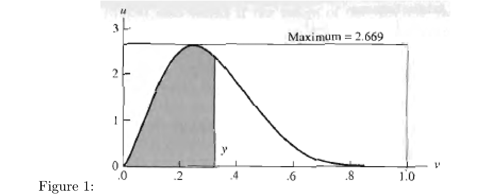
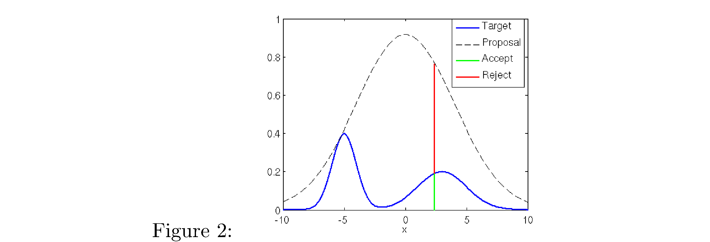

# Introduction

Suppose you want to generate a draw of a random variable, i.e. from a
distribution of a random variable $$Y$$ but the direct method (integral
transform, i.e. $$F_{Y}^{-1}\left(U\right)\sim Y$$ for
$$U\sim\text{uniform}\left(0,1\right)$$, which is from
$$F_{Y}\left(Y\right)\sim\text{uniform}\left(0,1\right)$$) doesn’t work
because you don’t have a closed form for $$F_{Y}$$. What do you do? <!--more--> How
about this for an idea: print out a picture of the “target” density
$$f_{Y}$$ (let’s suppose compact support), draw a tight bounding box
around it, and throw darts at it. Here’s a picture to keep in mind (for
now pretend that it’s completely shaded)

  

Let’s also pretend we can always nail the bounding box and the darts
will be uniformly distributed within, i.e. let $$V$$ be the random
variable that corresponds to the $$x$$-coordinate of the dart hit, which
is uniformly distributed on the support of the target density $$f_{Y}$$
(remember that the support is the range of $$Y$$, not the domain) and let
$$U$$ be the random variable that corresponds to the $$y$$-coordinate, which
is uniformly distributed on
(0,height-of-the-bounding-box)$$\equiv\left(0,M\right)$$ where

$$M=\sup_{y\in\mathcal{Y}}f_{Y}\left(y\right)$$

Then what’s the probability that we hit “inside the density”, i.e. under
the curve of the density? Because we’re throwing the darts uniformly,
with uniform distribution on the entire bounding box, it’s the area
subtended between the curve of density and the $$x$$-axis, divided by the
area of the entire box. Since $$U$$ corresponds to the $$y$$-coordinate of a
dart hit and $$V$$ corresponds to the $$x$$-coordinate we want to know what
the probability of the event $$\left\{ U\leq f_{Y}\left(V\right)\right\}$$
is, i.e

$$P\left(U\leq f_{Y}\left(V\right)\right)=?$$

Note this is no different than something much more mundane like
$$P\left(H\leq G\right)$$ when $$H,V$$ are for example uniformly distributed
on $$\left(0,1\right)$$ and then $$P\left(H\leq G\right)$$ is just the lower
or upper triangle (depending on how you orient the $$h$$ and $$g$$ axes).
Now $$V$$ is only defined on $$\mathcal{Y}$$ so let
$$\lambda\left(\mathcal{Y}\right)$$ be the Lebesgue measure of
$$\mathcal{Y}$$ and then

$$\begin{align}
P\left(U\leq f_{Y}\left(V\right)\right) & =\int_{\mathcal{Y}}\left(\int_{0}^{f_{Y}\left(v\right)}f_{U,V}\left(u,v\right)du\right)dv\\
 & =\int_{\mathcal{Y}}\left(\int_{0}^{f_{Y}\left(v\right)}f_{U}\left(u\right)f_{V}\left(v\right)du\right)dv\\
 & =\int_{\mathcal{Y}}\left(\int_{0}^{f_{Y}\left(v\right)}\frac{1}{M}\frac{1}{\lambda\left(\mathcal{Y}\right)}du\right)dv\\
 & =\frac{1}{M}\frac{1}{\lambda\left(\mathcal{Y}\right)}\int_{\mathcal{Y}}f_{Y}\left(v\right)dv\\
 & =\frac{1}{M}\frac{1}{\lambda\left(\mathcal{Y}\right)}\end{align}$$

Think about whether this makes sense. If $$\mathcal{Y}=\left(0,1\right)$$
and then the area of the bounding box is $$M\cdot1$$, and the density
$$f_{Y}$$, which integrates to 1 on its support is fraction

$$\frac{\text{its area}}{M\cdot1}=\frac{1}{M}$$

Alternatively

$$\begin{align}
P\left(U\leq f_{Y}\left(V\right)\right) & =E\left(1_{U\leq f_{Y}\left(V\right)}\right)\\
 & =E\left(E\left(1_{U\leq f_{Y}\left(V\right)}\big|V\right)\right)\\
 & =E\left(P\left(U\leq f_{Y}\left(V\right)\big|V\right)\right)\\
 & =\int_{\mathcal{Y}}P\left(U\leq f_{Y}\left(v\right)\right)f_{V}\left(v\right)dv\\
 & =\int_{\mathcal{Y}}\left(\int_{0}^{f_{Y}\left(v\right)}f_{U}\left(u\right)du\right)f_{V}\left(v\right)dv\\
 & =\frac{1}{M}\frac{1}{\lambda\left(\mathcal{Y}\right)}\int_{\mathcal{Y}}f_{Y}\left(v\right)dv\\
 & =\frac{1}{M}\frac{1}{\lambda\left(\mathcal{Y}\right)}\end{align}$$

Now fix some $$x$$ coordinate $$v$$. Given that a dart landed somewhere on
the line $$x=v$$ what’s the probability it landed underneath the curve?
Since $$M$$ corresponds to the height of our bounding box, the probability
that a dart with $$x$$ coordinate equal to $$v$$ hit underneath the curve of
the pdf is $$f_{Y}\left(v\right)/M$$. Why? Picture the bounding box and an
$$x$$-slice of it (cf. Figure 1: picture the line denoting the slice at
$$v=y$$ in Figure 1 extended all the way to the top of the bounding box).
The slice has height $$M$$ and $$f_{Y}\left(v\right)$$ is the height of the
density there. So the ratio of the length, on that slice, of the portion
“underneath the density” to height of the bounding box is
$$f_{Y}\left(v\right)/M$$ and since the darts were thrown with uniform
distribution in each coordinate it’s true that the probability of
landing underneath is the ratio of the length/total-height. So the claim
is

$$P\left(U\leq f_{Y}\left(v\right)\right)=f_{Y}\left(v\right)/M$$

When stated this way it’s maybe obvious, since we said the
$$y$$-coordinate of the dart is uniformly distributed on
$$\left(0,M\right)$$ and we’re basically computing

$$\begin{align}
P\left(U\leq f_{Y}\left(v\right)\right) & =\int_{0}^{f_{Y}\left(v\right)}\left(\frac{1}{M}\right)du\\
 & =f_{Y}\left(v\right)/M\end{align}$$

So what’s the punchline? Almost there: let’s compute the conditional
cumulative distribution of $$V$$, the random variable associated with the
$$x$$-coordinate of our dart hit, conditioned on the dart hitting below
the pdf of $$Y$$, i.e. conditioned on the event
$$\left\{ U\leq f_{Y}\left(V\right)\right\}$$ (by analogy with the
$$P\left(H\leq G\right)$$ example imagine computing
$$P\left(G\le g|H\leq G\right)$$, i.e. $$P\left(G\le g\right)$$ given that
we’re constrained to the half triangle as mentioned before, except it’s
$$\left\{ H\leq f\left(G\right)\right\}$$ instead of simply
$$\left\{ H\leq G\right\}$$ ):

$$\begin{align}
P\left(V\leq y\big|U\leq f_{Y}\left(V\right)\right) & =\frac{P\left(V\leq y,U\leq f_{Y}\left(V\right)\right)}{P\left(U\leq f_{Y}\left(V\right)\right)}\\
 & =\frac{\int_{A}\int_{0}^{f_{Y}\left(v\right)}f_{U,V}\left(u,v\right)dudv}{1/M\lambda\left(\mathcal{Y}\right)}\text{ where }A=\left\{ v\in\mathcal{Y}:v\le y\right\} \\
 & =M\lambda\left(\mathcal{Y}\right)\int_{A}\int_{0}^{f_{Y}\left(v\right)}f_{U}\left(u\right)f_{V}\left(v\right)dudv\\
 & =M\lambda\left(\mathcal{Y}\right)\int_{A}\left(\int_{0}^{f_{Y}\left(v\right)}\frac{1}{M}\frac{1}{\lambda\left(\mathcal{Y}\right)}du\right)dv\\
 & =\int_{A}\int_{0}^{f_{Y}\left(v\right)}dudv\\
 & =\int_{A}f_{Y}\left(v\right)dv\\
 & =P\left(Y\leq y\right)\end{align}$$

What does this mean? It means that the conditional distribution of $$V$$,
conditioned on the event $$\left\{ U\leq f_{Y}\left(V\right)\right\}$$, is
the same as the distribution of $$Y$$, i.e. the $$x$$-coordinate of all of
the darts that hit below the curve of the pdf is distributed the same as
$$Y$$. The distilled algorithm then is: throw darts at your pdf-dartboard.
If one hits below the curve of the pdf then “accept” it and take its
$$x$$-coordinate as a true draw from the distribution of $$Y$$ but otherwise
“reject” it and throw again.

How many darts do you have to throw before this will happen? Well since
$$P\left(U\leq f_{Y}\left(V\right)\right)=\frac{1}{M}\frac{1}{\lambda\left(\mathcal{Y}\right)}$$
and
$$1-P\left(U\leq f_{Y}\left(V\right)\right)=P\left(U>f_{Y}\left(V\right)\right)=1-\frac{1}{M}\frac{1}{\lambda\left(\mathcal{Y}\right)}$$
we see that the random variable

$$N=\text{number of pairs darts with coordinates }\left(v_{i},u_{i}\right)\text{ before }u_{i}\leq f_{Y}\left(v_{i}\right)$$

is geometrically distributed with success probability
$$\frac{1}{M}\frac{1}{\lambda\left(\mathcal{Y}\right)}$$ and therefore
expectation equal to $$M\lambda\left(\mathcal{Y}\right)$$, so you’d have
to throw on average $$M\lambda\left(\mathcal{Y}\right)$$ darts.

# Particular Example 

Take for example $$Y\sim\text{beta}\left(2.7,6.3\right)$$ (note that for
integer values of the shape and scale parameters $$\alpha,\beta$$ the
integral transform will work). Let

$$M=\sup_{y\in\mathcal{Y}}f_{Y}\left(y\right)$$

Take two independent uniform random variables
$$U\sim\text{uniform}\left(0,M\right)$$ and
$$V\sim\text{uniform}\left(0,1\right)$$. Then

$$\begin{align}
P\left(V\leq y,U\leq f_{Y}\left(V\right)\right) & =\int_{0}^{y}\left(\int_{0}^{f_{Y}\left(v\right)}f_{U,V}\left(u,v\right)du\right)dv\\
 & =\frac{1}{M}\frac{1}{1}\int_{0}^{y}\left(\int_{0}^{f_{Y}\left(v\right)}du\right)dv\\
 & =\frac{1}{M}\int_{0}^{y}f_{Y}\left(v\right)dv\\
 & =\frac{1}{M}P\left(Y\leq y\right)\end{align}$$

and

$$P\left(U\leq f_{Y}\left(V\right)\right)=\frac{1}{M}$$

and so reaffirming our calculations from the motivational discussion

$$P\left(V\leq y\big|U\leq f_{Y}\left(V\right)\right)=\frac{P\left(V\leq y,U\leq f_{Y}\left(V\right)\right)}{P\left(U\leq f_{Y}\left(V\right)\right)}=P\left(Y\leq y\right)$$

Recapitulating: if you want draw from a
$$Y\sim\text{beta}\left(2.7,6.3\right)$$ distribution then draw pairs
$$\left(v,u\right)$$ from $$\left(U,V\right)$$ (where $$U$$ and $$V$$ are as
defined above) and if

$$u\leq f_{Y}\left(v\right)=v^{2.7-1}\left(1-v\right)^{6.3}/\text{B}\left(2.7,6.3\right)$$

where $$\text{B}\left(2.7,6.3\right)$$ is the beta function defined by the

$$\text{B}\left(x,y\right)=\int_{0}^{1}t^{x-1}\left(1-t\right)^{y-1}dt$$

then “accept” $$v$$ as a true draw from a
$$\text{beta}\left(2.7,6.3\right)$$ distribution and if
$$u>f_{Y}\left(v\right)=v^{2.7-1}\left(1-v\right)^{6.3}/\text{B}\left(2.7,6.3\right)$$
then “reject” and simply draw again.

# Generalization

Now why did this work? Well many reasons (the entire argument in the
first part) but one in particular is that the support $$\mathcal{Y}$$ of
$$Y\sim\text{beta}\left(2.7,6.3\right)$$, which is $$\left(0,1\right)$$, is
the same as the support of $$V$$ (otherwise there would be no hope of them
being equal, regardless of the conditional). But of course you couldn’t
use a uniform as the “candidate” (what $$V$$ is called) to draw from a
distribution that has non-compact support (e.g. something like a Gamma
distribution which has support $$\mathbb{R}$$) since there’s no uniform
distribution on unbounded support (nothing like
$$\text{uniform}\left(0,\infty\right)$$). So you need another candidate
but it has to “cover” the target density, i.e. we need a bounding shape
not a bounding box, and we need to make sure that we throw darts only in
this bounding shape. Then conditionally the $$x$$-coordinate of our dart
throws should again be distributed the same as the target density.

First of all we need to scale our candidate density so that it
definitely covers the one we want to sample from, the target density. If
we compute

$$M=\sup_{y\in\mathcal{Y}}\frac{f_{Y}\left(y\right)}{f_{V}\left(y\right)}$$

we can scale our candidate density by $$M$$ so that it’s always greater
than or equal to our intractable density. The effect of the scaling is
only seen insofar as when we throw darts underneath the “bounding
shape”, i.e. the candidate density, the $$y$$-coordinate of our darts now
has to be constrained differently for each $$x$$-coordinate:

$$U|V\sim\text{uniform}\left(0,M\cdot f_{V}\left(V\right)\right)$$

Picture two densities, one covering the other like this (where
Proposal=candidate)

  

and we have to again find the probability of the event
$$\left\{ U\leq f_{Y}\left(V\right)\right\}$$

$$\begin{align}
P\left(U\leq f_{Y}\left(V\right)\right) & =\int_{\mathcal{Y}}\left(\int_{0}^{f_{Y}\left(v\right)}f_{U,V}\left(u,v\right)du\right)dv\\
 & =\int_{\mathcal{Y}}\left(\int_{0}^{f_{Y}\left(v\right)}f_{U|V}\left(u|v\right)f_{V}\left(v\right)du\right)dv\\
 & =\int_{\mathcal{Y}}\left(\int_{0}^{f_{Y}\left(v\right)}\frac{1}{M\cdot f_{V}\left(v\right)}f_{V}\left(v\right)du\right)dv\\
 & =\frac{1}{M}\int_{\mathcal{Y}}\left(\int_{0}^{f_{Y}\left(v\right)}du\right)dv\\
 & =\frac{1}{M}\int_{\mathcal{Y}}f_{Y}\left(v\right)dv\\
 & =\frac{1}{M}\end{align}$$

and then

$$\begin{align}
P\left(V\leq y\big|U\leq f_{Y}\left(V\right)\right) & =\frac{P\left(V\leq y,U\leq f_{Y}\left(V\right)\right)}{P\left(U\leq f_{Y}\left(V\right)\right)}\\
 & =\frac{\int_{A}\int_{0}^{f_{Y}\left(v\right)}f_{U,V}\left(u,v\right)dudv}{1/M}\text{ where }A=\left\{ v\in\mathcal{Y}:v\le y\right\} \\
 & =M\int_{A}\int_{0}^{f_{Y}\left(v\right)}f_{U|V}\left(u|v\right)f_{V}\left(v\right)dudv\\
 & =M\int_{A}\left(\int_{0}^{f_{Y}\left(v\right)}\frac{1}{M\cdot f_{V}\left(v\right)}f_{V}\left(v\right)du\right)dv\\
 & =\int_{A}\left(\int_{0}^{f_{Y}\left(v\right)}du\right)dv\\
 & =\int_{A}f_{Y}\left(v\right)dv\\
 & =P\left(Y\leq y\right)\end{align}$$

How many darts do you have to throw before this will happen? Well since
$$P\left(U\leq f_{Y}\left(V\right)\right)=\frac{1}{M}$$ and
$$1-P\left(U\leq f_{Y}\left(V\right)\right)=P\left(U>f_{Y}\left(V\right)\right)=1-\frac{1}{M}$$
we see that the random variable

$$N=\text{number of pairs darts with coordinates }\left(v_{i},u_{i}\right)\text{ before }u_{i}\leq f_{Y}\left(v_{i}\right)$$

is geometrically distributed with success probability $$\frac{1}{M}$$ and
therefore expectation equal to $$M$$, so you’d have to throw on average
$$M$$ darts.
