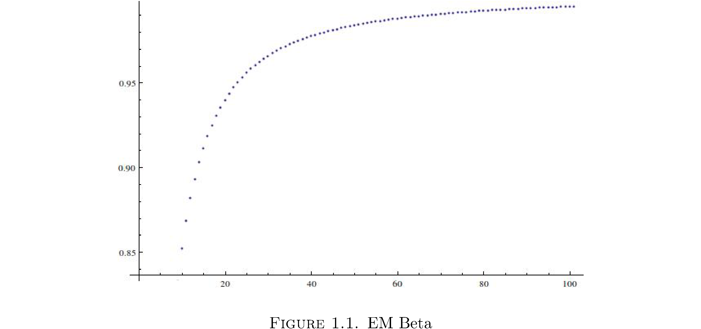

---
author:
- Maksim Levental
bibliography: /Users/maksim/dev_projects/school_work/notes/expectation_maximization//gentle.bib
csl: springer-mathphys-brackets.csl
excerpt_separator: <!--more-->
link-citations: true
reference-section-title: References
title: "Expectation Maximization: From the Horse’s Mouth"
---

Expectation maximization (EM) is a way to iteratively approximate the
maximum likelihood estimators (MLEs) for a parametric family when
solving the MLE equations analytically is intractable. Recall that
finding the MLEs for a parametric family

$$\mathbf{Y}\sim f_{\mathbf{Y}}\left(\cdot;\boldsymbol{\theta}\right)\,\boldsymbol{\theta}\in\Theta$$

is tantamount to maximizing the likelihood function

$$L\left(\boldsymbol{\theta};\mathbf{y}\right)=f_{\mathbf{Y}}\left(\mathbf{y};\boldsymbol{\theta}\right)$$

as a function of $$\boldsymbol{\theta}$$. <!--more--> The maximum likelihood
estimators are estimators of/for $$\boldsymbol{\theta}$$, usually denoted
$$\hat{\boldsymbol{\theta}}$$. The actual maximization is effected by
finding critical points of $$L$$ with respect to $$\boldsymbol{\theta}$$ and
testing concavity, i.e. solving

$$\nabla L\left(\boldsymbol{\theta};\mathbf{y}\right)=0$$

and checking the negative definiteness of Hessian of $$L$$. In general
$$\partial_{\theta_{i}}L\left(\boldsymbol{\theta};\mathbf{y}\right)$$
might be highly non-linear in $$\theta_{i}$$ and hence finding each might
be very difficult. What to do?

# Expectation Maximization Beta

Suppose[^1] there exists another random, unobserved, vector $$\mathbf{X}$$
such that were $$\mathbf{X}$$ in fact observed, maximizing the joint
likelihood for $$\mathbf{X}$$ and $$\mathbf{Y}$$

$$L\left(\boldsymbol{\theta};\mathbf{x},\mathbf{y}\right)=f_{\mathbf{X},\mathbf{Y}}\left(\mathbf{x},\mathbf{y};\boldsymbol{\theta}\right)$$

is easier than the original problem. $$\mathbf{X}$$ is called a latent or
hidden variable. Now a priori there’s absolutely no reason to assume
that having more information in hand and complicating the model should
make things easier. On the contrary, for example, a good physical model
makes simplifying assumptions and thereby becomes tractable. But indeed
for some very useful models such as Hidden Markov Models and Gaussian
Mixture Models this ansatz does simplify computing the MLEs.

All is going swimmingly except $$\mathbf{X}$$ is unobserved - the only
observed data are $$\mathbf{Y}$$. What to do? Estimate $$\mathbf{X}$$ of
course. How? Using the best estimator
$$E\left[\mathbf{X}|\mathbf{y};\boldsymbol{\theta}\right]$$ of
$$\mathbf{X}$$, based on observed **$$\mathbf{y}$$**, that minimizes the
risk for the quadratic loss function[^2], i.e. minimizes the mean square
error. Note two things. Firstly, it’s important that you can actually
compute *this* in closed form, otherwise you’ve traded one intractable
problem for another. Secondly, since
$$E\left[\mathbf{X}|\mathbf{y};\boldsymbol{\theta}\right]$$ is implicitly
a function of $$\boldsymbol{\theta}$$, which is unknown to begin with[^3]
you need some initial guess for it too, otherwise you can’t compute the
expectation. Hence the expectation computed is actually
$$E\left[\mathbf{X}|\mathbf{y};\boldsymbol{\theta}^{\left(r\right)}\right]$$
where $$\boldsymbol{\theta}^{\left(r\right)}$$ is the current guess for
$$\boldsymbol{\theta}$$. Then once you have this estimate for $$\mathbf{X}$$
just maximize

$$L\left(\boldsymbol{\theta};E\left[\mathbf{X}|\mathbf{y};\boldsymbol{\theta}^{\left(r\right)}\right],\mathbf{y}\right)=f_{\mathbf{X},\mathbf{Y}}\left(E\left[\mathbf{X}|\mathbf{y};\boldsymbol{\theta}^{\left(r\right)}\right],\mathbf{y};\boldsymbol{\theta}\right)$$

The procedure alternates between estimating **x** using
$$E\left[\mathbf{X}|\mathbf{y};\boldsymbol{\theta}^{\left(r\right)}\right]$$
and maximizing
$$L\left(\boldsymbol{\theta};E\left[\mathbf{X}|\mathbf{y};\boldsymbol{\theta}^{\left(r\right)}\right],\mathbf{y}\right)$$.
Compute expectation, then perform maxization, compute expectation, then
perform maximization, compute expectation,... hence **Expectation
Maximization** algorithm. Just to be clear

**Expectation Algorithm Beta.** Given some observed data $$\mathbf{y}$$,
in order to perform the intractable maximization of
$$L\left(\boldsymbol{\theta};\mathbf{y}\right)$$, posit the existence of
some latent $$\mathbf{x}$$ such that
$$L\left(\boldsymbol{\theta};\mathbf{x},\mathbf{y}\right)$$ is easier. Set
$$\boldsymbol{\theta}^{\left(0\right)}$$ to be some initial guess for
$$\boldsymbol{\theta}$$ then

1.  E-step: Set
    $$\mathbf{x}^{\left(r\right)}=E\left[\mathbf{X}|\mathbf{y};\boldsymbol{\theta}^{\left(r\right)}\right]$$

    1.  M-step: Set
        $$\boldsymbol{\theta}^{\left(r+1\right)}=\arg\max_{\boldsymbol{\theta}}L\left(\boldsymbol{\theta};\mathbf{x}^{\left(r\right)},\mathbf{y}\right)$$

    2.  Go to step 1 unless
        $$\left|\boldsymbol{\theta}^{\left(r+1\right)}-\boldsymbol{\theta}^{\left(r\right)}\right|<\varepsilon$$
        for some $$\varepsilon$$ of your choosing.

The equations in step 1 and 2 are called update equations because
specify how to update the current estimate for
$$\mathbf{x}^{\left(i\right)}$$ and
$$\boldsymbol{\theta}^{\left(i\right)}$$.

Here’s an example: let $$Y_{i}$$ be iid such that

$$f_{Y_{i}}\left(y_{i};\theta\right)=\theta g_{1}\left(y_{i}\right)+\left(1-\theta\right)g_{0}\left(y_{i}\right)$$

where $$\theta\in\left(0,1\right)$$ and $$g_{0}$$ and $$g_{1}$$ are Gaussians
with known means $$\left(\mu_{0},\mu_{1}\right)$$and variances
$$\left(\sigma_{0}^{2},\sigma_{1}^{2}\right)$$. We want the MLE for
$$\theta$$. Note that

$$L\left(\theta;\mathbf{y}\right)=\prod_{i=1}^{n}\left(\theta g_{1}\left(y_{i}\right)+\left(1-\theta\right)g_{0}\left(y_{i}\right)\right)$$

Quite messy[^4]. What to do? EM to the rescue! Suppose the $$Y_{i}$$ are
drawn by a process where a $$\theta$$-biased coin is flipped and either
$$g_{0}$$ or $$g_{1}$$ generates the $$y_{i}$$ depending on whether the coin
lands heads up or down. The latent variable here then is which Gaussian
generated $$y_{i}$$. Hence let $$X_{i}$$ be Bernoulli random variables where

$$\begin{align}
P\left(X_{i}=x_{i}\right) & =\begin{cases}
\theta & \text{ if }x_{i}=1\\
1-\theta & \text{ if }x_{i}=0
\end{cases}\\
 & =\theta^{x_{i}}\left(1-\theta\right)^{1-x_{i}}\end{align}$$

and
$$f_{Y_{i}|X_{i}}\left(y_{i}|x_{i}=1;\theta\right)=g_{1}\left(y_{i}\right)$$
and
$$f_{Y_{i}|X_{i}}\left(y_{i}|x_{i}=0;\theta\right)=g_{0}\left(y_{i}\right)$$.
Then

$$f_{X_{i},Y_{i}}\left(x_{i},y_{i};\theta\right)=f_{Y_{i}|X_{i}}\left(y_{i}|x_{i};\theta\right)P\left(X_{i}=x_{i}\right)$$

and so

$$\begin{align}
L\left(\theta;\mathbf{x},\mathbf{y}\right) & =\prod_{i=1}^{n}f_{Y_{i}|X_{i}}\left(y_{i}|x_{i};\theta\right)P\left(X_{i}=x_{i}\right)\\
 & =\prod_{i=1}^{n}\left(g_{1}\left(y_{i}\right)\right)^{x_{i}}\left(g_{0}\left(y_{i}\right)\right)^{1-x_{i}}\theta^{x_{i}}\left(1-\theta\right)^{1-x_{i}}\\
 & =\theta^{\sum_{i}x_{i}}\left(1-\theta\right)^{n-\sum_{i}x_{i}}\prod_{i=1}^{n}\left(g_{1}\left(y_{i}\right)\right)^{x_{i}}\left(g_{0}\left(y_{i}\right)\right)^{1-x_{i}}\end{align}$$

Note the trick in writing
$$f_{Y_{i}|X_{i}}\left(y_{i}|x_{i};\theta\right)=\left(g_{1}\right)^{x_{i}}\left(g_{0}\right)^{1-x_{i}}$$
- it comes up a lot for a class of models called mixture models. For the
E-step, to compute $$E\left[\mathbf{X}|\mathbf{y};\theta'\right]$$ we use
i.i.d-ness and compute $$E\left[X_{i}|y_{i};\theta'\right]$$ instead,
which will hold for each $$i$$. To compute the conditional expectation
$$E\left[X_{i}|y_{i};\theta\right]$$ we need the conditional distribution
$$f_{X_{i}|Y_{i}}\left(x_{i}|y_{i}\right)$$. By Bayes’ Theorem

$$\begin{align}
f_{X_{i}|Y_{i}}\left(x_{i}|y_{i};\theta\right) & =\frac{f_{X_{i},Y_{i}}\left(x_{i},y_{i};\theta\right)}{f_{Y_{i}}\left(y_{i};\theta\right)}\\
 & =\frac{f_{X_{i},Y_{i}}\left(x_{i},y_{i};\theta\right)}{\sum_{x_{i}}f_{X_{i},Y_{i}}\left(x_{i},y_{i};\theta\right)}\\
 & =\frac{\left(g_{1}\left(y_{i}\right)\right)^{x_{i}}\left(g_{0}\left(y_{i}\right)\right)^{1-x_{i}}\theta^{x_{i}}\left(1-\theta\right)^{1-x_{i}}}{\sum_{x_{i}}\left(g_{1}\left(y_{i}\right)\right)^{x_{i}}\left(g_{0}\left(y_{i}\right)\right)^{1-x_{i}}\theta^{x_{i}}\left(1-\theta\right)^{1-x_{i}}}\\
 & =\frac{\left(g_{1}\left(y_{i}\right)\right)^{x_{i}}\left(g_{0}\left(y_{i}\right)\right)^{1-x_{i}}\theta^{x_{i}}\left(1-\theta\right)^{1-x_{i}}}{g_{1}\left(y_{i}\right)\theta+g_{0}\left(y_{i}\right)\left(1-\theta\right)}\\
 & =\left(\frac{g_{1}\left(y_{i}\right)\theta}{g_{1}\left(y_{i}\right)\theta+g_{0}\left(y_{i}\right)\left(1-\theta\right)}\right)^{x_{i}}\left(\frac{g_{0}\left(y_{i}\right)\left(1-\theta\right)}{g_{1}\left(y_{i}\right)\theta+g_{0}\left(y_{i}\right)\left(1-\theta\right)}\right)^{1-x_{i}}\end{align}$$

So $$X_{i}\mid Y_{i}$$ is still Bernoulli just renormalized. Hence

$$E\left[X_{i}|y_{i};\theta\right]=\frac{g_{1}\left(y_{i}\right)\theta}{g_{1}\left(y_{i}\right)\theta+g_{0}\left(y_{i}\right)\left(1-\theta\right)}$$

For the M-step, since

$$\begin{align}
L\left(\theta;\mathbf{x},\mathbf{y}\right) & = & \left[\theta^{\sum_{i}x_{i}}\left(1-\theta\right)^{n-\sum_{i}x_{i}}\right]\left[\prod_{i=1}^{n}\left(g_{1}\left(y_{i}\right)\right)^{x_{i}}\left(g_{0}\left(y_{i}\right)\right)^{1-x_{i}}\right]\end{align}$$

and the second term is independent of $$\theta$$ we can just maximize the
first term. But this is just the the joint distribution for $$n$$ i.i.d
Bernoulli random variables and the MLE $$\hat{\theta}$$ is

$$\hat{\theta}=\frac{\sum_{i}x_{i}}{n}$$

Therefore, finally, the update equations are

$$\begin{align}
x_{i}^{\left(r\right)} & = & \frac{g_{1}\left(y_{i}\right)\theta^{\left(r\right)}}{g_{1}\left(y_{i}\right)\theta^{\left(r\right)}+g_{0}\left(y_{i}\right)\left(1-\theta^{\left(r\right)}\right)}\\
\theta^{\left(r+1\right)} & = & \frac{1}{n}\sum_{i=1}^{n}x_{i}^{\left(r\right)}\end{align}$$

So why did I dub it EM **Beta** instead of just EM? Because this isn’t
the standard EM algorithm. But why alter this algorithm at all? What’s
wrong with it as is? Well there are no convergence guarantees. Indeed
the iterates in Example 1 don’t converge to the right answer: figure
<a href="#fig:1" data-reference-type="ref" data-reference="fig:embetaiterates">1</a>
shows the first 100 iterates for
$$g_{1}\sim\text{n}\left(1,2\right),g_{0}\sim\text{n}\left(3,4\right),\theta=2/3$$.

  

So they converge but to $$1\neq2/3$$. Why did I present this algorithm
first? Standard EM is slightly more complicated and much less intuitive
but legend has it that it was in fact conceived in this way first and
then manipulated to get convergence.

# Expectation Maximization for Real

Recall that the whole point of this procedure is to actually maximize
the likelihood for $$\mathbf{Y}$$. This is equivalent to maximizing the
log-likelihood for $$\mathbf{Y}$$

$$l\left(\boldsymbol{\theta};\mathbf{y}\right)=\log L\left(\boldsymbol{\theta};\mathbf{y}\right)=\log f_{\mathbf{Y}}\left(\mathbf{y};\boldsymbol{\theta}\right)$$

The ansatz here is the same: suppose there exists another random,
unobserved, vector $$\mathbf{X}$$ such that were $$\mathbf{X}$$ in fact
observed, maximizing the joint log-likelihood for $$\mathbf{X}$$ and
$$\mathbf{Y}$$

$$l\left(\boldsymbol{\theta};\mathbf{x},\mathbf{y}\right)=\log L\left(\boldsymbol{\theta};\mathbf{x},\mathbf{y}\right)=\log f_{\mathbf{X},\mathbf{Y}}\left(\mathbf{x},\mathbf{y};\boldsymbol{\theta}\right)$$

is easier than the original problem. The ease of maximizing
$$l\left(\boldsymbol{\theta};\mathbf{x},\mathbf{y}\right)$$ over
$$l\left(\boldsymbol{\theta};\mathbf{y}\right)$$ isn’t immediately
apparent but first using Bayes’ theorem we see that

$$\begin{align}
l\left(\boldsymbol{\theta};\mathbf{y}\right) & =\log f_{\mathbf{Y}}\left(\mathbf{y};\boldsymbol{\theta}\right)\\
 & =\log\left(\frac{f_{\mathbf{X},\mathbf{Y}}\left(\mathbf{x},\mathbf{y};\boldsymbol{\theta}\right)}{f_{\mathbf{X}|\mathbf{Y}}\left(\mathbf{x}|\mathbf{y};\boldsymbol{\theta}\right)}\right)\\
 & =\log\left(f_{\mathbf{X},\mathbf{Y}}\left(\mathbf{x},\mathbf{y};\boldsymbol{\theta}\right)\right)-\log\left(f_{\mathbf{X}|\mathbf{Y}}\left(\mathbf{x}|\mathbf{y};\boldsymbol{\theta}\right)\right)\label{eq:2.3}\end{align}$$

If we can easily maximize the first term in $$\eqref{eq:2.3}$$, with
respect to $$\boldsymbol{\theta}$$ and the second term in $$\eqref{eq:2.3}$$
doesn’t spoil things somehow, then we’ll indeed maximize
$$l\left(\boldsymbol{\theta};\mathbf{y}\right)$$. This seems like a
workflow different from that of the beta algorithm[^5] but the analogy
follows. Since $$\mathbf{X}$$ is unobserved we face the same difficulty as
in the beta algorithm: the terms in $$\eqref{eq:2.3}$$ can’t be computed
and must be estimated. We use the same estimator as before
$$E\left[\cdot|\mathbf{y};\boldsymbol{\theta}^{\left(r\right)}\right]$$

$$l\left(\boldsymbol{\theta};\mathbf{y}\right)=E\left[\log\left(f_{\mathbf{X},\mathbf{Y}}\left(\mathbf{X},\mathbf{y};\boldsymbol{\theta}\right)\right)|\mathbf{y};\boldsymbol{\theta}^{\left(r\right)}\right]-E\left[\log\left(f_{\mathbf{X}|\mathbf{Y}}\left(\mathbf{X}|\mathbf{y};\boldsymbol{\theta}\right)\right)|\mathbf{y};\boldsymbol{\theta}^{\left(r\right)}\right]\label{eq:2.4}$$

Note some subtle things:

-   $$\mathbf{x}\rightarrow\mathbf{X}$$ because each of the terms on the
    right-hand side of $$\eqref{eq:2.4}$$ are estimates of the random
    variable **X** as a function of observed data **y.**

-   The expectations are again computed with respect to the conditional
    distribution of $$\mathbf{X}$$ given **Y** for fixed (iterate) values
    of $$\boldsymbol{\theta}^{\left(r\right)}$$, i.e.
    $$f_{\mathbf{X}|\mathbf{Y}}\left(\mathbf{x}|\mathbf{y};\boldsymbol{\theta}^{\left(r\right)}\right)$$.

-   The estimators, for which the expectations are computed, are
    functions of $$\boldsymbol{\theta}$$.

-   Equality is maintained because since
    $$l\left(\boldsymbol{\theta};\mathbf{y}\right)$$ is independent of
    $$\mathbf{X}$$

    $$E\left[l\left(\boldsymbol{\theta};\mathbf{y}\right)|\mathbf{y};\boldsymbol{\theta}^{\left(r\right)}\right]=l\left(\boldsymbol{\theta};\mathbf{y}\right)$$

The algorithm then is

**Expectation Algorithm.** Given some observed data $$\mathbf{y}$$, in
order to perform the intractable maximization of
$$L\left(\boldsymbol{\theta};\mathbf{y}\right)$$, posit the existence of
some latent $$\mathbf{X}$$ such that
$$L\left(\boldsymbol{\theta};\mathbf{x},\mathbf{y}\right)$$ is easier. Set
$$\boldsymbol{\theta}^{\left(0\right)}$$ to be some initial guess for
$$\boldsymbol{\theta}$$ then

1.  E-step: Compute
    $$E\left[\log\left(f_{\mathbf{X},\mathbf{Y}}\left(\mathbf{X},\mathbf{y};\boldsymbol{\theta}\right)\right)|\mathbf{y};\boldsymbol{\theta}^{\left(r\right)}\right]$$

    1.  M-step: Set
        $$\boldsymbol{\theta}^{\left(r+1\right)}=\arg\max_{\boldsymbol{\theta}}E\left[\log\left(f_{\mathbf{X},\mathbf{Y}}\left(\mathbf{X},\mathbf{y};\boldsymbol{\theta}\right)\right)|\mathbf{y};\boldsymbol{\theta}^{\left(r\right)}\right]$$

    2.  Go to step 1 unless
        $$\left|\boldsymbol{\theta}^{\left(r+1\right)}-\boldsymbol{\theta}^{\left(r\right)}\right|<\varepsilon$$
        for some $$\varepsilon$$ of your choosing.

The only thing to remains is to prove that maximizing
$$E\left[\log\left(f_{\mathbf{X},\mathbf{Y}}\left(\mathbf{X},\mathbf{y};\boldsymbol{\theta}\right)\right)|\mathbf{y};\boldsymbol{\theta}^{\left(r\right)}\right]$$
is sufficient to maximize
$$l\left(\boldsymbol{\theta};\mathbf{y}\right)$$. I won’t but I’ll prove a
thing on the way to that result, namely that
$$l\left(\boldsymbol{\theta}^{\left(r\right)};\mathbf{y}\right)\geq l\left(\boldsymbol{\theta}^{\left(r-1\right)};\mathbf{y}\right)$$
and since $$l\left(\boldsymbol{\theta};\mathbf{y}\right)$$ is bounded
above (it’s a density) the sequence of
$$l\left(\boldsymbol{\theta}^{\left(r\right)};\mathbf{y}\right)$$ must
converge. The last hurdle would be proving that convergence of
$$l\left(\boldsymbol{\theta}^{\left(r\right)};\mathbf{y}\right)$$ implies
the convergence of the iterates $$\boldsymbol{\theta}^{\left(r\right)}$$
themselves\[[1](#ref-wu1983convergence)\].

**Theorem (Monotonic EM Sequence)**: The sequence
$$\left\{ \boldsymbol{\theta}^{\left(r\right)}\right\}$$ satisfies
$$l\left(\boldsymbol{\theta}^{\left(r+1\right)};\mathbf{y}\right)\geq l\left(\boldsymbol{\theta}^{\left(r\right)};\mathbf{y}\right)$$.

**Proof:** Start with

$$l\left(\boldsymbol{\theta};\mathbf{y}\right)=\log\left(f_{\mathbf{X},\mathbf{Y}}\left(\mathbf{x},\mathbf{y};\boldsymbol{\theta}\right)\right)-\log\left(f_{\mathbf{X}|\mathbf{Y}}\left(\mathbf{x}|\mathbf{y};\boldsymbol{\theta}\right)\right)$$

Take conditional expectation with respect to
$$\mathbf{X}|\mathbf{Y};\boldsymbol{\theta}^{\left(r\right)}$$ of both
sides

$$\begin{align}
\int l\left(\boldsymbol{\theta};\mathbf{y}\right)f_{\mathbf{X}|\mathbf{Y}}\left(\mathbf{x}|\mathbf{y};\boldsymbol{\theta}^{\left(r\right)}\right)d\mathbf{x} & =\int\log\left(f_{\mathbf{X},\mathbf{Y}}\left(\mathbf{x},\mathbf{y};\boldsymbol{\theta}\right)\right)f_{\mathbf{X}|\mathbf{Y}}\left(\mathbf{x}|\mathbf{y};\boldsymbol{\theta}^{\left(r\right)}\right)d\mathbf{x}\\
 & -\int\log\left(f_{\mathbf{X}|\mathbf{Y}}\left(\mathbf{x}|\mathbf{y};\boldsymbol{\theta}\right)\right)f_{\mathbf{X}|\mathbf{Y}}\left(\mathbf{x}|\mathbf{y};\boldsymbol{\theta}^{\left(r\right)}\right)d\mathbf{x}\end{align}$$

Since $$l\left(\boldsymbol{\theta};\mathbf{y}\right)$$ is independent of
$$\mathbf{x}$$

$$\begin{align}
\int l\left(\boldsymbol{\theta};\mathbf{y}\right)f_{\mathbf{X}|\mathbf{Y}}\left(\mathbf{x}|\mathbf{y};\boldsymbol{\theta}^{\left(r\right)}\right)d\mathbf{x} & =l\left(\boldsymbol{\theta};\mathbf{y}\right)\int f_{\mathbf{X}|\mathbf{Y}}\left(\mathbf{x}|\mathbf{y};\boldsymbol{\theta}^{\left(r\right)}\right)d\mathbf{x}\\
 & =l\left(\boldsymbol{\theta};\mathbf{y}\right)\end{align}$$

and so

$$\begin{align}
l\left(\boldsymbol{\theta};\mathbf{y}\right) & =\int\log\left(f_{\mathbf{X},\mathbf{Y}}\left(\mathbf{x},\mathbf{y};\boldsymbol{\theta}\right)\right)f_{\mathbf{X}|\mathbf{Y}}\left(\mathbf{x}|\mathbf{y};\boldsymbol{\theta}^{\left(r\right)}\right)d\mathbf{x}\\
 & -\int\log\left(f_{\mathbf{X}|\mathbf{Y}}\left(\mathbf{x}|\mathbf{y};\boldsymbol{\theta}\right)\right)f_{\mathbf{X}|\mathbf{Y}}\left(\mathbf{x}|\mathbf{y};\boldsymbol{\theta}^{\left(r\right)}\right)d\mathbf{x}\\
 & =E\left[\log\left(f_{\mathbf{X},\mathbf{Y}}\left(\mathbf{X},\mathbf{y};\boldsymbol{\theta}\right)\right)|\mathbf{y};\boldsymbol{\theta}^{\left(r\right)}\right]-E\left[\log\left(f_{\mathbf{X}|\mathbf{Y}}\left(\mathbf{X}|\mathbf{y};\boldsymbol{\theta}\right)\right)|\mathbf{y};\boldsymbol{\theta}^{\left(r\right)}\right]\end{align}$$

Let

$$Q\left(\mathbf{\boldsymbol{\theta}},\boldsymbol{\theta}^{\left(r\right)}\right)=E\left[\log\left(f_{\mathbf{X},\mathbf{Y}}\left(\mathbf{X},\mathbf{y};\boldsymbol{\theta}\right)\right)|\mathbf{y};\boldsymbol{\theta}^{\left(r\right)}\right]$$

and
$$K\left(\boldsymbol{\theta},\boldsymbol{\theta}^{\left(r\right)}\right)=E\left[\log\left(f_{\mathbf{X}|\mathbf{Y}}\left(\mathbf{X}|\mathbf{y};\boldsymbol{\theta}\right)\right)|\mathbf{y};\boldsymbol{\theta}^{\left(r\right)}\right]$$.
Then

$$l\left(\boldsymbol{\theta};\mathbf{y}\right)=Q\left(\mathbf{\boldsymbol{\theta}},\boldsymbol{\theta}^{\left(r\right)}\right)-K\left(\boldsymbol{\theta},\boldsymbol{\theta}^{\left(r\right)}\right)$$

If we can show that

$$\begin{align}
Q\left(\boldsymbol{\theta}^{\left(r\right)},\boldsymbol{\theta}^{\left(r\right)}\right) & \leq Q\left(\boldsymbol{\theta}^{\left(r+1\right)},\boldsymbol{\theta}^{\left(r\right)}\right)\\
 & \text{and}\\
K\left(\boldsymbol{\theta}^{\left(r\right)},\boldsymbol{\theta}^{\left(r\right)}\right) & \geq K\left(\boldsymbol{\theta}^{\left(r+1\right)},\boldsymbol{\theta}^{\left(r\right)}\right)\end{align}$$

then it will follow that
$$l\left(\boldsymbol{\theta}^{\left(r+1\right)};\mathbf{y}\right)\geq l\left(\boldsymbol{\theta}^{\left(r\right)};\mathbf{y}\right)$$.
Well by definition of

$$\boldsymbol{\theta}^{\left(r+1\right)}=\arg\max_{\boldsymbol{\theta}}E\left[\log\left(f_{\mathbf{X},\mathbf{Y}}\left(\mathbf{X},\mathbf{y};\boldsymbol{\theta}\right)\right)|\mathbf{y};\boldsymbol{\theta}^{\left(r\right)}\right]=\arg\max_{\boldsymbol{\theta}}Q\left(\mathbf{\boldsymbol{\theta}},\boldsymbol{\theta}^{\left(r\right)}\right)$$

so

$$Q\left(\mathbf{\boldsymbol{\theta}},\boldsymbol{\theta}^{\left(r\right)}\right)\leq Q\left(\mathbf{\boldsymbol{\theta}},\arg\max_{\boldsymbol{\theta}}Q\left(\mathbf{\boldsymbol{\theta}},\boldsymbol{\theta}^{\left(r\right)}\right)\right)=Q\left(\mathbf{\boldsymbol{\theta}},\boldsymbol{\theta}^{\left(r+1\right)}\right)$$

To see that
$$K\left(\boldsymbol{\theta}^{\left(r\right)},\boldsymbol{\theta}^{\left(r\right)}\right)\geq K\left(\boldsymbol{\theta}^{\left(r+1\right)},\boldsymbol{\theta}^{\left(r\right)}\right)$$
inspect

$$\int\log\left(\frac{f_{\mathbf{X}|\mathbf{Y}}\left(\mathbf{x}|\mathbf{y};\boldsymbol{\theta}^{\left(r+1\right)}\right)}{f_{\mathbf{X}|\mathbf{Y}}\left(\mathbf{x}|\mathbf{y};\boldsymbol{\theta}^{\left(r\right)}\right)}\right)f_{\mathbf{X}|\mathbf{Y}}\left(\mathbf{x}|\mathbf{y};\boldsymbol{\theta}^{\left(r\right)}\right)d\mathbf{x}$$

On the one hand

$$\begin{align}
\int\log\left(\frac{f_{\mathbf{X}|\mathbf{Y}}\left(\mathbf{x}|\mathbf{y};\boldsymbol{\theta}^{\left(r+1\right)}\right)}{f_{\mathbf{X}|\mathbf{Y}}\left(\mathbf{x}|\mathbf{y};\boldsymbol{\theta}^{\left(r\right)}\right)}\right)f_{\mathbf{X}|\mathbf{Y}}\left(\mathbf{x}|\mathbf{y};\boldsymbol{\theta}^{\left(r\right)}\right)d\mathbf{x} & =\int\log\left(f_{\mathbf{X}|\mathbf{Y}}\left(\mathbf{x}|\mathbf{y};\boldsymbol{\theta}^{\left(r+1\right)}\right)\right)f_{\mathbf{X}|\mathbf{Y}}\left(\mathbf{x}|\mathbf{y};\boldsymbol{\theta}^{\left(r\right)}\right)d\mathbf{x}\\
 & -\int\log\left(f_{\mathbf{X}|\mathbf{Y}}\left(\mathbf{x}|\mathbf{y};\boldsymbol{\theta}^{\left(r\right)}\right)\right)f_{\mathbf{X}|\mathbf{Y}}\left(\mathbf{x}|\mathbf{y};\boldsymbol{\theta}^{\left(r\right)}\right)d\mathbf{x}\\
 & =K\left(\boldsymbol{\theta}^{\left(r+1\right)},\boldsymbol{\theta}^{\left(r\right)}\right)-K\left(\boldsymbol{\theta}^{\left(r\right)},\boldsymbol{\theta}^{\left(r\right)}\right)\end{align}$$

on the other hand, by Jensen’s[^6] inequality[^7]

$$\begin{align}
\int\log\left(\frac{f_{\mathbf{X}|\mathbf{Y}}\left(\mathbf{x}|\mathbf{y};\boldsymbol{\theta}^{\left(r+1\right)}\right)}{f_{\mathbf{X}|\mathbf{Y}}\left(\mathbf{x}|\mathbf{y};\boldsymbol{\theta}^{\left(r\right)}\right)}\right)f_{\mathbf{X}|\mathbf{Y}}\left(\mathbf{x}|\mathbf{y};\boldsymbol{\theta}^{\left(r\right)}\right)d\mathbf{x} & \leq\log\left[\int\left(\frac{f_{\mathbf{X}|\mathbf{Y}}\left(\mathbf{x}|\mathbf{y};\boldsymbol{\theta}^{\left(r+1\right)}\right)}{f_{\mathbf{X}|\mathbf{Y}}\left(\mathbf{x}|\mathbf{y};\boldsymbol{\theta}^{\left(r\right)}\right)}\right)f_{\mathbf{X}|\mathbf{Y}}\left(\mathbf{x}|\mathbf{y};\boldsymbol{\theta}^{\left(r\right)}\right)d\mathbf{x}\right]\\
 & =\log\left[\int f_{\mathbf{X}|\mathbf{Y}}\left(\mathbf{x}|\mathbf{y};\boldsymbol{\theta}^{\left(r+1\right)}\right)d\mathbf{x}\right]\\
 & =0\end{align}$$

Hence

$$K\left(\boldsymbol{\theta}^{\left(r+1\right)},\boldsymbol{\theta}^{\left(r\right)}\right)-K\left(\boldsymbol{\theta}^{\left(r\right)},\boldsymbol{\theta}^{\left(r\right)}\right)\leq0$$

which completes the proof.

# Applications

## Gaussian Mixture Models

EM works really well for mixture models, e.g. $$\mathbf{Y}_{i}$$ is
distributed iid such that

$$f_{\mathbf{Y}_{1}}\left(\mathbf{y}_{1}\right)=\sum_{j=1}^{m}\alpha_{j}g_{j}\left(\mathbf{y}_{1};\boldsymbol{\theta}_{j}\right)$$

where $$g_{j}$$ are (in general multivariate) densities with parameter
vectors $$\boldsymbol{\theta}_{j}$$ (in general, distinct for distinct
$$j$$) and $$\sum_{j}\alpha_{j}=1$$. If
$$g_{j}\sim\text{n}\left(\mu_{j},\sigma_{j}^{2}\right)$$ then the mixture
model is called a Gaussian mixture model (GMM). Naively if you wanted to
find the MLEs you would maximize

$$L\left(\left(\mathbf{y}_{1},\dots,\mathbf{y}_{n}\right);\boldsymbol{\theta}\right)=\prod_{i=1}^{n}f_{\mathbf{Y}_{i}}\left(\mathbf{y}_{i};\boldsymbol{\theta}\right)=\prod_{i=1}^{n}\sum_{j=1}^{m}\alpha_{j}g_{j}\left(\mathbf{y}_{i};\boldsymbol{\theta}_{j}\right)$$

Even taking the log won’t help you because of the interior sum. EM to
the rescue! Let $$\mathbf{X}=\left(X_{1},\dots,X_{n}\right)$$ be the
mixture components, i.e. each $$X_{i}$$ is a categorical random variable
that indicates which component of the mixture density produced the
correspondent $$\mathbf{Y}_{i}$$

$$\begin{align}
P\left(X_{i}=j\right) & =\begin{cases}
\alpha_{0} & \text{ if }x_{i}=0\\
\alpha_{1} & \text{ if }x_{i}=1\\
\vdots\\
\alpha_{m} & \text{ if }x_{i}=m
\end{cases}\end{align}$$

Hence

$$\begin{align}
P\left(X_{i}=j\right) & = & a_{j}\end{align}$$

And the $$\mathbf{Y}_{i}\mid X_{i}$$ takes the form

$$f_{\mathbf{Y}_{i}|X_{i}}\left(\mathbf{y}_{i}|x_{i}=j;\boldsymbol{\theta}\right)=g_{j}\left(\mathbf{y}_{i};\boldsymbol{\theta}_{j}\right)$$

The $$x_{i}$$ in
$$g_{x_{i}}\left(\mathbf{y}_{i};\boldsymbol{\theta}_{x_{i}}\right)$$
“picks” which mixture component the $$\mathbf{y}_{i}$$ is generated by.
Then the log-likelihood becomes

$$\begin{align}
l\left(\left(x_{1},\dots,x_{n}\right),\left(\mathbf{y}_{1},\dots,\mathbf{y}_{n}\right);\boldsymbol{\theta}\right) & =\log\left[\prod_{i=1}^{n}f_{X_{i},\mathbf{Y}_{i}}\left(x_{i},\mathbf{y}_{i};\boldsymbol{\theta}\right)\right]\\
 & =\log\left[\prod_{i=1}^{n}\left[f_{\mathbf{Y}_{i}|X_{i}}\left(\mathbf{y}_{i}|x_{i};\boldsymbol{\theta}\right)P\left(X_{i}=j\right)\right]\right]\\
 & =\log\left[\prod_{i=1}^{n}\left[g_{j}\left(\mathbf{y}_{i};\boldsymbol{\theta}_{j}\right)\alpha_{j}\right]\right]\\
 & =\sum_{i=1}^{n}\log\left(g_{j}\left(\mathbf{y}_{i};\boldsymbol{\theta}_{j}\right)\alpha_{j}\right)\\
 & =\sum_{i=1}^{n}\left[\log\alpha_{j}+\log\left(g_{j}\left(\mathbf{y}_{i};\boldsymbol{\theta}_{j}\right)\right)\right]\end{align}$$

There are a lot of indices and subscripts and superscripts to keep track
of: $$\boldsymbol{\theta}$$ is all of the parameters of all of the mixture
components, $$\mathbf{y}_{i}$$ are observed samples ($$n$$ of them), the
$$X_{i}$$ are the unobserved data (the mixture components), the
$$\boldsymbol{\theta}_{j}$$ are the parameters of the $$j$$th mixture
density, and the $$\alpha_{j}$$ are the mixture coefficients (i.e. in what
proportion the $$j$$th density contributes). Much as we did for Example 1
we need to compute
$$f_{X_{i}|\mathbf{Y}_{i}}\left(x_{i}|\mathbf{y}_{i};\boldsymbol{\theta}^{\left(r\right)}\right)=P\left(X_{i}=j|\mathbf{y}_{i};\boldsymbol{\theta}^{\left(r\right)}\right)$$
in order to compute the conditional expectations

$$\begin{align}
P\left(X_{i}=j|\mathbf{y}_{i};\boldsymbol{\theta}^{\left(r\right)}\right) & =\frac{f_{X_{i},\mathbf{Y}_{i}}\left(j,\mathbf{y}_{i};\boldsymbol{\theta}^{\left(r\right)}\right)}{f_{\mathbf{Y}_{i}}\left(\mathbf{y}_{i};\theta\right)}\\
 & =\frac{g_{j}\left(\mathbf{y}_{i};\boldsymbol{\theta}_{j}^{\left(r\right)}\right)\alpha_{j}^{\left(r\right)}}{\sum_{k=1}^{m}\left(g_{k}\left(\mathbf{y}_{i};\boldsymbol{\theta}_{k}^{\left(r\right)}\right)\alpha_{k}^{\left(r\right)}\right)}\end{align}$$

So again $$X_{i}\mid\mathbf{Y}_{i}$$ is categorical random variable. By
i.i.d

$$P\left(\left(X_{1}=j_{1},\dots,X_{n}=j_{n}\right)|\left(\mathbf{y}_{1},\dots,\mathbf{y}_{n}\right);\boldsymbol{\theta}^{\left(r\right)}\right)=\prod_{i=1}^{n}\frac{g_{j}\left(\mathbf{y}_{i};\boldsymbol{\theta}_{j}^{\left(r\right)}\right)\alpha_{j_{i}}^{\left(r\right)}}{\sum_{k=1}^{m}\left(g_{k}\left(\mathbf{y}_{i};\boldsymbol{\theta}_{k}^{\left(r\right)}\right)\alpha_{k}^{\left(r\right)}\right)}$$

Now we just need to take the expectation of the log-likelihood against
this conditional density

$$\begin{align}
E\left[l\left(\left(X_{1},\dots,X_{n}\right),\left(\mathbf{y}_{1},\dots,\mathbf{y}_{n}\right);\boldsymbol{\theta}\right)|\left(\mathbf{y}_{1},\dots,\mathbf{y}_{n}\right);\boldsymbol{\theta}^{\left(r\right)}\right]=\\
\sum_{j_{1}=1}^{m}\sum_{j_{2}=1}^{m}\cdots\sum_{j_{n}=1}^{m}\left(\left[\sum_{k=1}^{n}\left\{ \log\alpha_{j_{k}}+\log\left[g_{j_{k}}\left(\mathbf{y}_{k};\boldsymbol{\theta}_{j_{k}}\right)\right]\right\} \right]\prod_{i=1}^{n}\frac{g_{j}\left(\mathbf{y}_{i};\boldsymbol{\theta}_{j}^{\left(r\right)}\right)\alpha_{j}^{\left(r\right)}}{\sum_{k=1}^{m}\left(g_{k}\left(\mathbf{y}_{i};\boldsymbol{\theta}_{k}^{\left(r\right)}\right)\alpha_{k}^{\left(r\right)}\right)}\right)\end{align}$$

Pretty ugly right? Suffice it to say you’re not actually taking this
expectation. So let

$$\gamma_{ij}^{\left(r\right)}\coloneqq P\left(X_{i}=j|\mathbf{y}_{i};\boldsymbol{\theta}^{\left(r\right)}\right)=\frac{g_{j}\left(\mathbf{y}_{i};\boldsymbol{\theta}_{j}^{\left(r\right)}\right)\alpha_{j}^{\left(r\right)}}{\sum_{k=1}^{m}\left(g_{k}\left(\mathbf{y}_{i};\boldsymbol{\theta}_{k}^{\left(r\right)}\right)\alpha_{k}^{\left(r\right)}\right)}$$

and a helpful lemma:

**Lemma 1**: For i.i.d incomplete samples $$Y_{i}$$, with completions
$$X_{i}$$

$$E\left[l\left(\left(X_{1},\dots,X_{n}\right),\left(\mathbf{y}_{1},\dots,\mathbf{y}_{n}\right);\boldsymbol{\theta}\right)|\left(\mathbf{y}_{1},\dots,\mathbf{y}_{n}\right);\boldsymbol{\theta}^{\left(r\right)}\right]=\sum_{i=1}^{n}E\left[l\left(X_{i}|\mathbf{y}_{i};\boldsymbol{\theta}\right)|\mathbf{y}_{i};\boldsymbol{\theta}^{\left(r\right)}\right]$$

where $$\mathbf{y}_{i}$$ is the ith sample.

**Proof**: By i.i.d

$$\begin{align}
E\left[l\left(\left(X_{1},\dots,X_{n}\right),\left(\mathbf{y}_{1},\dots,\mathbf{y}_{n}\right);\boldsymbol{\theta}\right)|\left(\mathbf{y}_{1},\dots,\mathbf{y}_{n}\right);\boldsymbol{\theta}^{\left(r\right)}\right] & =\\
E\left[\log\left[\prod_{i=1}^{n}f\left(X_{i}|\left(\mathbf{y}_{1},\dots,\mathbf{y}_{n}\right);\boldsymbol{\theta}\right)\right]|\left(\mathbf{y}_{1},\dots,\mathbf{y}_{n}\right);\boldsymbol{\theta}^{\left(r\right)}\right] & =\\
E\left[\sum_{i=1}^{n}\log\left[f\left(X_{i}|\left(\mathbf{y}_{1},\dots,\mathbf{y}_{n}\right);\boldsymbol{\theta}\right)\right]|\left(\mathbf{y}_{1},\dots,\mathbf{y}_{n}\right);\boldsymbol{\theta}^{\left(r\right)}\right] & =\left(\text{ since }X_{i}\perp X_{j}\text{ for }i\neq j\right)\\
\sum_{i=1}^{n}E\left[\log\left[f\left(X_{i}|\left(\mathbf{y}_{1},\dots,\mathbf{y}_{n}\right);\boldsymbol{\theta}\right)\right]|\left(\mathbf{y}_{1},\dots,\mathbf{y}_{n}\right);\boldsymbol{\theta}^{\left(r\right)}\right] & =\left(\text{ since }P\left(X_{i}=x_{i}|\left(\mathbf{Y}_{1},\dots,\mathbf{Y}_{n}\right)\right)=P\left(X_{i}=x_{i}|\mathbf{Y}_{i}\right)\right)\\
\sum_{i=1}^{n}E\left[\log\left[f\left(X_{i}|\mathbf{y}_{i};\boldsymbol{\theta}\right)\right]|\mathbf{y}_{i};\boldsymbol{\theta}^{\left(r\right)}\right] & =\\
\sum_{i=1}^{n}E\left[l\left(X_{i}|\mathbf{y}_{i};\boldsymbol{\theta}\right)|\mathbf{y}_{i};\boldsymbol{\theta}^{\left(r\right)}\right]\end{align}$$

Therefore we only need to compute
$$E\left[l\left(X_{i}|\mathbf{y}_{i};\boldsymbol{\theta}\right)|\mathbf{y}_{i};\boldsymbol{\theta}^{\left(r\right)}\right]$$
to perform the E-step. Let $$j_{i}\rightarrow j$$ for convenience and
$$\left(\mu_{j},\Sigma_{j}\right)$$ be the parameters for the $$j$$th
Gaussian. Actually let’s take the 1 dimensional Gaussian case[^8] so
$$\left(\mu_{j},\Sigma_{j}\right)=\left(\mu_{j},\sigma_{j}^{2}\right)$$
and $$\mathbf{y}_{i}\rightarrow y_{i}$$.

$$\begin{align}
E\left[l\left(X_{i}|y_{i};\boldsymbol{\theta}\right)|y_{i};\boldsymbol{\theta}^{\left(r\right)}\right] & =\sum_{j=1}^{m}\left(\left[\log\alpha_{j}+\log\left(g_{j}\left(y_{i};\boldsymbol{\theta}_{j}\right)\right)\right]\gamma_{ij}^{\left(r\right)}\right)\\
 & =\sum_{j=1}^{m}\left(\left[\log\alpha_{j}+\left(-\frac{1}{2}\left(\log\left(\sigma_{j}^{2}\right)+\log\left(2\pi\right)\right)-\frac{1}{2\sigma_{j}^{2}}\left(y_{i}-\mu_{j}\right)^{2}\right)\right]\gamma_{ij}^{\left(r\right)}\right)\end{align}$$

Then

$$\begin{align}
E\left[l\left(\left(X_{1},\dots,X_{n}\right)|\left(y_{1},\dots,y_{n}\right);\boldsymbol{\theta}\right)|\left(y_{1},\dots,y_{n}\right);\boldsymbol{\theta}^{\left(r\right)}\right] & =\\
\sum_{i=1}^{n}\sum_{j=1}^{m}\left(\left[\log\alpha_{j}+\log\left(g_{j}\left(y_{i};\boldsymbol{\theta}_{j}\right)\right)\right]\gamma_{ij}^{\left(r\right)}\right) & =\\
\sum_{i=1}^{n}\sum_{j=1}^{m}\left(\left[\log\alpha_{j}+\left(-\frac{1}{2}\left(\log\left(\sigma_{j}^{2}\right)+\log\left(2\pi\right)\right)-\frac{1}{2\sigma_{j}^{2}}\left(y_{i}-\mu_{j}\right)^{2}\right)\right]\gamma_{ij}^{\left(r\right)}\right)\end{align}$$

Define

$$n_{j}^{\left(r\right)}=\sum_{i=1}^{n}\gamma_{ij}^{\left(r\right)}=\sum_{i=1}^{n}P\left(X_{i}=j|\mathbf{y}_{i};\boldsymbol{\theta}^{\left(r\right)}\right)$$

This is something like the portion of the samples that were generated by
the $$j$$th component of the density[^9]. The expectation becomes

$$\begin{align}
E\left[l\left(\left(X_{1},\dots,X_{n}\right)|\left(y_{1},\dots,y_{n}\right);\boldsymbol{\theta}\right)|\left(y_{1},\dots,y_{n}\right);\boldsymbol{\theta}^{\left(r\right)}\right] & =\\
\sum_{i=1}^{n}\sum_{j=1}^{m}\left(\left[\log\alpha_{j}+\left(-\frac{1}{2}\left(\log\left(\sigma_{j}^{2}\right)+\log\left(2\pi\right)\right)-\frac{1}{2\sigma_{j}^{2}}\left(y_{i}-\mu_{j}\right)^{2}\right)\right]\gamma_{ij}^{\left(r\right)}\right) & =\\
\sum_{i=1}^{n}\sum_{j=1}^{m}\log\alpha_{j}\gamma_{ij}^{\left(r\right)}-\sum_{i=1}^{n}\sum_{j=1}^{m}\frac{1}{2}\left(\log\left(\sigma_{j}^{2}\right)+\log\left(2\pi\right)\right)\gamma_{ij}^{\left(r\right)}-\sum_{i=1}^{n}\sum_{j=1}^{m}\frac{1}{2\sigma_{j}^{2}}\left(y_{i}-\mu_{j}\right)^{2}\gamma_{ij}^{\left(r\right)} & =\\
\sum_{j=1}^{m}n_{j}^{\left(r\right)}\log\alpha_{j}-\frac{1}{2}\sum_{j=1}^{m}n_{j}^{\left(r\right)}\left(\log\left(\sigma_{j}^{2}\right)+\log\left(2\pi\right)\right)-\frac{1}{2}\sum_{i=1}^{n}\sum_{j=1}^{m}\frac{\left(y_{i}-\mu_{j}\right)^{2}}{\sigma_{j}^{2}}\gamma_{ij}^{\left(r\right)}\end{align}$$

This is the expression that needs to be maximized with respect to
$$\alpha_{j},\mu_{j},\sigma_{j}^{2}$$[^10]. The fully specified
maximization problem is

$$\begin{align}
\max_{\alpha_{j},\mu_{j},\sigma_{j}^{2}} & E\left[l\left(\left(X_{1},\dots,X_{n}\right)|\left(y_{1},\dots,y_{n}\right);\boldsymbol{\theta}\right)|\left(y_{1},\dots,y_{n}\right);\boldsymbol{\theta}^{\left(r\right)}\right]\\
 & \iff\\
\max_{\alpha_{j},\mu_{j},\sigma_{j}^{2}} & \sum_{j=1}^{m}n_{j}^{\left(r\right)}\log\alpha_{j}-\frac{1}{2}\sum_{j=1}^{m}n_{j}^{\left(r\right)}\left(\log\left(\sigma_{j}^{2}\right)+\log\left(2\pi\right)\right)-\frac{1}{2}\sum_{i=1}^{n}\sum_{j=1}^{m}\frac{\left(y_{i}-\mu_{j}\right)^{2}}{\sigma_{j}^{2}}\gamma_{ij}^{\left(r\right)}\\
\text{subject to} & \sum_{j=1}^{m}\alpha_{j}=1,\:\alpha_{j}\geq0\end{align}$$

This looks tough but because it’s a bunch of uncoupled (somewhat) terms
summed together so it’s easier than the original log-likelihood

$$\log\left[\sum_{j=1}^{m}\alpha_{j}g_{j}\left(\mathbf{y}_{i};\boldsymbol{\theta}_{j}\right)\right]$$

The local maxima for $$\alpha_{j},\mu_{j},\sigma_{j}^{2}$$ become the new
iterates, ie.
$$\alpha_{j}^{\left(r+1\right)},\mu_{j}^{\left(r+1\right)},\left(\sigma_{j}^{2}\right)^{\left(r+1\right)}$$.
To perform the constrained maximization (only the $$\alpha_{j}$$) we use
Lagrange multipliers; form the Lagrangian

$$\mathcal{L}\left(\boldsymbol{\alpha},\lambda\right)=\sum_{j=1}^{m}n_{j}^{\left(r\right)}\log\alpha_{j}+\lambda\left(\sum_{j=1}^{m}\alpha_{j}-1\right)$$

Then computing derivatives and setting to zero to find $$\alpha_{j}$$

$$\begin{align}
\frac{\partial\mathcal{L}}{\partial\alpha_{j}} & = & \frac{n_{j}^{\left(r\right)}}{\alpha_{j}}+\lambda\end{align}$$

Therefore the critical[^11] $$\alpha_{j}$$ satisfy

$$\alpha_{j}=-\frac{n_{j}^{\left(r\right)}}{\lambda}$$

To eliminate $$\lambda$$ use the equality constraint, i.e.
$$\sum_{j=1}^{m}\alpha_{j}=1$$ implies
$$\lambda=-\sum_{j=1}^{m}n_{j}^{\left(r\right)}$$ and hence

$$\alpha_{j}^{\left(r+1\right)}=\frac{n_{j}^{\left(r\right)}}{\sum_{j=1}^{m}n_{j}^{\left(r\right)}}=\frac{n_{j}^{\left(r\right)}}{n}$$

So $$\alpha_{j}^{\left(r+1\right)}$$ is just the current best estimate for
how many of the samples were generated by the $$j$$th component of the
mixture density[^12]. To compute the updates
$$\mu_{j}^{\left(r+1\right)}$$ we just need to do the standard
maximization of
$$E\left[l\left(\left(X_{1},\dots,X_{n}\right)|\left(y_{1},\dots,y_{n}\right);\boldsymbol{\theta}\right)|\left(y_{1},\dots,y_{n}\right);\boldsymbol{\theta}^{\left(r\right)}\right]$$
since the $$\mu_{j}$$ are unconstrained. Therefore

$$\frac{\partial}{\partial\mu_{j}}E\left[l\left(\left(X_{1},\dots,X_{n}\right)|\left(y_{1},\dots,y_{n}\right);\boldsymbol{\theta}\right)|\left(y_{1},\dots,y_{n}\right);\boldsymbol{\theta}^{\left(r\right)}\right]=\sum_{i=1}^{n}\frac{\left(y_{i}-\mu_{j}\right)}{\sigma_{j}^{2}}\gamma_{ij}^{\left(r\right)}=0$$

Note the sum of $$j$$ disappears because only the $$j$$th term is non-zero.
Then simplifying further

$$\begin{align}
\sum_{i=1}^{n}\frac{\left(y_{i}-\mu_{j}\right)}{\sigma_{j}^{2}}\gamma_{ij}^{\left(r\right)} & =\frac{1}{\sigma_{j}^{2}}\left(\sum_{i=1}^{n}\gamma_{ij}^{\left(r\right)}y_{i}-\mu_{j}\sum_{i=1}\gamma_{ij}^{\left(r\right)}\right)\\
 & =\frac{1}{\sigma_{j}^{2}}\left(\sum_{i=1}^{n}\gamma_{ij}^{\left(r\right)}y_{i}-\mu_{j}n_{j}^{\left(r\right)}\right)=0\\
 & \Rightarrow\\
\mu_{j}^{\left(r+1\right)} & =\frac{1}{n_{j}^{\left(r\right)}}\sum_{i=1}^{n}\gamma_{ij}^{\left(r\right)}y_{i}\end{align}$$

Finally doing the same kind of thing for
$$\left(\sigma_{j}^{2}\right)^{\left(r+1\right)}$$

$$\frac{\partial}{\partial\sigma_{j}^{2}}E\left[l\left(\left(X_{1},\dots,X_{n}\right)|\left(y_{1},\dots,y_{n}\right);\boldsymbol{\theta}\right)|\left(y_{1},\dots,y_{n}\right);\boldsymbol{\theta}^{\left(r\right)}\right]=-\frac{1}{2}\frac{n_{j}^{\left(r\right)}}{\sigma_{j}^{2}}+\frac{1}{2}\sum_{i=1}^{n}\frac{\left(y_{i}-\mu_{j}^{\left(r+1\right)}\right)^{2}}{\left(\sigma_{j}^{2}\right)^{2}}\gamma_{ij}^{\left(r\right)}=0$$

where $$\mu_{j}$$ now gets a superscript because it’s already been
updated. Hence

$$\left(\sigma_{j}^{2}\right)^{\left(r+1\right)}=\frac{1}{n_{j}^{\left(r+1\right)}}\sum_{i=1}^{n}\left(y_{i}-\mu_{j}^{\left(r+1\right)}\right)^{2}\gamma_{ij}^{\left(r\right)}$$

In summary the update equations for a univariate GMM

$$\begin{align}
\alpha_{j}^{\left(r+1\right)} & =\frac{n_{j}^{\left(r\right)}}{n}\\
\mu_{j}^{\left(r+1\right)} & =\frac{1}{n_{j}^{\left(r\right)}}\sum_{i=1}^{n}\gamma_{ij}^{\left(r\right)}y_{i}\\
\left(\sigma_{j}^{2}\right)^{\left(r+1\right)} & =\frac{1}{n_{j}^{\left(r+1\right)}}\sum_{i=1}^{n}\left(y_{i}-\mu_{j}^{\left(r+1\right)}\right)^{2}\gamma_{ij}^{\left(r\right)}\end{align}$$

where

$$\begin{align}
\gamma_{ij}^{\left(r\right)} & =\frac{g_{j}\left(\mathbf{y}_{i};\boldsymbol{\theta}_{j}^{\left(r\right)}\right)\alpha_{j}^{\left(r\right)}}{\sum_{k=1}^{m}\left(g_{k}\left(\mathbf{y}_{i};\boldsymbol{\theta}_{k}^{\left(r\right)}\right)\alpha_{k}^{\left(r\right)}\right)}\\
n_{j}^{\left(r\right)} & =\sum_{i}\gamma_{ij}^{\left(r\right)}\end{align}$$

For multivariate GMM the only difference is
$$\sigma_{j}^{2}\rightarrow\Sigma_{j}$$ and so you need to use matrix
derivatives. Consult \[[2](#ref-chen2010demystified)\] for the full
derivation

$$\Sigma_{j}^{\left(r+1\right)}=\frac{1}{n_{j}^{\left(r+1\right)}}\sum_{i=1}^{n}\left(\mathbf{y}_{i}-\boldsymbol{\mu}_{j}^{\left(r+1\right)}\right)\left(\mathbf{y}_{i}-\boldsymbol{\mu}_{j}^{\left(r+1\right)}\right)^{T}\gamma_{ij}^{\left(r\right)}$$

# References

1. Wu, C.J.: On the convergence properties of the
EM algorithm. The Annals of statistics. 95–103 (1983)

2. Chen, Y., Gupta, M.R.: Em demystified: An
expectation-maximization tutorial. University of Washington.
(2010)

# Footnotes

[^1]: Suppose!

[^2]: $$l\left(\mathbf{X},\hat{\mathbf{X}}\right)=\left(\mathbf{X}-\hat{\mathbf{X}}\right)^{2}$$

[^3]: Don’t forget the point of all this is actually to estimate
    $$\boldsymbol{\theta}$$.

[^4]: Even if you think you’re clever and try to maximize log-likelihood
    you’re still going to have a rough go at it.

[^5]: Here we’re explicitly maximizing a function of the likelihood for
    $$\mathbf{Y}$$ by maximizing a lowerbound.

[^6]: Pronounce Yen-sen you uncultured boor!

[^7]: For convex $$g\left(X\right)$$ it’s the case that
    $$g\left(E\left(X\right)\right)\leq Eg\left(X\right)$$ and for concave
    $$g\left(X\right)$$ the inequality is reversed.

[^8]: \[[2](#ref-chen2010demystified)\] is a good place for the general
    case.

[^9]: Why? Because
    $$\sum_{j=1}^{m}n_{j}=\sum_{j=1}^{m}\sum_{i=1}^{n}\gamma_{ij}=\sum_{i=1}^{n}1=n$$.

[^10]: Pay attention to the difference between the arguments that come
    from the log $$\alpha_{j},\mu_{j},\sigma_{j}^{2}$$ and the current
    estimates of the parameters, those with iterate superscripts
    $$\left(r\right)$$ that come from conditional density, with respect to
    which the expectation was taken.

[^11]: You need to do the convex analysis (second-deriative test) to
    determine whether $$\alpha_{j}$$ are maxima but they are and I’m not
    going to.

[^12]: Pretty much the epitome of the MLE for a parameter.
