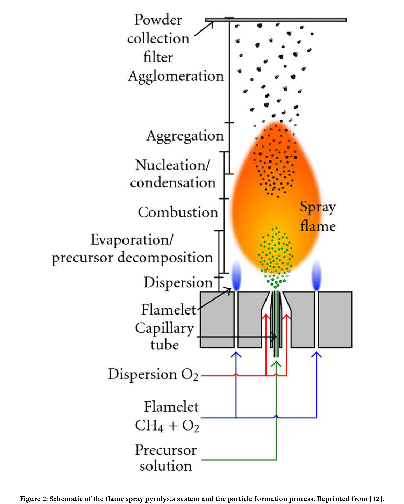
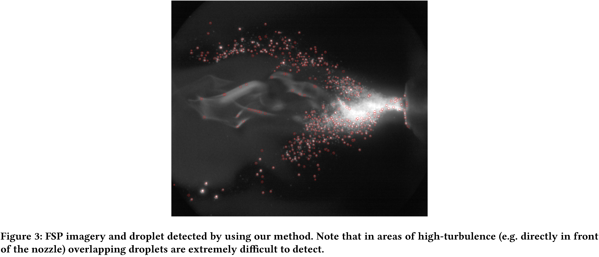
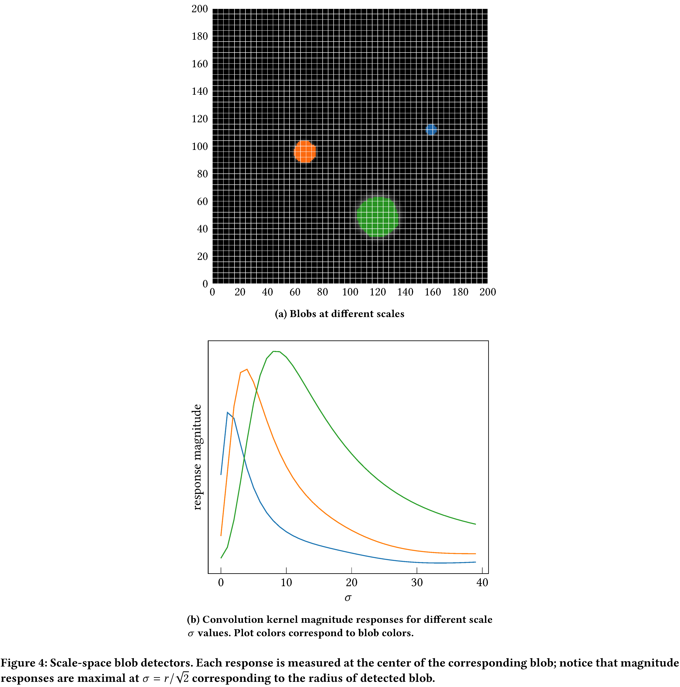
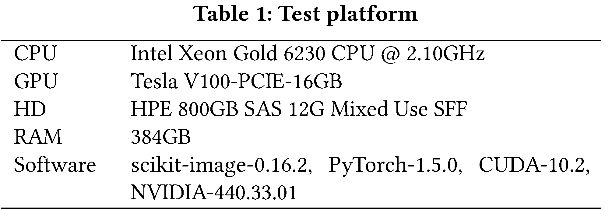
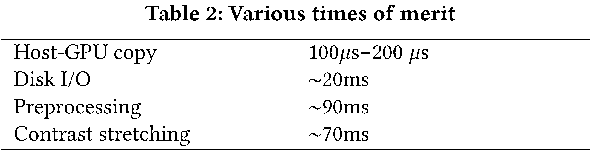
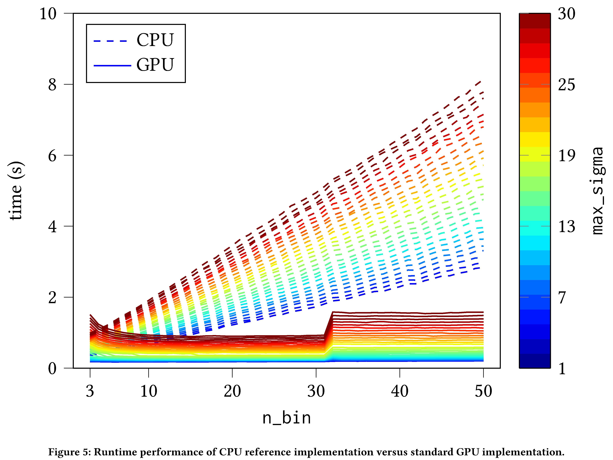
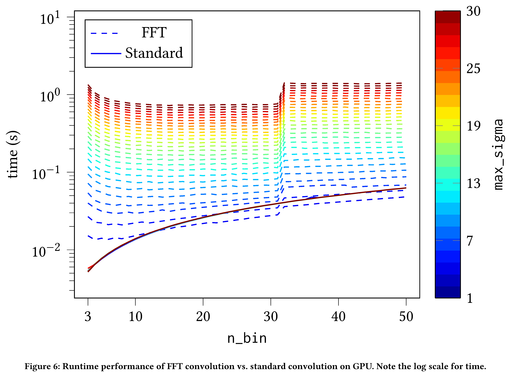

---
author:
- Maksim Levental
- Ryan Chard
- Joseph A. Libera
- Kyle Chard
- Aarthi Koripelly
- Jakob R. Elias
- Marcus Schwarting
- Ben Blaiszik
- Marius Stan
- Santanu Chaudhuri
- Ian Foster
bibliography: /Users/maksim/dev_projects/merf_paper/biblio.bib
csl: springer-mathphys-brackets.csl
excerpt_separator: <!--more-->
link-citations: true
reference-section-title: References
title: Towards Online Steering of Flame Spray Pyrolysis Nanoparticle
  Synthesis
---

Flame Spray Pyrolysis (FSP) is a manufacturing technique to mass
produce engineered nanoparticles for applications in catalysis, energy
materials, composites, and more. FSP instruments are highly dependent
on a number of adjustable parameters, including fuel injection rate,
fuel-oxygen mixtures, and temperature, which can greatly affect the
quality, quantity, and properties of the yielded nanoparticles.
Optimizing FSP synthesis requires monitoring, analyzing,
characterizing, and modifying experimental conditions. Here, we
propose a hybrid CPU-GPU Difference of Gaussians (DoG) method for
characterizing the volume distribution of unburnt solution, so as to
enable near-real-time optimization and steering of FSP experiments.
Comparisons against standard implementations show our method to be an
order of magnitude more efficient. This surrogate signal can be
deployed as a component of an online end-to-end pipeline that
maximizes the synthesis yield. <!--more-->

# Introduction

Flame Spray Pyrolysis (FSP) is used to manufacture nanomaterials
employed in the production of various industrial materials. A FSP
instrument rapidly produces nanoparticle precursors by combusting liquid
dissolved in an organic solvent. Optical and spectrometry
instrumentation can be used in a FSP experiment to monitor both flame
and products. This provides insight into the current state and stability
of the flame, quantity of fuel successfully combusted, and quantity and
quality of materials produced. To avoid fuel wastage and to maximize
outputs, data must not only be collected but also analyzed and acted
upon continuously during an experiment.

A key technique for monitoring and determining a FSP experiment’s
effectiveness is quantifying and classifying the fuel that is not
successfully combusted. Planar Laser-Induced Fluoroscopy (PLIF) and
optical imagery of the flame can be used to make informed decisions
about an experiment and guide the fuel mixtures, fuel-oxygen rates, and
various pressures. Fuel wastage can be approximated by detecting and
quantifying the droplets of fuel that have not been successfully
aerosolized (thus, uncombusted). Blob detection algorithms provide an
effective means for both detecting fuel droplets and determining their
sizes. Blob detection is the identification and characterization of
regions in an image that are distinct from adjacent regions and for
which certain properties are either constant or approximately constant.
Note, however, that the volume and rate of the data generated by FSP
instruments requires both automation and high-performance computing
(HPC); the primary latency constraint is imposed by the collection
frequency of the imaging sensor (ranging from 10Hz-100Hz).

Argonne National Laboratory’s Combustion Synthesis Research Facility
(CSRF) operates a FSP experiment that produces silica, metallic, oxide
and alloy powders or particulate films. However, standard processing
methods on CPUs far exceeds FSP edge computing capacity, i.e. performing
image analysis on the FSP device is infeasible. To address this need for
rapid, online analysis we present a hybrid CPU-GPU method to rapidly
evaluate the volume distribution of unburnt fuel.

Surrogate models can be employed to steer experiments by producing an
inference for a quantity of interest faster than physical
measurements \[[1](#ref-liu2019tomogan)\]. In particular, machine
learning surrogate models have been used in materials science, with
varying degrees of success \[[2](#ref-guan2019ptychonet)\]. Here we aim
to drive a Bayesian hyper-parameter optimizer (BO) that optimizes the
various parameters of CSRF’s FSP experiment. The combination of FSP, our
technique, and the BO, define an "end-to-end" system for optimizing FSP
synthesis (see
figure <a href="#fig:1" data-reference-type="ref" data-reference="fig:block_diagram">1</a>).

  

We integrate our solution into the Manufacturing Data and Machine
Learning platform \[[3](#ref-elias2020manufacturing)\], enabling
near-real-time optimization and steering of FSP experiments through
online analysis.

The remainder of this paper is as follows: Section
<a href="#sec:science" data-reference-type="ref" data-reference="sec:science">science</a>
discusses the materials science of FSP, Section
<a href="#sec:blobdetection" data-reference-type="ref" data-reference="sec:blobdetection">blobdetection</a>
discusses blob detection and derives some important mathematical
relationships, Section
<a href="#sec:implementation" data-reference-type="ref" data-reference="sec:implementation">implementation</a>
covers practical considerations and our improvements to blob detection,
Section
<a href="#sec:evaluation" data-reference-type="ref" data-reference="sec:evaluation">evaluation</a>
compares our improved algorithms against standard implementations,
Section <a href="#sec:related" data-reference-type="ref" data-reference="sec:related">related</a>
discusses related work, and Section
<a href="#sec:conclusion" data-reference-type="ref" data-reference="sec:conclusion">conclusion</a>
concludes.

# Flame Spray Pyrolysis

Flame aerosol synthesis (FAS) is the formation of fine particles from
flame gases \[[4](#ref-PRATSINIS1998197)\]. Pyrolysis (also thermolysis)
is the separation of materials at elevated temperatures in an inert
environment (that is, without oxidation). Flame Spray Pyrolysis (FSP) is
a type of FAS where the precursor for the combustion reaction is a high
heat of combustion liquid dissolved in an organic
solvent \[[5](#ref-SOKOLOWSKI1977219)\] ( see
Figure <a href="#fig:2" data-reference-type="ref" data-reference="fig:fsp">2</a>).
An early example of industrial manufacturing employing FSP was in the
production of carbon black, used, for example, as a pigment and a
reinforcing material in rubber products.

  

Optimizing FSP reaction yield is challenging; there are many instrument
parameters (sheath O2, pilot CH4 and solution flow
rates, solute concentration, and air gap) and salient physical
measurements often have low resolution in time. Reaction yield can be
inferred from the FSP droplet size distribution, with smaller droplets
implying a more complete combustion. Unfortunately, the characterization
of droplet distribution via, for example, Scanning Mobility Particle
Sizer Spectrometry (SMPSS) has an analysis period of roughly ten
seconds \[[6](#ref-smpss)\],

while other measurement techniques, such as Raman spectroscopy, require
even longer collection periods. These measurement latencies prevent the
use of such characterization techniques for adaptive control of the
experiment and hence optimization of experiment parameters.

In this work, droplet imaging is performed by using a iSTAR sCMOS camera
oriented perpendicular to a 285nm laser light sheet that bisects the
flame along its cylindrical axis. Imagery is collected at 10Hz, with
each image capturing the droplet distribution from a 10ns exposure due
to the laser pulse. The images are formed by Mie scattering from the
surfaces of the spherical droplets (see
Figure <a href="#fig:3" data-reference-type="ref" data-reference="fig:plif">3</a>).
The image size is not calibrated to droplet size, and so we use relative
size information to assess the atomization efficiency of the FSP.

  

# Blob detection background

Blob detectors operate on scale-space
representations \[[7](#ref-Lindeberg1998)\]; define the scale-space
representation $L(x,y,\sigma)$ of an image $I(x,y)$ to be the
convolution of that image with a mean zero Gaussian kernel
$g(x,y,\sigma)$, i.e.:

$$L(x,y,\sigma) \coloneqq g(x,y,\sigma) * I(x,y),$$

where $\sigma$ is the standard deviation of the Gaussian and determines
the *scale* of $L(x,y,\sigma)$. Scale-space blob detectors are also
parameterized by the scale $\sigma$, such that their response is
extremal when simultaneously in the vicinity of blobs and when
$\sqrt{2}\sigma = r$ corresponds closely to the characteristic radius of
the blob. In particular, they are *locally* extremal in space and
*globally* extremal in scale, since at any given scale there might be
many blobs in an image but each blob has a particular scale.
Conventionally, scale-space blob detectors are strongly positive for
dark blobs on light backgrounds and strongly negative for bright blobs
on dark backgrounds. Two such operators are:

-   *Scale-normalized trace of the Hessian*:

    $$\operatorname{trace}(H L) \coloneqq \sigma^2\left(\frac{\partial^2 L}{\partial x^2} + \frac{\partial^2 L}{\partial y^2}\right)$$

    Equivalently $\operatorname{trace}(H L) \coloneqq \sigma^2\Delta L$,
    where $\Delta$ is the Laplacian.

-   *Scale-normalized Determinant of Hessian* (DoH):

    $$\operatorname{det} (H L)  \coloneqq \sigma^4 \left(\frac{\partial^2 }{\partial x^2}\frac{\partial^2 L}{\partial y^2}-\left(\frac{\partial^2 L}{\partial x \partial y}\right)^2\right)$$

Note that by the associativity of convolution,

$$\sigma^2\Delta L = \sigma^2 \Delta \left(g * I\right) = \left( \sigma^2\Delta g \right) * I$$

Consequently, $\sigma^2\Delta g$ is called the *scale-normalized
Laplacian of Gaussians* (LoG) operator/blob detector.

DoH and LoG are both nonlinear (due to dependence on derivatives) and
compute intensive (directly a function of the dimensions of the image),
but in fact LoG can be approximated. Since $g$ is the Green’s function
for the heat equation:

$$\begin{aligned}
   \sigma \Delta g &= \frac{\partial g}{\partial \sigma} \\
    &\approx \frac{g(x,y,\sigma + \delta \sigma) - g(x,y,\sigma)}{\delta \sigma}\end{aligned}$$

Hence, we see that for small, fixed, $\delta \sigma$

$$\sigma^2 \Delta g \approx \sigma \times [g(x,y,\sigma + \delta \sigma) - g(x,y,\sigma)]$$

up to a constant. This approximation is called the *Difference of
Gaussians* (DoG). In practice, one chooses $k$ standard deviations such
that the $\sigma_i$ densely sample the range of possible blob radii,
through the relation $\sqrt{2}\sigma_i = r_i$. For example,
Figure <a href="#fig:4" data-reference-type="ref" data-reference="fig:scalescapedetector">4</a>
schematically demonstrates the response of a DoG detector that is
responsive to approximately 40 blob radii, applied to three blobs.

  

While LoG is the most accurate detector, it is also slowest as it
requires numerical approximations to second derivatives across the
entire image. In practice, this amounts to convolving the image with
second order *edge filters*, which have large sizes and thereby incur a
large number of multiply–accumulate (MAC) operations. DoG, being an
approximation, is faster than LoG, with similar accuracy. Hence, here we
focus on LoG and derivations thereof.

# Blob Detector Implementation

We abstractly describe a standard implementation of a blob detector that
employs DoG operators, and then discuss optimizations.

A first, optional, step is to preprocess the images; a sample image (one
for which we wish to detect blobs) is smoothed and then contrast
stretched (with 0.35% saturation) to the range $[0,1]$. This
preprocessing is primarily to make thresholding more robust (necessary
for us because our imaging system has dynamic range and normalizes anew
for every collection). Since DoG is an approximation of LoG, a sample
image is first filtered by a set of mean zero Gaussian kernels
$\{g(x,y,\sigma_i)\}$ in order to produce the set of scale-space
representations $\{L(x,y,\sigma_i)\}$. The quantity and standard
deviations of these kernels is determined by three hyperparameters:

-   `n_bin` — one less than the number of Gaussian kernels. This
    hyperparameter ultimately determines how many different radii the
    detector can recognize.

-   `min_sigma` — proportional to the minimum blob radius recognized by
    the detector.

-   `max_sigma` — proportional to the maximum blob radius recognized by
    the detector.

Therefore, define
$\delta\sigma \coloneqq (\mathtt{max\_sigma} - \mathtt{min\_sigma})/\mathtt{n\_bin}$
and

$$\sigma_i \coloneqq \mathtt{min\_sigma} + (i-1) \times \delta\sigma$$

for $i=1, \dots, (\mathtt{n\_bin}+1)$. This produces an arithmetic
progression of kernel standard deviations such that
$\sigma_1 = \mathtt{min\_sigma}$ and
$\sigma_{\mathtt{n\_bin}} = \mathtt{max\_sigma}$. Once an image has been
filtered by the set of mean zero Gaussian kernels, we take adjacent
pairwise differences

$$\Delta L_i \coloneqq L(x,y,\sigma_{i+1})-L(x,y,\sigma_i)$$

for $i=1, \dots, \mathtt{n\_bin}$, and define

$$\operatorname{DoG}(x,y,\sigma_i) \coloneqq \sigma_i \times \Delta L_i$$

We then search for local maxima

$$\{(\hat{x}_j, \hat{y}_j, \hat{\sigma}_j)\} \coloneqq \operatorname*{argmaxlocal}_{x,y, \sigma_i} \operatorname{DoG}(x,y,\sigma_i)$$

Such local maxima can be computed in various ways (for example, zero
crossings of numerically computed derivatives) and completely
characterize circular blob candidates with centers
$(\hat{x}_j, \hat{y}_j)$ and radii $\hat{r}_j = \sqrt{2}\hat{\sigma}_j$.
Finally blobs that overlap in excess of some predetermined, normalized,
threshold can be pruned or coalesced. Upon completion, the collection of
blob coordinates and radii $\{(\hat{x}_j, \hat{y}_j, \hat{\sigma}_j)\}$
can be transformed further (for example, histogramming to produce a
volume distribution).

An immediate, algorithmic, optimization is with respect to detecting
extrema. We use a simple heuristic to identify local extrema: for smooth
functions, values that are equal to the extremum in a fixed neighborhood
are in fact extrema. We implement this heuristic by applying an
$n \times n$ maximum filter $\operatorname{Max}(n,n)$ (where $n$
corresponds to the neighborhood scale), to the data and comparing:

$$\operatorname*{argmaxlocal}_{x,y} I \equiv \{x,y \,| (\operatorname{Max}(n,n)*I - I) = 0 \}$$

Second, note that since $\operatorname{DoG}(x,y,\sigma_i)$, in
principle, is extremal for exactly one $\sigma_i$ (that which
corresponds to the blob radius) we have

$$\operatorname*{argmaxlocal}_{x,y, \sigma_i} \operatorname{DoG}(x,y,\sigma_i) = \operatorname*{argmaxlocal}_{x,y} \operatorname*{argmax}_{\sigma_i} \operatorname{DoG}(x,y,\sigma_i)$$

Thus, we can identify local maxima of $\operatorname{DoG}(x,y,\sigma_i)$
by the aforementioned heuristic, by applying a 3D maximum filter to the
collection $\operatorname{Max}(n,n,n)$ to
$\{\operatorname{DoG}(x,y,\sigma_i)\}$. Typically, neighborhood size is
set to three. This has the twofold effect of comparing scales with only
immediately adjacent neighboring scales and setting the minimum blob
proximity to two pixels.

Further optimizations are implementation dependent. A reference
sequential (CPU) implementation of the DoG blob detector is available in
the popular Python image processing package scikit-image
 \[[8](#ref-scikit-image)\]. For our use case, near real-time
optimization, this reference implementation was not performant for dense
volume distributions (see
Section <a href="#sec:evaluation" data-reference-type="ref" data-reference="sec:evaluation">evaluation</a>).
Thus, we developed a de novo implementation; the happily parallel
structure of the algorithm naturally suggests itself to GPU
implementation.

## GPU Implementation

We use the PyTorch \[[9](#ref-NEURIPS2019_9015)\] package due its GPU
primitives and ergonomic interface. Our code and documentation are
available \[[10](#ref-merf-fsp-github)\]. As we use PyTorch only for its
GPU primitives, rather than for model training, our implementation
consists of three units with “frozen” weights and a blob pruning
subroutine.

We adopt the PyTorch
$\mathtt{C_{out}} \times \mathtt{H} \times \mathtt{W}$ convention for
convolution kernels and restrict ourselves to grayscale images. Hence,
the first unit in our architecture is a
`(n_bin+1) \times max_width \times max_width` 2D convolution, where
`max_width` is proportional to the maximum sigma of the Gaussians
(discussed presently). Note that the discretization mesh for these
kernels must be large enough to sample far into the tails of the
Gaussians. To this end, we parameterize this sampling
$\mathtt{radius}_i$ as
$\mathtt{radius}_i \coloneqq   \mathtt{truncate} \times \sigma_i$ and
set $\mathtt{truncate} = 5$ by default (in effect sampling each Gaussian
out to five standard deviations). The width of each kernel is then
$\mathtt{width}_i \coloneqq   2\times\mathtt{radius}_i + 1$ in order
that the Gaussian is centered relative to the kernel. To compile this
convolution unit to a single CUDA kernel, as opposed to a sequence of
kernels, we pad with zeros all of the convolution kernels (except the
largest) to the same width as the largest such kernel. That is to say

$$\mathtt{width}_i = \mathtt{max\_width} \coloneqq   \max_j\{\mathtt{width}_j\}$$

The second unit is essentially a linear layer that performs the adjacent
differencing and scaling discussed in
Section <a href="#sec:implementation" data-reference-type="ref" data-reference="sec:implementation">implementation</a>.
The maximum filtering heuristic is implemented using a
$3 \times 3 \times 3$ 3D maximum pooling layer with stride equal to 1
(so that the DoG response isn’t collapsed). Blobs are then identified
and low confidence blobs (DoG response lower than some threshold, by
default $0.1$) are rejected

$$\operatorname{Thresh}(x,y,\sigma) \coloneqq \begin{cases}
    1 \text{ if } \left(\operatorname{MaxPool3D} * D - D = 0\right) \bigwedge (D > 0.1) \\
    0 \text{ otherwise}
    \end{cases}$$

where $D \coloneqq D(x,y,\sigma)$. Once true blobs are identified,
overlapping blobs can be pruned according to an overlap criterion;
pruning proceeds by finding pairwise intersections amongst blobs and
coalescing blobs (by averaging the radius) whose normalized overlap
exceeds a threshold (by default $0.5$). Blobs are then histogrammed,
with bin centers are equal to $\{\hat{r}_i\}$. Currently pruning and
histogramming are both performed on the CPU but could be moved to the
GPU as well \[[11](#ref-Johnson_2019), [12](#ref-gpuhistogram)\].

Surprisingly, for the naive PyTorch implementation of DoG there is a
strong dependence on `max_sigma`. This turns out to be due to how
convolutions are implemented in PyTorch. Further refining the GPU
implementation by implementing FFT convolutions sacrifices (slightly)
independence with respect to `n_bin`, but renders the detector constant
with respect to `max_sigma` and dramatically improves performance (see
Section <a href="#sec:evaluation" data-reference-type="ref" data-reference="sec:evaluation">evaluation</a>).

# Evaluation

We compare our GPU implementation of DoG against the standard
implementation found in scikit-image. Our test platform is described in
Table <a href="#tab:5" data-reference-type="ref" data-reference="tab:test">5</a>.
Both detectors were tested on simulated data generated by a process that
emulates the FSP experiment; a graphics rendering engine renders 100
spheres and then Poisson and Gaussian noise \[[13](#ref-Cesarelli2013)\]
is added to the rendered image. The images have a resolution of 1000
$\times$ 1000 pixels. We turn off overlap pruning as it is the same
across both methods (performed on the CPU). In order to perform an
"apples to apples" comparison we exclude disk I/O and Host-GPU copy
times from the charted measurements; we discuss the issue of Host-GPU
copy time as potentially an inherent disadvantage of our GPU
implementation in the forthcoming.

We compare precision and recall, according to PASCAL VOC
2012 \[[14](#ref-pascal-voc-2012)\] conventions, for both the CPU and
GPU implementations. The precision and recall differences have means
$-3.2 \times 10^{-4}, 3.5 \times 10^{-3}$ and standard deviations
$4.0\times 10^{-6}, 2.0\times 10^{-4}$ respectively. This shows that for
a strong majority of samples, the precision and recall for a given
sample are exactly equal for both implementations; on rare occasions
there is a difference in recall due to the padding of the Gaussian
kernels for the GPU implementation.

  

The performance improvement of the straightforward translation of the
standard algorithm to PyTorch is readily apparent. The PyTorch
implementation is approximately constant in `n_bin` (i.e. the number of
Gaussian filters) owing to the inherent parallelism of GPU compute (see
Figure <a href="#fig:7" data-reference-type="ref" data-reference="fig:gpu_vs_cpu">7</a>)
while the CPU implementation scales linearly in `n_bin` (owing to the
sequential nature of execution on the CPU). We see a discontinuous
increase in runtime for the standard GPU implementation at
$\mathtt{n\_bin} = 32$ due to CUDA’s internal optimizer’s choice of
convolution strategy; setting a fixed strategy is currently not exposed
by the CUDA API. Naturally, both implementations scale linearly in the
`max_sigma` (i.e. the widths of the Gaussian filters). On the other
hand, CPU as compared with our bespoke FFT convolution implementation is
even more encouraging; FFT convolutions make the GPU implementation even
faster. They are weakly dependent (approximately log-linear) on `n_bin`
but constant with respect to `max_sigma` (see
Figure <a href="#fig:8" data-reference-type="ref" data-reference="fig:gpu_vs_gpu">8</a>).
In fact, we see that for $\mathtt{max\_sigma} > 2$ and
$\mathtt{n\_bin} > 10$ it already makes sense to use FFT convolution
instead of the standard PyTorch convolution.

  

Some discussion of I/O and Host-GPU and GPU-Host copy is warranted (see
Table <a href="#tab:6" data-reference-type="ref" data-reference="tab:iotimes">6</a>).
Our measurements show that for $1000 \times 1000$ grayscale images,
Host-GPU copy times range from 100$\mu$s–200 $\mu$s, depending on
whether or not we copy from page-locked memory (by setting
`pin_memory=True` in various places). This Host-GPU transfer is strongly
dominated by disk I/O and initial preprocessing, which is common to both
CPU and GPU implementations. The bulk of the preprocessing time is
consumed by the contrast stretching operation, whose purpose is to
approximately fix the threshold at which we reject spurious maxima in
scale-space. We further note that since most of our samples have
${\sim}1000$ blobs, GPU-Host copy time (i.e. ${\sim}1000$ tuples of
$(x,y,\sigma)$) is nominal. Therefore Host-GPU and GPU-Host copy times
are not onerous and do not dilute the performance improvements of our
GPU implementation.

  

  

We have deployed our GPU implementation of DoG as an on-demand analysis
tool through the MDML platform. The MDML uses
funcX \[[15](#ref-chard2020funcx)\] to serve the DoG tool on a HPC
GPU-enhanced cluster at Argonne National Laboratory. The GPU cluster
shares a high performance network with the FSP instrument (284$\mu$s
average latency). Our DoG implementation requires 100ms on average to
analyze a PLIF image. This processing rate is sufficient to provide
online analysis of PLIF data as they are generated, enabling near
real-time feedback and optimization of configurations.

# Related work

There is much historical work in this area employing classical methods
and some more recent work employing neural network methods. A useful
survey is Ilonen et al. \[[16](#ref-Ilonen2018)\]. Yuen et
al. \[[17](#ref-Yuen1990)\] compare various implementations of the Hough
Transform for circle finding in metallurgical applications. Strokina et
al. \[[18](#ref-Strokina2016)\] detect bubbles for the purpose of
measuring gas volume in pulp suspensions, formulating the problem as the
detection of concentric circular arrangements by using Random Sample and
Consensus (RANSAC) on edges. Poletaev et
al. \[[19](#ref-Poletaev_2016)\] train a CNN to perform object detection
for studying two-phase bubble flows. The primary impediment to applying
Poletaev’s techniques to our problem is our complete lack of
ground-truthed samples, which prevents us from being able to actually
train any learning machine, let alone a sample-inefficient machine such
as a CNN \[[20](#ref-arora2019fine1)\]. All of these methods, amongst
other drawbacks, fail to be performant enough for real-time use. For
example, Poletaev’s CNN takes ${\sim}$<!-- -->8 seconds to achieve
94%–96% accuracy. One method that merits further investigation is direct
estimation of the volume distribution from the power spectrum of the
image \[[21](#ref-Ilonen2014)\].

As pertaining to real-time optimization and steering, Laszewski et
al. \[[22](#ref-osti_752879)\] and Bicer et al. \[[23](#ref-8109123)\]
demonstrate real-time processing and consequent steering of synchrotron
light sources. Steering using other compute node types such as FPGAs has
also been studied \[[24](#ref-7111386)\]. Vogelgesang et
al. \[[25](#ref-8069895)\] used FPGAs in concert with GPUs in streaming
mode to analyze synchrotron data. The key difference between
Vogelgesang’s and our work is we do not need to use direct memory access
to achieve low-latency results.

# Conclusion

We have presented a method for the inference of droplet size
distribution in PLIF images of FSP. We briefly introduced the
scale-space representation of an image and discussed several detectors
that operate on such a representation. Identifying the DoG operator as
striking the right balance between accuracy and performance, we
implemented it on GPU. We then compared our GPU implementation (and a
refinement thereof) against a reference implementation. Our comparison
demonstrates an order of magnitude improvement over the reference
implementation with almost no decrease in accuracy. These improvements
make it possible to perform online analysis of PLIF images using a
GPU-enhanced cluster, enabling online feedback and optimization of the
FSP instrument. Future work will focus on improving memory access times
and disk I/O optimizations.

This work was supported by the U.S. Department of Energy, Office of
Science, under contract DE-AC02-06CH11357.

# References

1. Liu, Z., Bicer, T., Kettimuthu, R., Gursoy, D.,
De Carlo, F., Foster, I.: Tomogan: Low-dose x-ray tomography with
generative adversarial networks. arXiv preprint arXiv:1902.07582.
(2019)

2. Guan, Z., Tsai, E.H.: PtychoNet: Fast and high
quality phase retrieval for ptychography. Brookhaven National Lab.(BNL),
Upton, NY (United States) (2019)

3. Elias, J.R., Chard, R., Libera, J.A., Foster,
I., Chaudhuri, S.: The manufacturing data and machine learning platform:
Enabling real-time monitoring and control of scientific experiments via
IoT. arXiv preprint arXiv:2005.13669. (2020)

4. Pratsinis, S.E.: Flame aerosol synthesis of
ceramic powders. Progress in Energy and Combustion Science. 24, 197–219
(1998).
https://doi.org/<https://doi.org/10.1016/S0360-1285(97)00028-2>

5. Sokolowski, M., Sokolowska, A., Michalski, A.,
Gokieli, B.: The “in-flame-reaction” method for Al2O3 aerosol formation.
Journal of Aerosol Science. 8, 219–230 (1977).
https://doi.org/<https://doi.org/10.1016/0021-8502(77)90041-6>

6. Incorporated, T.: Scanning Mobility Particle
Sizer Spectrometer 3938,
<https://tsi.com/products/particle-sizers/particle-size-spectrometers/scanning-mobility-particle-sizer-spectrometer-3938/>

7. Lindeberg, T.: Feature
Detection with Automatic Scale Selection. International Journal
of Computer Vision. 30, 79–116 (1998).
<https://doi.org/10.1023/A:1008045108935>

8. Walt, S. van der, Schönberger, J.L.,
Nunez-Iglesias, J., Boulogne, F., Warner, J.D., Yager, N., Gouillart,
E., Yu, T., contributors, the scikit-image: Scikit-image: Image
processing in Python. PeerJ. 2, e453 (2014).
<https://doi.org/10.7717/peerj.453>

9. Paszke, A., Gross, S., Massa, F., Lerer, A.,
Bradbury, J., Chanan, G., Killeen, T., Lin, Z., Gimelshein, N., Antiga,
L., Desmaison, A., Kopf, A., Yang, E., DeVito, Z., Raison, M., Tejani,
A., Chilamkurthy, S., Steiner, B., Fang, L., Bai, J., Chintala, S.:
PyTorch: An imperative style, high-performance deep learning library.
In: Wallach, H., Larochelle, H., Beygelzimer, A., dAlché-Buc, F., Fox,
E., and Garnett, R. (eds.) Advances in neural information processing
systems 32. pp. 8024–8035. Curran Associates, Inc. (2019)

10. Labs, G.: MERF-FSP, (2020)

11. Johnson, J., Douze, M., Jegou, H.:
Billion-scale similarity search with GPUs. IEEE Transactions on Big
Data. 1–1 (2019). <https://doi.org/10.1109/tbdata.2019.2921572>

12. Poostchi, M., Palaniappan, K., Bunyak, F.,
Becchi, M., Seetharaman, G.: Efficient GPU implementation of the
integral histogram. In: Park, J.-I. and Kim, J. (eds.) Computer vision -
ACCV 2012 workshops. pp. 266–278. Springer Berlin Heidelberg, Berlin,
Heidelberg (2013)

13. Cesarelli, M., Bifulco, P., Cerciello, T.,
Romano, M., Paura, L.: X-ray fluoroscopy noise
modeling for filter design. International Journal of Computer
Assisted Radiology and Surgery. 8, 269–278 (2013).
<https://doi.org/10.1007/s11548-012-0772-8>

14. Everingham, M., Van Gool, L., Williams, C.K.I.,
Winn, J., Zisserman, A.: The PASCAL Visual Object Classes Challenge 2012
(VOC2012) Results

15. Chard, R., Babuji, Y., Li, Z., Skluzacek, T.,
Woodard, A., Blaiszik, B., Foster, I., Chard, K.: FuncX: A federated
function serving fabric for science. In: Proceedings of the 29th
international symposium on high-performance parallel and distributed
computing. pp. 65–76. Association for Computing Machinery, New York, NY,
USA (2020)

16. Ilonen, J., Juránek, R., Eerola, T., Lensu, L.,
Dubská, M., Zemčík, P., Kälviäinen, H.: Comparison
of bubble detectors and size distribution estimators. Pattern
Recognition Letters. 101, 60–66 (2018).
<https://doi.org/10.1016/j.patrec.2017.11.014>

17. Yuen, H., Princen, J., Illingworth, J.,
Kittler, J.: Comparative study of Hough Transform
methods for circle finding. Image and Vision Computing. 8, 71–77
(1990). <https://doi.org/10.1016/0262-8856(90)90059-E>

18. Strokina, N., Matas, J., Eerola, T., Lensu, L.,
Kälviäinen, H.: Detection of bubbles as concentric
circular arrangements. Machine Vision and Applications. 27,
387–396 (2016). <https://doi.org/10.1007/s00138-016-0749-7>

19. Poletaev, I.E., Pervunin, K.S., Tokarev, M.P.:
Artificial neural network for bubbles pattern recognition on the images.
Journal of Physics: Conference Series. 754, 072002 (2016).
<https://doi.org/10.1088/1742-6596/754/7/072002>

20. Arora, S., Du, S.S., Hu, W., Li, Z., Wang, R.:
Fine-grained analysis of optimization and generalization for
overparameterized two-layer neural networks. arXiv preprint
arXiv:1901.08584. (2019)

21. Ilonen, J., Eerola, T., Mutikainen, H., Lensu,
L., Käyhkö, J., Kälviäinen, H.: Estimation of
bubble size distribution based on power spectrum. In: Lecture
notes in computer science (including subseries lecture notes in
artificial intelligence and lecture notes in bioinformatics). pp. 38–45.
Springer Verlag (2014)

22. Laszeski, G. von, Insley, J.A., Foster, I.,
Bresnahan, J., Kesselman, C., Su, M., Thiebaux, M., Rivers, M.L., Wang,
S., Tieman, B., McNulty, I.: Real-time analysis, visualization, and
steering of microtomography experiments at photon sources. (2000)

23. Bicer, T., Gursoy, D., Kettimuthu, R., Foster,
I.T., Ren, B., De Andrede, V., De Carlo, F.: Real-time data analysis and
autonomous steering of synchrotron light source experiments. In: 2017
IEEE 13th international conference on e-science (e-science). pp. 59–68
(2017)

24. Stevanovic, U., Caselle, M., Cecilia, A.,
Chilingaryan, S., Farago, T., Gasilov, S., Herth, A., Kopmann, A.,
Vogelgesang, M., Balzer, M., Baumbach, T., Weber, M.: A control system
and streaming DAQ platform with image-based trigger for x-ray imaging.
IEEE Transactions on Nuclear Science. 62, 911–918 (2015)

25. Kopmann, A., Chilingaryan, S., Vogelgesang, M.,
Dritschler, T., Shkarin, A., Shkarin, R., dos Santos Rolo, T., Farago,
T., van de Kamp, T., Balzer, M., Caselle, M., Weber, M., Baumbach, T.:
UFO — a scalable platform for high-speed synchrotron x-ray imaging. In:
2016 IEEE nuclear science symposium, medical imaging conference and
room-temperature semiconductor detector workshop (NSS/MIC/RTSD). pp. 1–5
(2016)

