# A slew of definitions about graphs

A **graph** $$G$$ is a pair $$\left(V,E\right)$$ of things: a set $$V$$ of
*vertices* and a set $$E$$ of *edges*. Vertices are an abstraction: they
can represent anything from cities, people, jobs, classes, etc. to other
vertices. <!--more--> The edges give relational information: if two vertices $$u,v$$
are related then there will be an edge saying as much, usually written
$$\left(u,v\right)$$, in the set of edges. If the relational information
is symmetric[^1] - $$u$$ related to $$v$$ is the same as $$v$$ related to $$u$$
\- then the edges are **undirected** and the the graph is an undirected
graph. If the relational information isn’t symmetric[^2] - $$u$$ related
to $$v$$ isn’t the same as $$v$$ related to $$u$$ - then the edges are ordered
pairs, meaning $$\left(u,v\right)\neq\left(v,u\right)$$ (just like the
$$xy$$ plane ordered pairs $$\left(1,2\right),\left(2,1\right)$$ aren’t
equal), are called **directed** edges or arrows, and the graph is a
directed graph. Figure
<a href="#fig:1" data-reference-type="ref" data-reference="fig:Order-of-dressing">1</a>
is a directed graph. The vertices are clothes you would put on when
getting dressed and the edges (arrows) represent precedence (you have to
put on your underwear before your pants and your pants before your
belt).

  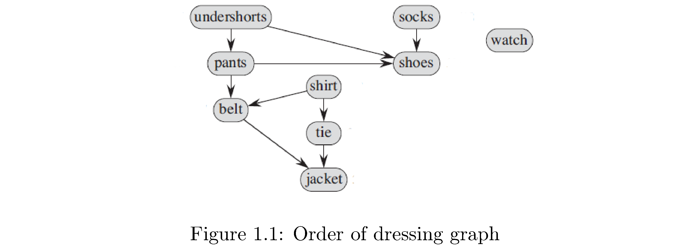

In an undirected graph the jargon is that the edge $$\left(u,v\right)$$ is
*incident* on the vertices $$u$$ and $$v$$. In a directed graph we need to
convey information about the direction of the edge so we say that edge
$$\left(u,v\right)$$ is *incident from* $$u$$ and *incident to* $$v$$. I’ve
never heard anyone say this but it is true that it’s important to convey
direction for all edges when describing edges in an undirected graph. If
two vertices have an edge connecting them then they’re **adjacent**.

A **subraph** $$G'=\left(V',E'\right)$$ of a graph $$G$$ is any
$$E'\subset E$$ and $$V'\subset V$$. Given some $$V'\subset V$$ the subgraph
*induced* on $$G$$ by $$V'$$ is the graph $$G'=\left(V',E'\right)$$ where $$E'$$
is the set of edges in $$E$$ connecting vertices in $$V'$$, i.e.
$$E'=\left\{ \left(u,v\right)\in E\big|u,v\in V'\right\}$$. It’s basically
the graph you get by throwing away some vertices.

In a graph the **degree** of a vertex is the number of edges incident on
it (i.e. just the number of edges connected to it). In a directed graph
we need to also distinguish between edges into the vertex and edges
leaving (but just the degree is still the total number): the
**in-degree** of a vertex is number of edges coming into the vertex and
the **out-degree** **** is the number of edges leaving the vertex. An
**isolated** vertex is one whose degree is 0 (like ‘watch‘ in figure
<a href="#fig:1" data-reference-type="ref" data-reference="fig:Order-of-dressing">1</a>).

A **path** of length $$k$$ from vertex $$v_{0}$$ to $$v_{k}$$ is a sequence of
vertices $$\left(\underbrace{v_{0},v_{1},\dots,v_{k}}_{k+1}\right)$$ (i.e.
a walk along the edges from $$v_{0}$$ to $$v_{k}$$). The “$$k$$ length” comes
from the $$k$$ edges connecting vertices not the $$k+1$$ vertices:
$$\left\{ \underbrace{\left(v_{0},v_{1}\right)}_{\text{1st}},\underbrace{\left(v_{1},v_{2}\right)}_{\text{2nd}},\dots,\underbrace{\left(v_{k-1},v_{k}\right)}_{k\text{th}}\right\}$$.
Note also that there’s no requirement that the edges or vertices be
distinct, meaning a path that retraces its steps is fine. A **simple**
path is one where all the vertices in
$$\left(v_{0},v_{1},\dots,v_{k}\right)$$ are distinct, i.e. that doesn’t
retrace its steps. A **cycle** is a path where $$v_{0}=v_{k}$$, i.e. ends
up where it starts. A **simple cycle** is a cycle that doesn’t
retrace its steps. A graph with no cycles is called **acyclic**.

A graph is **connected** if there’s a path from any vertex to any other
vertex. A graph that isn’t connected isn’t “disconnected”! It’s just not
connected. The graph in figure
<a href="#fig:1" data-reference-type="ref" data-reference="fig:Order-of-dressing">1</a>
is not connected because there’s no path from any vertex to ‘watch‘.
Note in a directed graph you can’t “go backwards” along edges so also
there’s no path from ‘pants‘ to ‘undershorts‘. A **connected component**
$$V'\subset V$$ of an undirected graph is a set of vertices such that the
graph $$G'$$ induced on $$G$$ by $$V'$$ is connected, i.e. it’s a subset of
the original vertices where any vertex in that subset is reachable from
any other in that subset. In figure
<a href="#fig:1" data-reference-type="ref" data-reference="fig:Order-of-dressing">1</a>
if you flip the edge $$\left(\text{undershorts},\text{shoes}\right)$$ to
$$\left(\text{shoes},\text{undershorts}\right)$$ then
$$V'=\left\{ \text{undershorts},\text{shorts},\text{shoes}\right\}$$
becomes a connected component because you can just “go around the path”
from any of them to any other. There can be several connected components
in a graph. In figure
<a href="#fig:1" data-reference-type="ref" data-reference="fig:Order-of-dressing">1</a>
if you also flip the edges $$\left(\text{shirt},\text{tie}\right)$$ and
$$\left(\text{tie},\text{jacket}\right)$$ then
$$V'=\left\{ \text{undershorts},\text{pants},\text{shoes}\right\}$$ and
$$V''=\left\{ \text{shirt},\text{tie},\text{jacket}\right\}$$ become
connected components (but are not connected to each other).

Two graphs $$G,G'$$ are **isomorphic** if there’s a bijection
$$f:V\rightarrow V'$$ such that
$$\left(u,v\right)\in E\iff\left(f\left(u\right),f\left(v\right)\right)\in E'$$,
i.e. essentially the same except for a relableing of the vertex names.
Figure
<a href="#fig:2" data-reference-type="ref" data-reference="fig:Isomorphic-graphs">2</a>
shows two isomorphic graphs because the mapping

$$\begin{align}
f\left(u_{1}\right) &= v_{1}\\
f\left(u_{2}\right) &= v_{4}\\
f\left(u_{3}\right) &= v_{3}\\
f\left(u_{4}\right) &= v_{2}\end{align}$$

works (all you do is “twist” vertices $$u_{2},u_{4}$$).

  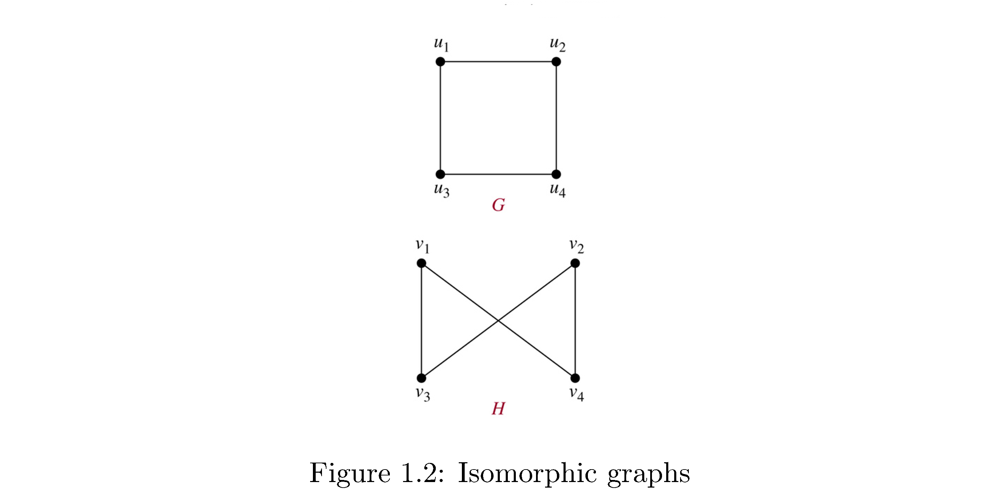

Graphs with particular properties get fancy names. A **complete** graph
is a graph where every vertex has an edge to every other vertex (how
many edges is that?). Figure
<a href="#fig:3" data-reference-type="ref" data-reference="fig:Complete-graphs-for">3</a>
shows complete graphs for[^3] $$\left|V\right|=2,\dots,7$$, i.e. 2
vertices, 3 vertices, ..., 7 vertices. Are these unique? I.e is every
other complete graph with $$7$$ vertices isomorphic to $$K_{7}$$? A
**bipartite** graph is a graph that can be divided into two sets
$$V_{1},V_{2}$$ such that the edges of the graph only connect vertices in
$$V_{1}$$ to $$V_{2}$$ and vice versa (i.e. vertices in $$V_{1}$$ are not
connected to each other).

  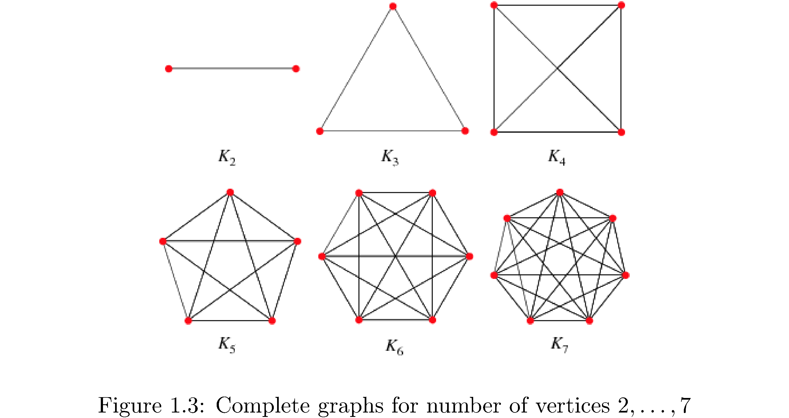

A **bipartite** graph is a graph that can be divided into two sets
$$V_{1},V_{2}$$ such that the edges of the graph only connected vertices
in $$V_{1}$$ to $$V_{2}$$ and vice versa (i.e. vertices in $$V_{1}$$ are not
connected to each other). Figure
<a href="#fig:4" data-reference-type="ref" data-reference="fig:Bipartite-graph">4</a>
is a bipartite graph.

  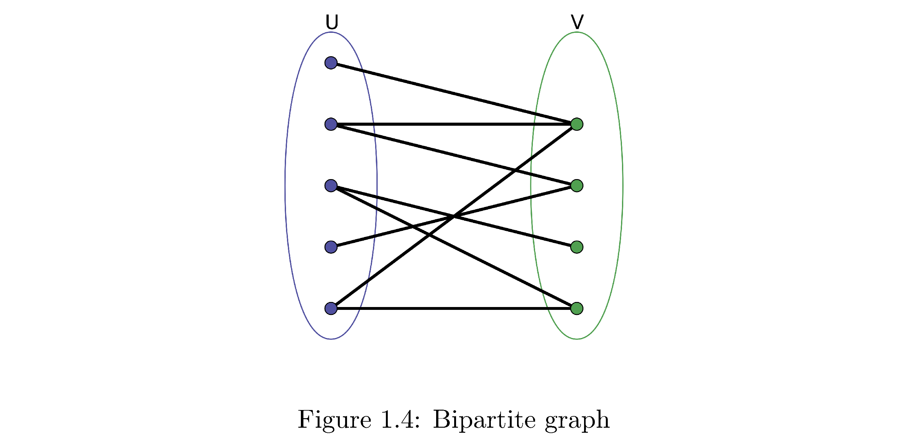

An acyclic undirected graph is a **forest** (need not be connected) and
a connected, acyclic, undirected graph is a **tree**[^4]. A **d**irected
**a**cyclic **g**raph is usually shortened to **dag**.

Finally the **contraction** of an undirected graph by an edge
$$\left(u,v\right)$$ is formed by removing the edge and making $$u=v$$, i.e.
contract $$u$$ and $$v$$ to be one vertex, with the edges connected to each
of $$u,v$$ now connected to the contracted vertex.

A **weighted** graph is one where the edges have numbers associated with
them called “weights”. For example if vertices were cities in Florida
and edges represented “being connected to by freeway” (any number of
freeways but only freeways) then the edge weights might represent the
number of highway changes you have to make when going from one city to
another.

# Representations of graphs

A representation of a graph is a data structure of some sort that
captures information about the vertices and the edges connecting the
vertices. The two standard representations are an **adjacency list**
(which uses a list of linked lists) and an **adjacency matrix** (which
uses a matrix obviously).

How to construct the adjacency list representation: first enumerate all
the vertices of the graph (i.e. give each vertex a unique numerical
“name”), then create a list or array type data structure of length $$n$$
and for each entry in this list store another list. The index of the
first list corresponds to some vertex and the list fetched upon indexing
corresponds to all of the vertices its connected to. For example
consider the graph in figure
<a href="#fig:5" data-reference-type="ref" data-reference="fig:Adjacency-list">5</a>.
The structure on the right is the adjacency list: the first column is an
array or vector or something with pointers to the heads of linked lists.
For example the 3rd position in the array corresponds to vertex 3 and
hence has a pointer to a linked list that contains nodes (linked list
nodes not graph nodes) that store the number identifying vertices that
vertex 3 is connected to (a node with the number 6 and a pointer to
another node with the number 5 \[and the null pointer because vertex 3
isn’t connected to any other vertices\]). Note that the order of the
vertices as they appear in the linked lists don’t mean anything (for
example 2 precedes 4 in vertex 1’s linked list but vertex 6 precedes
vertex 5 in vertex 3’s linked list). Also note that since this is a
directed graph the adjacency lists respect this: vertex 2 doesn’t have
vertex 1 in its adjacency list.

  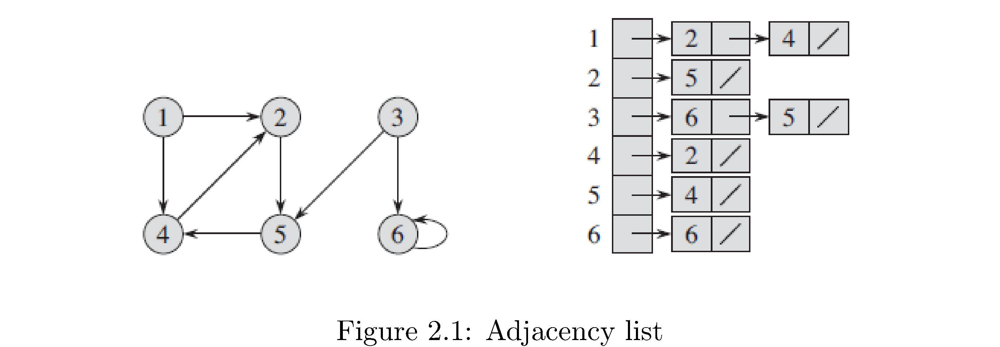

How to construct adjacency matrix representation: create a 2d array
(matrix) of size $$\left|V\right|^{2}$$ filled with zeros. Then fill in 1s
on row $$i$$ position $$j$$ if vertex $$i$$ is connected to $$j$$. Figure
<a href="#fig:6" data-reference-type="ref" data-reference="fig:Adjacency-matrix">6</a>
is the adjacency matrix representation for the graph in figure
<a href="#fig:5" data-reference-type="ref" data-reference="fig:Adjacency-list">5</a>.
Note that since this graph is directed the adjacency matrix
representation respects this: just like for the adjacency list
representation row 2 (corresponding to vertex 2) doesn’t have a 1 in the
first position because there’s no edge from vertex 2 to vertex 1, but
there is a 1 in the first row’s (the row corresponding to vertex 1)
second position because there is an edge from vertex 1 to vertex 2. What
would the graph look like if the graph was undirected? Hint: an
undirected graph is like a directed graph but for any directed edge
$$\left(i,j\right)$$ there also exists directed edge $$\left(j,i\right)$$.

  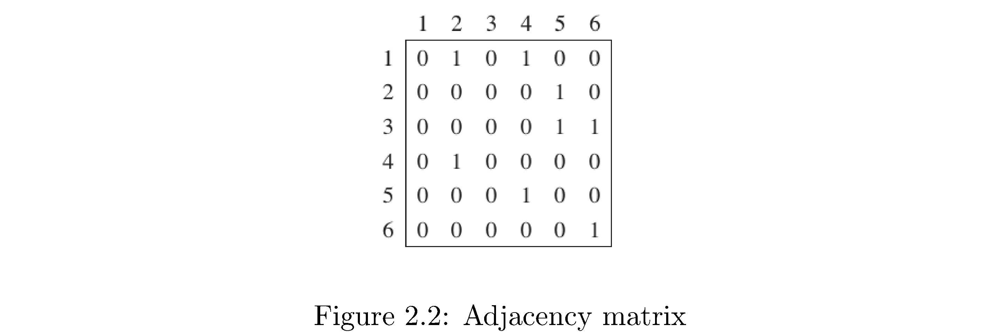

When is an adjacency list representation better than an adjacency graph
representation? When the graph is “sparse”, which means vertices are on
average adjacent to a small percentage of the other vertices. Why?
Because adjacency lists store only information about present edges while
the adjacency matrix explicitly stores zeros to indicate when 2 vertices
aren’t adjacent. Notice that the matrix in figure
<a href="#fig:6" data-reference-type="ref" data-reference="fig:Adjacency-matrix">6</a>
has many more numbers in it (if you count the zeros) than the adjacency
list in figure
<a href="#fig:5" data-reference-type="ref" data-reference="fig:Adjacency-list">5</a>.
Conversely when a graph is “dense”, which means vertices are on average
connected to a large percentage of the other vertices, the adjacency
matrix representation is better because the added cost of traversing a
linked list isn’t worthwhile for example if you’re trying to figure out
if two vertices are adjacent (in the adjacency matrix representation you
would just index directly to the other vertex and check for a 0 or 1
whereas in the adjacency list you have to traverse the list). For the
adjacency list the space cost[^5] is
$$\Theta\left(\left|V\right|+\left|E\right|\right)$$ which means you need
space proportional to the number of vertices (the length of the “top”
array) and the number of edges (one linked list node for each edge). For
the adjacency matrix representation the space cost is
$$\Theta\left(\left|V\right|^{2}\right)$$ regardless of the density or
sparseness of the graph. Notice that if
$$\left|E\right|=\left|V\right|\left(\left|V\right|-1\right)$$, the
maximum number of edges, then

$$\Theta\left(\left|V\right|+\left|E\right|\right)=\Theta\left(\left|V\right|+\left|V\right|\left(\left|V\right|-1\right)\right)=\Theta\left(\left|V\right|^{2}\right)$$

So worst case the space cost of an adjacency list representation is the
same as that of the adjacency matrix representation.

Both representation can be adapted to represent weighted graphs. The
linked list nodes in the adjacency list can be pointers to some other
data structure that has fields that store weight attributes and the
adjacency 2d array can similarly store pointers or simply have binary
entries (the entries can be real numbers but note that in that case 0
weight might be semantically distinct from “not adjacent to” in which
the case appropriate thing might be something like some entry
representing $$\infty$$).

# Breadth-first search

Breadth-first search (BFS) is better called breadth-first discovery
because you’re not necessarily searching for anything you’re just
exploring the graph. It’s the simplest thing you could think of doing:
if you’re at some vertex “discover” all of its adjacent vertices then
for each one of those discover each of its adjacent vertices, and so on.
Note you go in order of discovery. So first discover all neighboring
vertices $$v_{1},v_{2},\dots,v_{k}$$ of some **source** vertex $$s$$, then
discover all the neighboring vertices $$v_{1,1},v_{1,2},\dots,v_{1,k'}$$
of $$v_{1}$$ and then move on to discovering all adjacent vertices of
$$v_{2}$$, not all adjacent vertices $$v_{1,1}$$. So the discovery process
goes in frontiers of number of edges from the source: discover all
vertices within one edge of $$s$$, then within two edges of $$s$$, etc.
Consider figure
<a href="#fig:7" data-reference-type="ref" data-reference="fig:BFS">7</a>:
The source is A from which B,H are discovered. From B the vertices C,F
are discovered and then from H the vertices I,J are discovered. The
levels are circled in red and correspond to frontiers of discovery.

  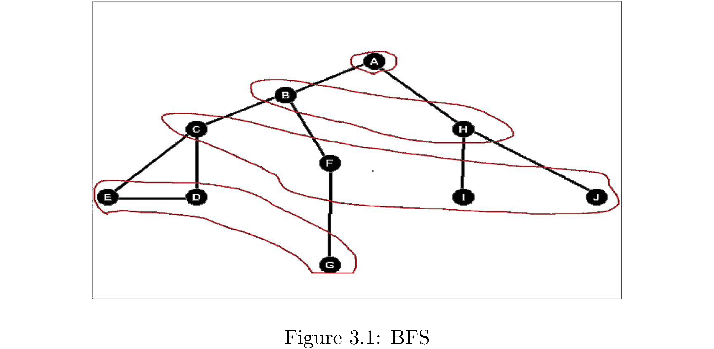

The order of visiting the vertices in BFS suggests an implementation:
you want to discover the first vertex that’s one edge away, then the
second vertex that’s one edge away, etc. until there are no more
vertices one edge away. Then you want to “visit” the first vertex
discovered at the one edge frontier and discover its “children”, then
move on to the second vertex discovered at the one edge frontier and
discover its “children” and so on. Hence you want to do the discovery
process in a first in first out order: the vertices discovered earlier
should be visited earlier. Obviously this suggests using a queue data
structure. It’s also important to distinguish between vertices that have
been discovered and those which have been fully explored so that
vertices that have been discovered don’t get “re-discovered” (since a
vertex might have an incoming edge from two other vertices in a
preceding frontier) and those which have been fully explored don’t get
explored again. Algorithm
<a href="#fig:8" data-reference-type="ref" data-reference="fig:Breadth-first-search">8</a>
lists pseudocode for a function that takes a graph $$G$$ and a source $$s$$
(from which to start the BFS) and performs the breadth-first search

  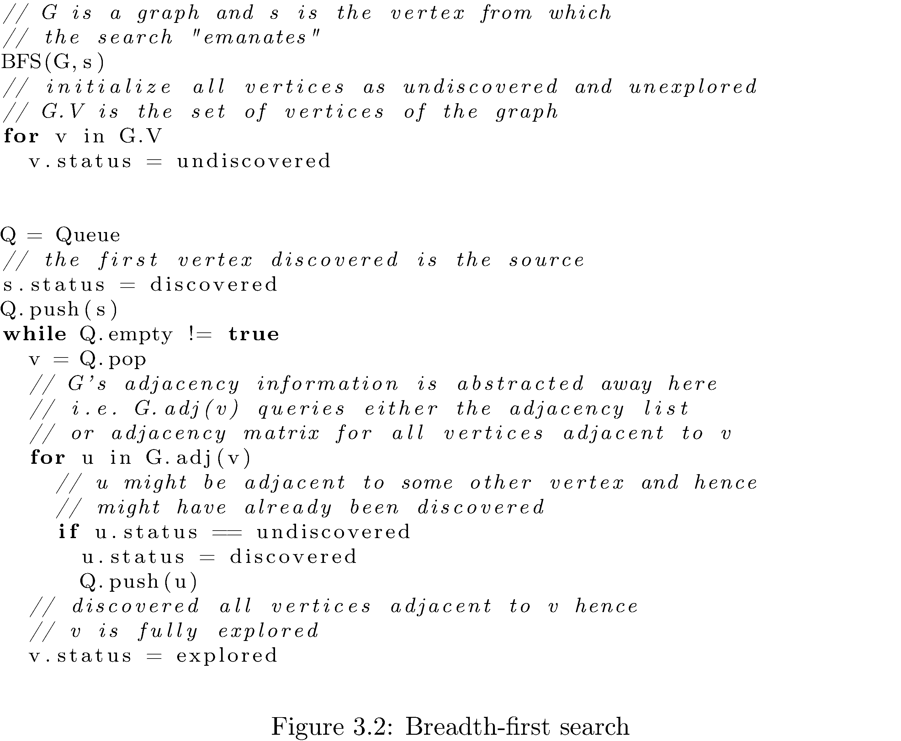

That’s it - that’s basic BFS. What’s the runtime of BFS? Since you have
to traverse each edge it’s $$O\left(\left|E\right|\right)$$.

Now there are variations on the theme: for example you could use BFS to
compute the number of edges from the source to every other vertex it’s
connected to. How? Note that every vertex is one frontier deeper than
the vertex “through which” it was discovered: so if the number of edges
$$s.d$$ from the source to itself is 0 then the number of edges from the
source to each of the vertices discovered after exploring the source is
$$s.d+1$$. Setting this “distance” upon discovering the vertices adjacent
to some vertex gives the correct distance of the discovered vertex from
the source. Why? Because no vertex is discovered twice and so when $$u.d$$
is set it’s set as early as it can be. There is also the notion of a
**breadth-first predecessor tree**. This is basically a representation
of which vertices were discovered by exploring which vertices in a
breadth-first search. You can imagine rearranging the graph such that
$$s$$ at the center and the frontiers of vertices form concentric circles
around $$s$$. Figure
<a href="#fig:9" data-reference-type="ref" data-reference="fig:Breadth-first-predecessor-tree">9</a>
demonstrates this.

  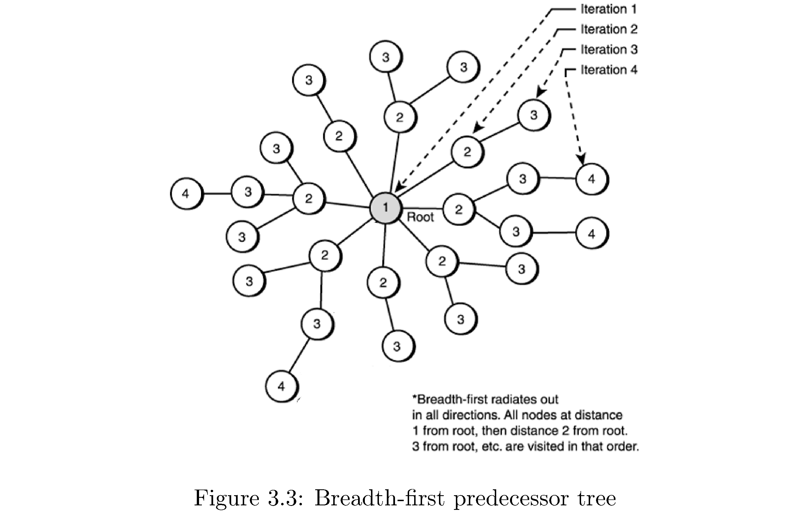

Formally for a graph $$G=\left(V,E\right)$$ and $$s$$ the breadth-first
predecessor tree $$G'$$ consists of all vertices $$V'\subset V$$ that were
discovered in a BFS emanating from $$s$$ and edges
$$\left(u,v\right)\in E'\subset E$$ if $$v$$ was discovered through
exploring $$u$$. It’s called a tree because there are no cycles (why?),
it’s connected (why?). The “root” of the tree (figure
<a href="#fig:9" data-reference-type="ref" data-reference="fig:Breadth-first-predecessor-tree">9</a>)
will be the source vertex $$s$$. How would you construct the tree? Just
keep track of which vertex a vertex was discovered through by storing a
“parent” pointer that’s set when the vertex is discovered. Using the BFS
predecessor tree you can also print out shortest paths to the source, in
the sense of fewest edges, by following the parent pointers back to the
source.

# Dijkstra’s Shortest Path (Optional)

You haven’t read the section on depth-first search, nor topological
sort, nor strongly connected components, but this section apperas here
because topological sort and strongly connected components are
applications of depth-first search and Dijkstra’s shortest path
algorithm is an application of bread-first search.

As alluded to at the end of the BFS section you can use BFS to compute
shortest paths from a single source to all vertices using a BFS tree.
One way to think about the problem that that solves is computing the
shortest path from a single source to all vertices on a weighted graph
where all the edges have weight 1. But what if the edge weights aren’t
one? It won’t work. BFS only gives you shortest path in the sense of
fewest number of edges, not in terms of sum of edge weights (obviously
since the algorithm never checks the edge weights). How could you use
BFS to solve the problem of single source all vertices[^6] in terms of
sum of all edge weights? Well if the edge weights are integral (have
whole number values) one hack would be to insert $$k-1$$ vertices on any
edge with weight $$k$$ and then the number of edges distance matches the
edge weight distance. But that would blow up the run time of BFS since
it’s $$O\left(\left|E\right|\right)$$ and $$\left|E\right|$$ will blow up.

The smarter way is to make BFS a little smarter: expand the frontier in
the direction of the “nearest” vertices, where nearest now means those
for which the path is shortest in the sense of sum of edge weights. In
addition to expanding in the direction of the nearest vertices you
should always update your current assessments of shortest paths to all
vertices seen so far. Effecting the first part is easy: just replace the
Queue in BFS with a Min-Heap where the priority ranking of each vertex
its current shortest path distance from the source. Then the nearest
vertices will be popped. To effect the second part is easy too: after
popping a vertex update all of the distances to all of its neighbors if
the shortest path to them (from the source) is shorter through the
vertex that just got popped. The code appears in Algorithm
<a href="#fig:10" data-reference-type="ref" data-reference="fig:Dijkstra&#39;s-shortest-path">10</a>.

  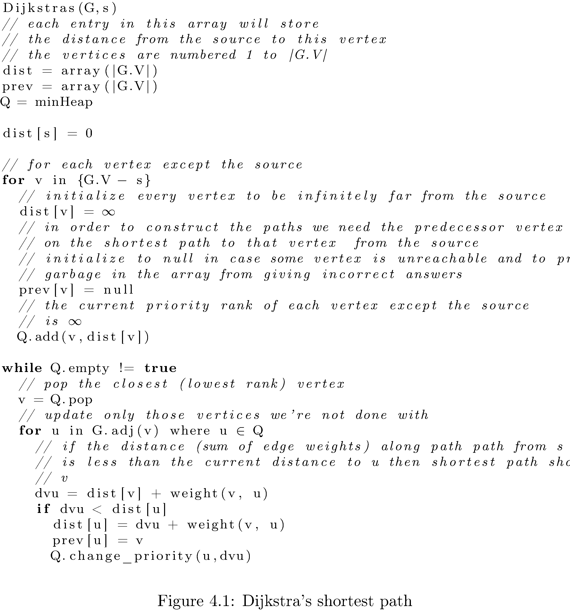

What’s the runtime of Dijkstra’s shortest path algorithm? The
breadth-first search costs $$O\left(\left|E\right|\right)$$ but since you
have to do $$\left|V\right|$$ insertions in the MinHeap, which each cost
at most[^7] $$\log\left(\left|V\right|\right)$$ (for example when the heap
is almost full) the total runtime is
$$O\left(\left|E\right|+\left|V\right|\log\left(\left|V\right|\right)\right)$$.

# Depth-first search

Depth-first search is almost exactly like breadth-first search except
that it explores as deeply as possible (as opposed to as broadly as
possible) on each iteration. Practically speaking the only difference is
the replacement of the Queue with a Stack. Algorithm
<a href="#fig:12" data-reference-type="ref" data-reference="fig:Breadth-first-search-1">12</a>
shows the algorithm. Why should it be a Stack? The easiest way to see it
intuitively is to go through an example on a small graph. Consider
figure
<a href="#fig:11" data-reference-type="ref" data-reference="fig:Depth-first-search-example">11</a>:
first A is pushed (so it’s at the top of the stack), then popped and
explored, then C and B are pushed (so B is at the top of the stack),
then B is popped and explored, then E and D are pushed (so D is at the
top of the stack, followed by E). D has no neighbors so E is the next to
be popped and explored, pushing I and then H. The current state of the
stack from bottom to top is (C,I,H). You get the idea. Essentially the
Stack orders which vertices are to be explored by which were explored
most recently (they appear at the top of the Stack!).

  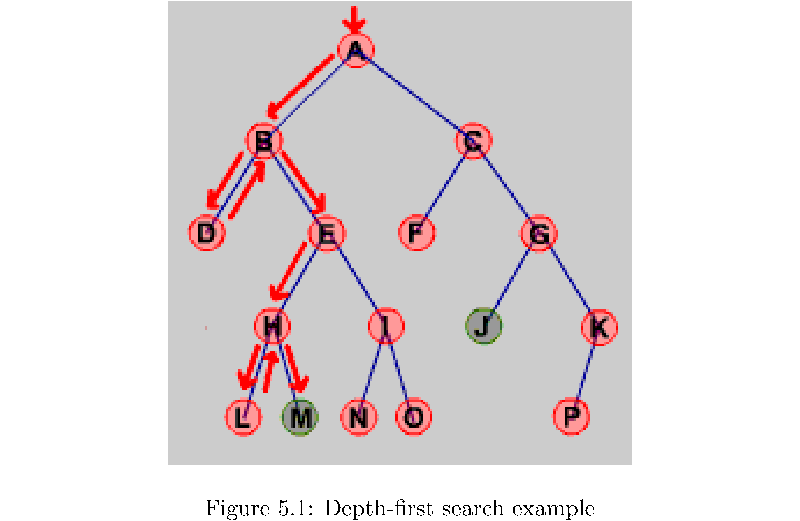

  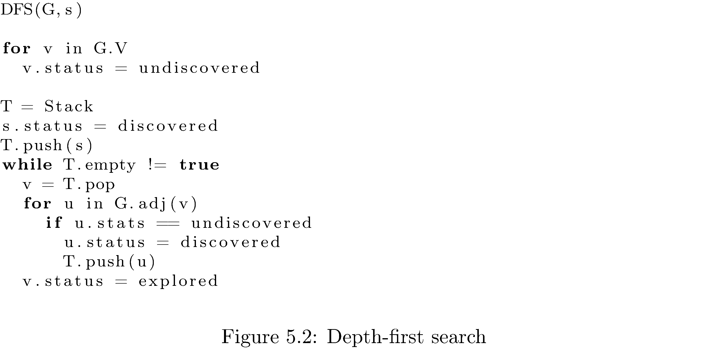

What’s the runtime of the algorithm? Since you need to traverse each
edge in the worst case it’s $$O\left(\left|E\right|\right)$$. Finally just
like for breadth-first search you can construct a depth-first
predecessor tree by keeping pointers.

# Tangent: parentheses

The standard DFS algorithm can be easily modified to make it infinitely
more useful: let’s keep track of when a vertex is first discovered, its
“open” time, and when all of its children are done being explored, i.e.
when it is “closed”. To enable this bookkeeping some trivial
modifications need to made. Algorithm
<a href="#fig:13" data-reference-type="ref" data-reference="fig:modified-Breadth-first-search-1-1">13</a>
is the modified algorithm.

How does the modified algorithm work? Keeping track of open times is
easy: just keep a global timer (which you increment constantly) and
assign the value of the timer to each vertex when it is discovered. The
more difficult task is keeping track of the close time. Before even
attempting to figure out what times to assign as close times note that
in the unmodified algorithm the vertex is popped and disappears (in the
sense that we don’t keep track of it anymore) so we couldn’t assign a
time to it (whatever time) even if we wanted to. The solution is to
“save” the vertex, i.e. don’t pop it. Hence peaking at it instead of
outright popping it.

  

But now we need to distinguish between vertices on the stack because
they are yet to be explored and those we’re saving just in order to
assign close times to; hence the conditional. If the top of the stack is
a vertex that hasn’t been explored then we do the same thing as the
unmodified algorithm and if it’s one that has been explored then we know
it’s one of those that we’re holding onto in order to assign it a close
time. Also (coincidentally enough) if the top of stack is a vertex we’ve
already explored that means that all of its children have been explored
too (that’s the only way you “come back” to a vertex) and it should be
closed. Note the counter is always incremented so that every open and
close time is unique (i.e. no set of vertices has the same open time for
example; it’s not possible for two vertices to have the same close time
since the algorithm isn’t parallel).

What’s the use of all of this bookkeeping? We can the open and close
times to “parenthesize” the vertices:

**Theorem** **(Parenthesis)**: Given a DFS of a graph
$$G=\left(V,E\right)$$ for any two $$u,v\in V$$ **either** the intervals
$$\left[u.open,u.close\right]$$ and $$\left[v.open,v.close\right]$$ are
entirely disjoint, i.e. $$u.close<v.open$$ **or** one of
$$\left[u.open,u.close\right],\left[v.open,v.close\right]$$ is entirely
contained in the other, i.e. $$u.open<v.open<v.close<u.close$$.

What this theorem says is that for any two vertices $$u,v$$ either they’re
completely unrelated (e.g. $$u$$ opens and closes before $$v$$ opens and
closes) or one of $$u,v$$ is a ancestor of the other (e.g. $$v$$ is “down
the graph” from $$u$$ and hence $$u$$ opens, sometime later $$v$$ opens, then
eventually $$v$$ closes, and sometime later $$u$$ closes). Note this is not
just about direct descendents, i.e. parents and children, but applies to
any depth of descendance. Why is this called the parenthesis theorem?
Look at this sequence of parentheses

$$\left(\left(\right)\left(\right)\left(\mathbf{\boldsymbol{(}\boldsymbol{)}}\left(\mathbf{\boldsymbol{(}}\left(\left(\right)\left(\right)\right)\mathbf{\boldsymbol{)}}\right)\right)\right)$$

and notice how for any two sets of parenthesesare disjoint (for example
the bolded ones) or one is nested in the other.

In a sort-of but not completely related interesting tidbit if you wanted
to test whether a set of parentheses was parenthesized correctly, i.e.
nothing like )(()(, you’d use a stack. Can you think up how?

# Topological Sort

A topological sort of a directed graph is a sorting of the vertices by
precedence (i.e. which vertices “globally” precede which). For example
figure $$\ref{fig:Topological-sort-of}$$ is a topological sort of the
graph in figure
<a href="#fig:1" data-reference-type="ref" data-reference="fig:Order-of-dressing">1</a>
that represents an order in which you can successfully get dressed:
first socks, then undershorts, then pants, then shoes, then watch, etc.
Note the edges are just reproduced from the graph - the topological sort
is the order of vertices from left to right. I say an order because for
example undershorts could be put on before socks because there’s no
precedence relationship (no edge or sequence of edges) between socks and
undershorts. Another name for a topological sort is a *linearization* of
a graph (because it kind of arranges the vertices in a line).

  

A topological sort only makes sense for a directed graph - there is no
notion of precedence in an undirected graph. Furthermore a topological
sort is only possible in a directed acyclic graph. Why? If there’s a
cycle in the graph then which vertex in the cycle really precedes which
other vertex? The precedence of the vertices in the cycle with respect
to each other is ill-defined. How do you detect a cycle in a directed
graph? Easy: if at some point during a depth-first search you were about
to “discover” a vertex that had already been discovered (i.e. but not
explored) then there’s a cycle. Why? Since all discovered vertices get
turned into explored vertices as the DFS “comes back up” the only way to
see a discovered vertex that hasn’t been fully explored is if the DFS
has looped back. Therefore assume without loss of generality that the
directed graphs in this are directed acyclic graphs (meaning before you
try to do a topological sort of a graph check to see if it’s acyclic).

How do you do a topological sort of an acyclic graph? Easily! Do a
depth-first search and just list the vertices in reverse order of their
closing times. I’ll repeat that again: list the vertices in reverse
order of their closing times **not their opening times!!!** Why? As a
warm-up think about it like this: what is the closing time of
‘undershorts‘ in figure
<a href="#fig:1" data-reference-type="ref" data-reference="fig:Order-of-dressing">1</a>
if I start the depth-first search at it? It’ll be one of the last
ones[^8] because everything below it will close before it (since
everything below it is a descendent of it and by the parenthesis
theorem). Now figure
<a href="#fig:1" data-reference-type="ref" data-reference="fig:Order-of-dressing">1</a>
is kind of strange because ‘socks‘ is never discovered by a depth-first
search starting at ‘undershorts‘. The solution is essentially to rerun
depth-first search start at vertices that remain undiscovered while
keeping the timer global. The algorithm appears in Algorithm
<a href="#fig:15" data-reference-type="ref" data-reference="fig:topsort">15</a>.

  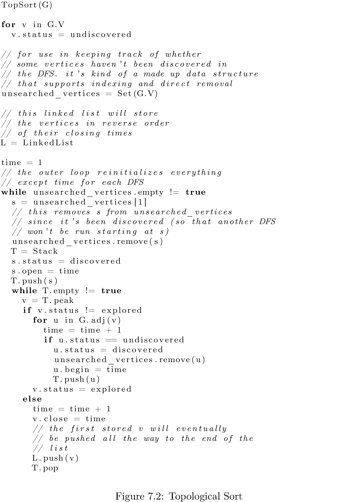

What’s the runtime? Since it’s essentially a DFS the runtime is
$$O\left(\left|E\right|\right)$$.

# Strongly Connected Components

Recall that a connected component of a undirected graph $$G$$ is a
subgraph $$G'$$ that’s connected, i.e. each vertex can reach each other
vertex. A *strongly* connected component is the same thing in a directed
graph. A graph could have many distinct (unreachable from each other)
connected components. How would you find them all? For an undirected
graph it’s easy: use either breadth-first search or depth-first search.
Since the graph is undirected any path from a vertex $$u$$ to a vertex $$v$$
can be similarly used by $$v$$ to reach $$u$$. For directed graphs it’s a
little more difficult...

How about an intuition pump[^9]: consider the directed graph in figure
<a href="#fig:16" data-reference-type="ref" data-reference="fig:Strongly-connected-components">16</a>

  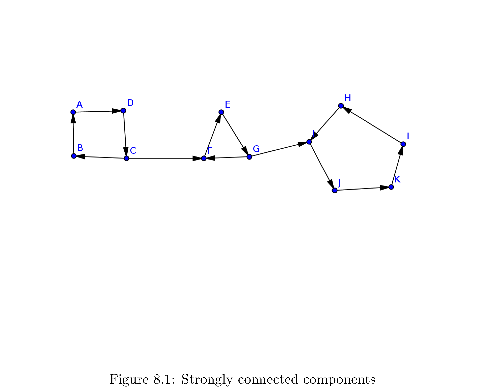

. First of all do you recognize the connected components? They are

$$\begin{align}
C_{1} & =\left\{ A,B,C,D\right\} \\
C_{2} & =\left\{ E,F,G\right\} \\
C_{3} & =\left\{ H,I,J,K,L\right\} \end{align}$$

Note that the entire graph is not strongly connected (since, for
example, $$A$$ is unreachable from $$K$$).

So how would algorithmically decide all of the connected components in
this graph? Maybe a first guess would be to perform a depth-first search
from and see which vertices are discovered by that depth first search.
That clearly doesn’t work because all vertices are reachable from $$A$$.
In contrast how about a performing a depth-first search that starts at
$$H$$? Well then the only vertices discovered will be
$$\left\{ H,I,J,K,L\right\}$$. That’s $$C_{1}$$ the connected component $$H$$
is a member of! This is very close to what we need but this doesn’t work
iforms a cycle. All of the vertices you can reach from some fixed vertex
(e.g. $$F$$) are not all in that vertex’s strongly connected component. To
drive the point home: if you had started the DFS at $$F$$ you would have
discovered

$$\left\{ E,F,G,H,I,J,K,L\right\} =C_{1}\cup C_{2}$$

**Not all of the discovered vertices are in $$F$$’s connected component
but all of vertices in $$F$$’s connected component are discovered!**

What’s the key feature here? Look again at $$C_{3}$$ and think about what
happens when you perform the depth-first search starting at $$H$$. The DFS
discovers all the vertices in the “last” part of the graph only because
it’s stuck; because the edge $$\left(G,I\right)$$ only goes one direction
the DFS can’t get out. This is the key. If you knew what the “last” part
of the graph was you could run DFS on it, collect all the vertices
discovered and label them as one strongly connected component, remove
all of them, then rerun DFS on the “second to last” part, etc.

This is almost the answer **but it’s not, unfortunately**. Consider the
graph in figure
<a href="#fig:17" data-reference-type="ref" data-reference="fig:Counter-example">17</a>

  

. A plausible DFS that starts at $$0$$ gives finishing ordering of first
1, then 2, then 0. Then your second DFS, starting at 1, would produce
$$\left\{ 1,0,2\right\}$$ as a strongly connected component since both 0
and 2 are reachable from 1. The reason for this, vaguely, is that
there’s no well defined “last” part of the graph. But there is a well
defined “first” part to the graph (at least relative to where you start
the DFS from)! A topological sort[^10] gives you the “first” part as the
vertex with the highest finishing time. But how can we use this since
the whole algorithm hinges on “getting stuck” and clearly for graphs
like in figure
<a href="#fig:16" data-reference-type="ref" data-reference="fig:Strongly-connected-components">16</a>
you wouldn’t get stuck if you started at $$A$$.

The solution is to use, for the second depth-first search the transpose
graph[^11], i.e. flip all the edges in the original graph. Note that the
strongly connected components of $$G^{T}$$ and $$G$$ are the same[^12]so
there’s no loss of reachable paths. So now you can effect the same idea
(using the “getting stuck” nature of the second DFS) on the “first” part
of the graph: just start the second DFS on the vertex with the highest
finishing time (i.e. the one that’s topologically sorted to be the first
in order). Once you identify the strongly connected component of the
“first” part of the graph, remove all those vertices and do the same
thing with the next highest finishing time vertex that’s still left. The
source appears in Algorithm
<a href="#fig:18" data-reference-type="ref" data-reference="fig:topsort-1">18</a>.

  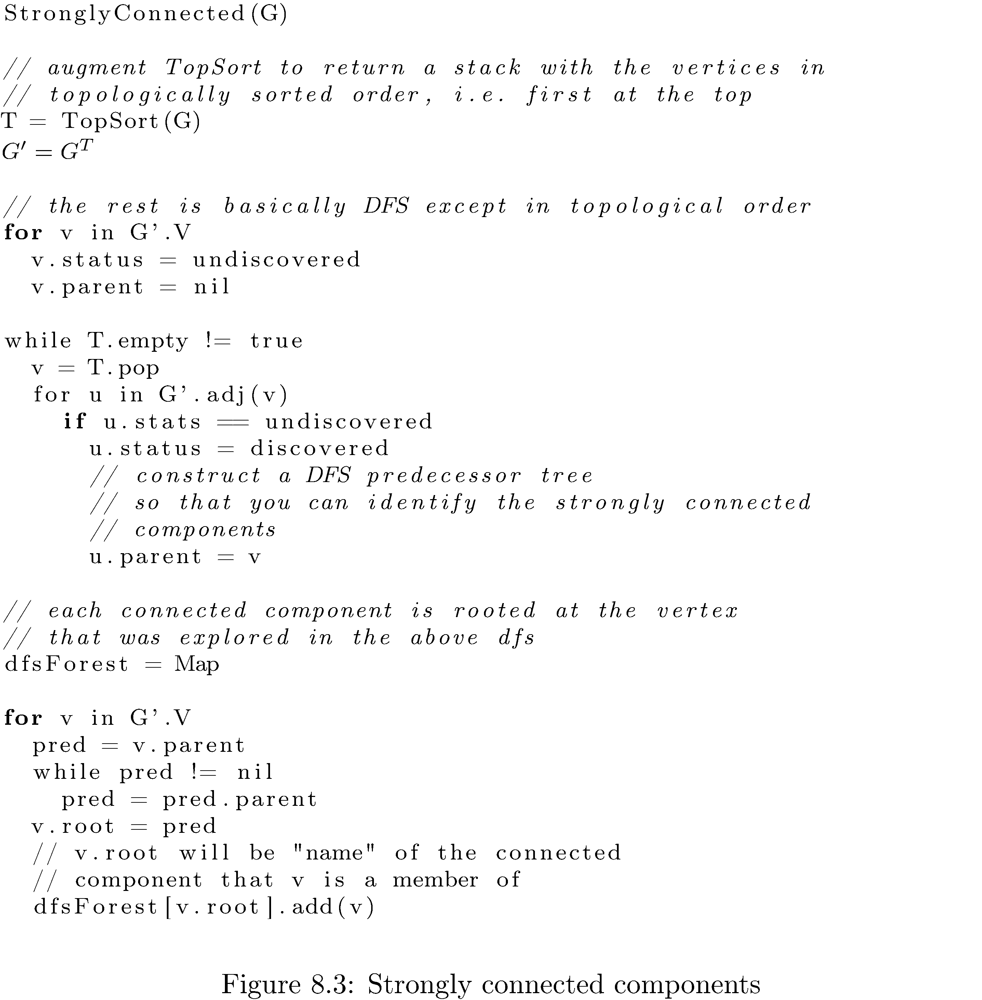

What’s the runtime of the algorithm? Each DFS takes
$$O\left(\left|E\right|\right)$$ but the computation of the transpose
graph takes $$O\left(\left|V\right|+\left|E\right|\right)$$ so the total
runtime is $$O\left(\left|V\right|+\left|E\right|\right)$$.

# Footnotes

[^1]: Obvious example: relatives - if you’re related to someone then
    they’re related to you.

[^2]: Obvious example: parents - if you’re someone’s parent they’re not
    your parent.

[^3]: $$\left|V\right|$$ is the number of vertices and $$\left|E\right|$$ is
    the number of edges.

[^4]: There are tons of refinements of tree, e.g. binary tree, complete
    binary tree, full binary tree, etc.

[^5]: Big $$\Theta$$ means best and worst case. Big $$O$$ means worst case.
    Big $$\Omega$$ means best case.

[^6]: Compute shortest paths from a single source to all other vertices.

[^7]: Using a Fibonacci heap.

[^8]: And in fact if you look at figure
    <a href="#fig:14" data-reference-type="ref" data-reference="fig:Topological-sort-of">14</a>
    you’ll see it’s the second item.

[^9]: “An intuition pump is a thought experiment structured to allow the
    thinker to use their intuition to develop an answer to a problem.
    The term was coined by Daniel Dennett.”

[^10]: We’re not really going to do a topological sort since the graph
    obviously has cycles, but what is true is that the graph of strongly
    connected components is a dag.

[^11]: $$G^{T}=\left(V,E^{T}\right)$$ where
    $$E^{T}=\left\{ \left(v,u\right)\big|\left(u,v\right)\in E\right\}$$.

[^12]: Since if you can reach $$v$$ from $$u$$ and $$u$$ from $$v$$ then
    flipping all the edges means the paths have just switched roles; the
    path from $$u$$ to $$v$$ because the path from $$v$$ to $$u$$ and
    vice-versa.
