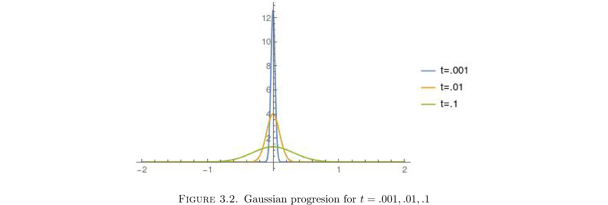

---
author:
- Maksim Levental
excerpt_separator: <!--more-->
title: Collard Green’s Functions
---

# Motivation

Green’s functions are a way to solve certain PDEs. Consider a PDE

$$\begin{align}
\frac{\partial u}{\partial t}-\frac{D}{2}\frac{\partial^{2}u}{\partial x^{2}} & =\left(\frac{\partial}{\partial t}-\frac{D}{2}\frac{\partial^{2}}{\partial x^{2}}\right)\label{eq:diffeqn}\\
 & =Lu\label{eq:pdesystem}\\
u\left(x,0\right) & =f\left(x\right)\nonumber \end{align}$$

<!--more-->

as a *linear system*[^1] $$L$$ with *input* $$f\left(x\right)$$ and
*response* $$u$$. This is appropriate because $$u\left(x,t\right)$$ is
completely characterized[^2] by $$L$$ and $$f\left(x\right)$$. The *Green’s
function* $$G\left(x,t\right)$$ of the system is the solution that
satisfies

$$\lim_{t\downarrow0}G\left(x,t\right)=\delta\left(x\right)\label{eq:initcondimpul}$$

Note that this is the *impulse response* of the system because it is the
response/solution of the system whose input/initial conditions
$$u\left(x,0\right)=G\left(x,0\right)$$ are in a sense[^3] the unit
impulse $$\delta\left(x\right)$$. Why is the Green’s function useful? For
arbitrary[^4] input $$f\left(x\right)$$

$$\begin{align}
L\left(\int_{-\infty}^{\infty}G\left(s-x,t\right)f\left(s\right)ds\right) & =\int_{-\infty}^{\infty}\left[LG\left(s-x,t\right)\right]f\left(s\right)ds\\
 & =\int_{-\infty}^{\infty}\left[\frac{\partial G}{\partial t}-\frac{D}{2}\frac{\partial^{2}G}{\partial x^{2}}\right]f\left(s\right)ds\\
 & =0\end{align}$$

and

$$\begin{align}
\lim_{t\downarrow0}\left(\int_{-\infty}^{\infty}G\left(s-x,t\right)f\left(s\right)ds\right) & =\int_{-\infty}^{\infty}\left[\lim_{t\downarrow0}G\left(s-x,t\right)\right]f\left(s\right)ds\nonumber \\
 & =\int_{-\infty}^{\infty}\delta\left(s-x\right)f\left(s\right)ds\label{eq:siftprop}\\
 & =f\left(x\right)\nonumber \end{align}$$

So

$$\begin{align}
u\left(x,t\right) & =\int_{-\infty}^{\infty}G\left(s-x,t\right)f\left(s\right)ds\\
 & =G\left(x,t\right)\star f\left(x\right)\end{align}$$

is a general solution of the system defined by eqns.
$$\eqref{eq:pdesystem}$$.

# Green’s function for the Diffusion equation

The PDE in eqn. $$\eqref{eq:diffeqn}$$ is called the *Diffusion* equation
and the system I’ll call a *Diffusion system*[^5]: it diffuses the
initial concentration of mass $$f\left(x\right)$$ as time evolves. We seek
a general solution to the system and therefore we seek the Green’s
function $$G\left(x,t\right)$$ for the system. For reasons that will
become clearer in the 3rd section

$$\begin{align}
G\left(x,t\right) & =\frac{1}{t^{\alpha}}\phi\left(\frac{x}{t^{\alpha}}\right)\label{eq:greenprototype}\end{align}$$

for any smooth[^6] and integrable function $$\phi\left(y\right)$$ is a
good guess for the form of a Green’s function. Indeed we will construct
$$G$$ by finding a suitable $$\phi$$. Substituting this $$G$$ into the
diffusion equation

$$\begin{align}
\frac{\partial G}{\partial t}-\frac{D}{2}\frac{\partial^{2}G}{\partial x^{2}} & =\left(-\frac{\alpha}{t^{\alpha+1}}\phi-\frac{\alpha x}{t^{2\alpha+1}}\phi'\right)-\frac{D}{2}\left(\frac{1}{t^{3\alpha}}\phi''\right)\label{eq:greeneqn}\end{align}$$

To simplify the notation a little define
$$\eta\left(x\right)=\phi\left(\frac{x}{t^{\alpha}}\right)$$. Then

$$\begin{align}
\eta'\left(x\right) & =\frac{1}{t^{\alpha}}\phi'\left(x\right)\\
\eta''\left(x\right) & =\frac{1}{t^{2\alpha}}\phi''\left(x\right)\end{align}$$

and eqn. $$\eqref{eq:greeneqn}$$ becomes

$$\left(-\frac{\alpha}{t^{\alpha+1}}\eta\left(x\right)-\frac{\alpha x}{t^{\alpha+1}}\eta'\left(x\right)\right)-\frac{D}{2}\left(\frac{1}{t^{\alpha}}\eta''\left(x\right)\right)=0$$

or (by multiplying both sides by $$-t^{\alpha}/\left(D/2\right)$$ and
moving $$\eta''\left(x\right)$$ over)

$$\frac{\alpha}{\left(D/2\right)t}\eta\left(x\right)+\frac{\alpha x}{\left(D/2\right)t}\eta'\left(x\right)=-\eta''\left(x\right)\label{eq:odegreen}$$

This is now a linear second order ordinary differential equation that’s
easy to solve. The first trick is recognizing the left side is an exact
differential, i.e.

$$\frac{\alpha}{\left(D/2\right)t}\eta\left(x\right)+\frac{\alpha x}{\left(D/2\right)t}\eta'\left(x\right)=\frac{\alpha}{\left(D/2\right)t}\frac{d}{dx}\left(x\eta\left(x\right)\right)$$

and hence eqn. $$\eqref{eq:odegreen}$$ can be integrated once easily

$$\begin{align}
\frac{\alpha}{\left(D/2\right)t}\int\frac{d}{dx}\left(x\eta\left(x\right)\right) & =-\int\eta''\left(x\right)dx\\
\frac{\alpha}{\left(D/2\right)t}x\eta\left(x\right) & =-n'\left(x\right)+c_{1}\end{align}$$

This again is a linear first order ordinary differential equation more
commonly written

$$n'\left(x\right)+\frac{\alpha x}{\left(D/2\right)t}\eta\left(x\right)=c_{1}$$

which is solved by a similar sort of trick. The left side is almost an
exact differential[^7] except the $$x$$ spoils it. We can hack it to
indeed be an exact differential by multiplying both sides by some
function $$h\left(x\right)$$

$$\left[h\left(x\right)\right]n'\left(x\right)+\left[h\left(x\right)\frac{\alpha x}{\left(D/2\right)t}\right]\eta\left(x\right)=h\left(x\right)c_{1}\label{eq:integfac}$$

such that the second term becomes the first derivative of $$h$$, i.e.

$$h\left(x\right)n'\left(x\right)+h'\left(x\right)\eta\left(x\right)=\frac{d}{dx}\left(h\left(x\right)\eta\left(x\right)\right)$$

Which function has the property that it’s first derivative is equal to
itself times $$\alpha x/\left(D/2\right)t$$? Well that’s just another[^8]
differential equation in disguise!

$$\frac{dh}{dx}=h\cdot\frac{\alpha x}{\left(D/2\right)t}\Rightarrow\frac{dh}{h}=dx\frac{\alpha x}{\left(D/2\right)t}\Rightarrow\log\left(h\right)=\frac{\alpha}{Dt}x^{2}$$

or $$h\left(x\right)=e^{\alpha x^{2}/Dt}$$. So substituting $$h$$ into eqn.
$$\eqref{eq:integfac}$$

$$\frac{d}{dx}\left(e^{\alpha x^{2}/Dt}\eta\left(x\right)\right)=e^{\alpha x^{2}/Dt}c_{1}$$

and finally

$$\begin{align}
e^{\frac{\alpha x^{2}}{Dt}}\eta\left(x\right) & =c_{1}\int e^{\alpha x^{2}/Dt}dx+c_{2}\\
 & \text{or}\\
\phi\left(\frac{x}{t^{\alpha}}\right)=\eta\left(x\right) & =c_{1}e^{-\frac{\alpha x^{2}}{Dt}}\int e^{\alpha x^{2}/Dt}dx+c_{2}e^{-\frac{\alpha x^{2}}{Dt}}\end{align}$$

Now to reconcile that $$\phi\left(\frac{x}{t^{\alpha}}\right)$$ should be
a function of only $$\frac{x}{t^{\alpha}}$$ we need to pick the
appropriate $$\alpha$$. Inspect that for $$\alpha=1/2$$

$$\phi\left(\frac{x}{\sqrt{t}}\right)=c_{1}e^{-\frac{1}{2D}\left(\frac{x}{\sqrt{t}}\right)^{2}}\int e^{\frac{1}{2D}\left(\frac{x}{\sqrt{t}}\right)^{2}}dx+c_{2}e^{-\frac{1}{2D}\left(\frac{x}{\sqrt{t}}\right)^{2}}$$

So $$\phi\left(\frac{x}{\sqrt{t}}\right)$$ is the Green’s function of the
diffusion equation. Well almost. The regularity conditions mentioned in
footnote
<a href="#fn:Given-some-regularity" data-reference-type="ref" data-reference="fn:Given-some-regularity">[fn:Given-some-regularity]</a>
require that $$\phi\rightarrow0$$ as $$x\rightarrow\infty$$ and for the
calculation in eqns. $$\eqref{eq:siftprop}$$ to work $$G$$ should be
normalized to integrate to 1. To satisfy the first requirement it’s
clear that $$c_{1}$$ should be 0. To meet the second requirement we set
$$c_{2}$$:

$$\begin{align}
1 & =\int_{-\infty}^{\infty}G\left(x,t\right)dx\\
 & =c_{2}\int_{-\infty}^{\infty}\frac{1}{\sqrt{t}}e^{-\frac{1}{2D}\left(\frac{x}{\sqrt{t}}\right)^{2}}dx\\
 & =c_{2}\int_{-\infty}^{\infty}\frac{1}{\sqrt{t}}e^{-\frac{1}{2}\left(\frac{x}{\sqrt{Dt}}\right)^{2}}dx\\
 & \text{let }u=x/\sqrt{Dt}\\
 & =c_{2}\sqrt{D}\int_{-\infty}^{\infty}e^{-\frac{1}{2}u^{2}}du\\
 & =c_{2}\sqrt{2D\pi}\end{align}$$

Therefore the normalization factor $$c_{2}=1/\sqrt{D\pi}$$ and the
complete Green’s function is

$$G\left(x,t\right)=\frac{1}{\sqrt{2\pi Dt}}e^{-\frac{1}{2}\frac{x^{2}}{Dt}}\label{eq:gaussian}$$

Indeed a very recognizable function! And hence the general solution to
the diffusion equation is

$$\begin{align}
u\left(x,t\right) & =\int_{-\infty}^{\infty}G\left(s-x,t\right)f\left(s\right)ds\\
 & =\frac{1}{\sqrt{2\pi t}}\int_{-\infty}^{\infty}\frac{1}{\sqrt{t}}e^{-\frac{1}{2}\frac{\left(s-x\right)^{2}}{Dt}}f\left(s\right)ds\end{align}$$

# Smoothing

A Green’s function is a smoother[^9] and $$u\left(x,t\right)$$ is the
smoothed version of $$f\left(x\right)$$. Figure
<a href="#fig:1" data-reference-type="ref" data-reference="fig:Smoothing">1</a>
shows initial conditions $$f\left(x\right)$$ for

$$f\left(x\right)=\begin{cases}
0 & x<-1\\
x+1 & -1\leq x<0\\
1 & 0\leq x<1\\
2 & 1\leq x<2\\
0 & 2\leq x
\end{cases}$$

and $$G\left(x,t\right)$$ convolved with $$f\left(x\right)$$ for
$$t=.01,.1,1$$, i.e. the solution $$u\left(x,t\right)$$ to the diffusion
equation at those times. As you can see as $$t$$ increases the initial
distribution of mass $$f\left(x\right)$$ is diffused out **and** the
points where $$f\left(x\right)$$ is nondifferentiable[^10] vanish, i.e.
$$u\left(x,t\right)$$ is differentiable at those points.

  

Actually $$u\left(x,t\right)$$ is $$C^{\infty}$$ for any $$t>0$$, so
$$f\left(x\right)$$ is instaneously smoothed out. How smooth? Perfectly
smooth:

$$\begin{align}
\frac{\partial^{n}}{\partial x^{n}}u\left(x,t\right) & =\int_{-\infty}^{\infty}\left(\frac{\partial^{n}}{\partial x^{n}}G\left(s-x,t\right)\right)f\left(s\right)ds\\
 & =\int_{-\infty}^{\infty}\left(-1\right)^{n}G^{\left(n\right)}\left(s-x,t\right)f\left(s\right)ds\end{align}$$

where $$G^{\left(n\right)}$$ denotes the $$n$$th partial deriviative of $$G$$
with respect to its first argument. And since $$G\left(x,t\right)$$ is
$$C^{\infty}$$[^11] this integral converges for all $$n$$. Even more
shockingly $$u\left(x,t\right)$$ is non-zero everywhere on $$\mathbb{R}$$
for any $$t>0$$, so $$f\left(x\right)$$ is diffused everywhere instaneously.

Why is that eqn. $$\eqref{eq:greenprototype}$$

$$G\left(x,t\right)=\frac{1}{t^{\alpha}}\phi\left(\frac{x}{t^{\alpha}}\right)$$

is a good guess for the form a Green’s function? First of all first of
all since $$\phi$$ is integrable we can normalize it such that

$$\int_{-\infty}^{\infty}\phi\left(y\right)dy=1$$

and then by a change of variables

$$\int_{-\infty}^{\infty}\frac{1}{t^{\alpha}}\phi\left(\frac{x}{t^{\alpha}}\right)dx=1$$

which as already mentioned is necessary for the calcuation in eqns.
$$\eqref{eq:siftprop}$$ to work.

But more intuitively eqn. $$\eqref{eq:greenprototype}$$ is the right form
for a Green’s function because it has the behavior of a smoother as
$$t\rightarrow0$$ and as $$t\rightarrow\infty$$. As $$t\rightarrow0$$ the the
factor of $$1/t^{\alpha}$$ increases the value of $$G\left(x,t\right)$$
around $$x=0$$ and shrinks the base because the $$1/t^{\alpha}$$ in the
argument of $$\phi$$ functions as a scale parameter[^12]. So initially (at
$$t\approx0$$) a $$G$$ of this form will preserve the initial distribution
of mass $$f\left(x\right)$$. As $$t\rightarrow\infty$$ the inverse effect on
$$G\left(x,t\right)$$ is observed: the factor $$1/t^{\alpha}$$ will flatten
$$G\left(x,t\right)$$ and therefore spread/smear/smooth out
$$f\left(x\right)$$. It’s also critical that $$G\left(x,t\right)$$
integrates to 1 because otherwise it would add mass to the initial
distribution[^13]and that’s not. My point here is that if you wanted to
construct a smoothing function de-noveau you would want these properties
and the $$1/t^{\alpha}$$ trick would be an easy way to effect them.
Figure
<a href="#fig:2" data-reference-type="ref" data-reference="fig:Gaussian-progresion-for">2</a>
shows what the Green’s function for the diffusion equation, eqn.
$$\eqref{eq:gaussian}$$, looks like as $$t$$ increases.

  

# Footnotes

[^1]: $$L$$ is a linear differential operator (maps functions to
    functions).

[^2]: Kind of obvious because that’s the only thing given.

[^3]: In what sense? In the sense of eqn. $$\eqref{eq:initcondimpul}$$.

[^4]: In fact $$f\left(x\right)$$ can be very ugly, e.g. unbounded,
    non-differentiable, etc. All that is required is some regularity
    conditions that satisfy the hypotheses of Lebesgue’s dominated
    convergence theorem. 

[^5]: This is nonstandard. Typically this is just called a Diffusion
    boundary value problem with Dirichlet boundary conditions (the
    values of the solution are specified as opposed to the values of the
    derivatives, which is a Neumann boundary condition).

[^6]: At least $$C^{1}$$, i.e. the first derivative exists.

[^7]: Notice that the first term has a first derivative of $$\eta$$ and
    the second has just an $$\eta$$.

[^8]: It’s DEs all the way down.

[^9]: And convolution is a smoothing process.

[^10]: $$x=-1,0,1,2$$.

[^11]: The $$n$$th derivative of $$G\left(x,t\right)$$ is

    $$\left(\frac{-1}{\sqrt{2Dt}}\right)^{n}H_{n}\left(\frac{x}{\sqrt{2Dt}}\right)G\left(x,t\right)$$

    where $$H_{n}$$ is the $$n$$th Hermite polynomial defined by

    $$H_{n}\left(x\right)=\left(2x-\frac{d}{dx}\right)^{n}\cdot1$$

    The 1 is necessary because the differential operator must be applied
    to a function.

[^12]: And the scale increases, is made coarser, as $$t\rightarrow0$$.

[^13]: You have to look at $$G$$ in Fourier space to rigorously define and
    prove this notion. Suffice it to say that if $$G$$ didn’t integrate to
    1, by Parseval’s theorem, it wouldn’t just redistribute power
    amongst the frequency components of $$f\left(x\right)$$, it would add
    power too.
